<p align="center">
  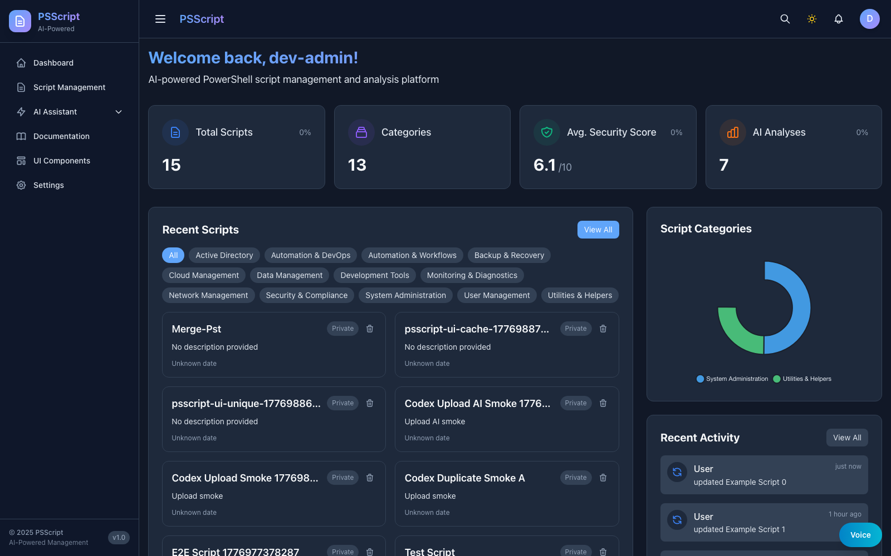
</p>

<h1 align="center">PSScript</h1>

<p align="center">
  <strong>PowerShell Script Management with Agentic AI Analysis</strong>
</p>

<p align="center">
  <a href="#quick-start">Quick Start</a> &bull;
  <a href="#features">Features</a> &bull;
  <a href="#architecture">Architecture</a> &bull;
  <a href="#ai-models">AI Models</a> &bull;
  <a href="#screenshots">Screenshots</a> &bull;
  <a href="#documentation">Docs</a>
</p>

---

## Overview

PSScript is a full-stack platform for teams that need to **store, search, analyze, and operate on PowerShell scripts** from one interface. It combines script management with agentic AI workflows, semantic search, voice interactions, and enterprise-grade security analysis.

### How it works

1. Upload or create a PowerShell script in the React frontend
2. The Express API validates, persists with version history in PostgreSQL, and deduplicates via SHA-256 hashing
3. The AI service runs multi-step analysis through GPT-4.1 and LangGraph workflows with security scoring, code quality metrics, and optimization recommendations
4. Results surface in the UI alongside semantic search, documentation, analytics, and admin tooling
5. A voice dock enables speech-to-text dictation and text-to-speech playback across the app

---

## Features

| Area | What it does |
|------|-------------|
| **Script Management** | Upload, store, version, filter, search, and export PowerShell scripts |
| **AI Analysis** | Security scoring, code quality assessment, risk analysis, and remediation guidance |
| **Agentic Workflows** | Multi-step LangGraph orchestration with tool calling and human-in-the-loop |
| **Semantic Search** | Vector embeddings via `text-embedding-3-large` for similarity-based discovery |
| **Voice** | OpenAI-powered TTS (`gpt-4o-mini-tts`), STT (`gpt-4o-mini-transcribe`), and diarization |
| **Analytics** | Usage metrics, AI cost tracking, security dashboards, and category distribution |
| **Admin Tools** | Database backup/restore, test-data cleanup, sequence reseeding, cache management |
| **Documentation Crawl** | Index and search external documentation within the app |
| **Responsive App Shell** | Dark left-nav UI with dashboard, script management, AI, documentation, analytics, and settings views |

---

## Architecture

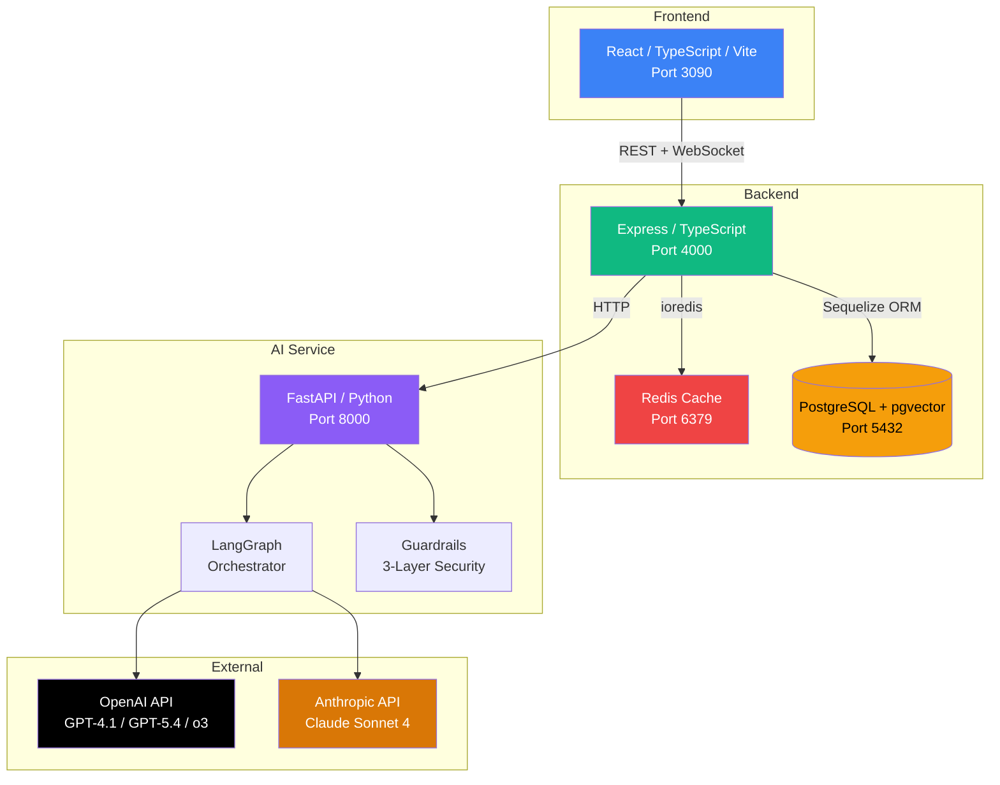

### Service Map

| Service | Port | Stack | Purpose |
|---------|------|-------|---------|
| **Frontend** | 3090 | React, TypeScript, Vite, TailwindCSS | UI, user flows, visualization |
| **Backend** | 4000 | Express, TypeScript, Sequelize | API, orchestration, auth, caching |
| **AI Service** | 8000 | FastAPI, LangGraph 1.1, Python | Model inference, agentic workflows |
| **PostgreSQL** | 5432 | PostgreSQL 15 + pgvector | Persistent data, vector embeddings |
| **Redis** | 6379 | Redis 7 | Cache layer (with in-memory fallback) |

### Request Flow

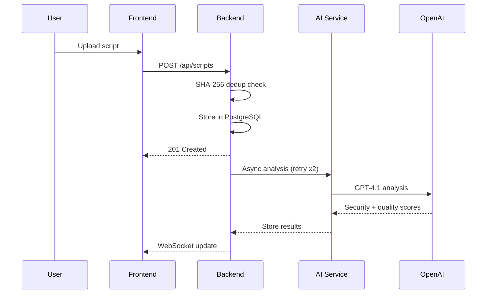

---

## AI Models

Updated April 12, 2026. All deprecated models (gpt-4o, gpt-4o-mini, gpt-3.5-turbo) have been replaced.

| Purpose | Model | Notes |
|---------|-------|-------|
| **Code generation** | `gpt-4.1` | 1M token context, best for PowerShell |
| **Flagship tasks** | `gpt-5.4` | Complex multi-step analysis |
| **Fast tasks** | `gpt-4.1-mini` | Quick responses, cost-effective |
| **Reasoning** | `o3` | Complex debugging and architecture |
| **Fast reasoning** | `o4-mini` | Lightweight step-by-step |
| **Embeddings** | `text-embedding-3-large` | 3072 dimensions for semantic search |
| **Text-to-speech** | `gpt-4o-mini-tts` | Instruction-controllable voice |
| **Speech-to-text** | `gpt-4o-mini-transcribe` | Best accuracy STT |
| **Diarization** | `gpt-4o-transcribe-diarize` | Speaker-labeled transcription |
| **Anthropic fallback** | `claude-sonnet-4-6-20260217` | Alternative analysis provider |

### SDK Versions

| Package | Version | Language |
|---------|---------|----------|
| `openai` | ^6.33.0 | Node.js |
| `openai` | >=2.30.0 | Python |
| `langgraph` | >=1.1.0 | Python |
| `langchain` | >=1.0.0 (GA) | Python |

> **Note:** The OpenAI Assistants API sunsets on August 26, 2026. The checked-in `/api/assistants` routes already return `Deprecation`, `Sunset`, and successor `Link` headers, and the migration target is the Responses API.

---

## Screenshots

<details>
<summary><strong>Login</strong> — Auth-enabled sign-in and demo access</summary>

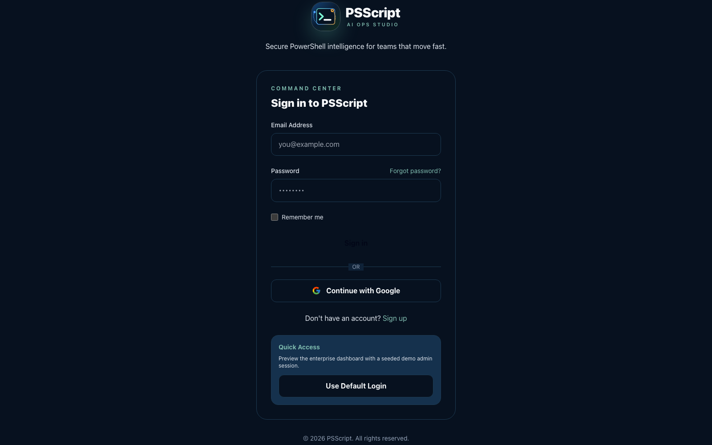
</details>

<details>
<summary><strong>Dashboard</strong> — Health, activity, and AI usage overview</summary>


</details>

<details>
<summary><strong>Scripts</strong> — Upload, browse, filter, and analyze</summary>

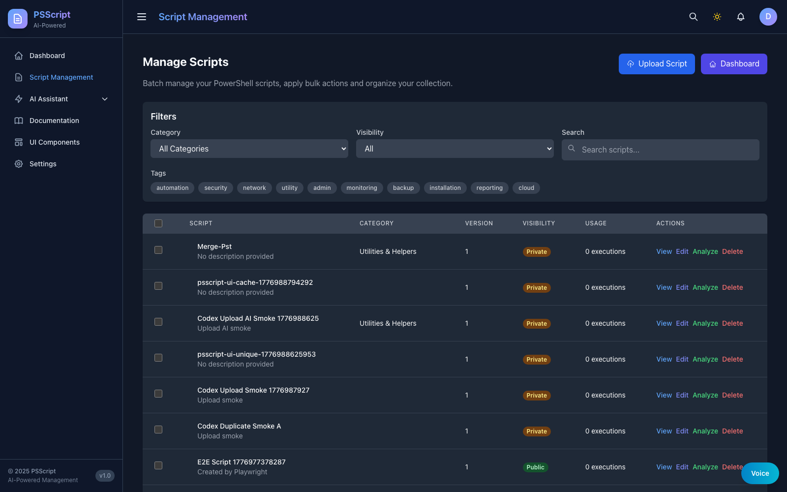
</details>

<details>
<summary><strong>Upload</strong> — Script intake with metadata and preview</summary>

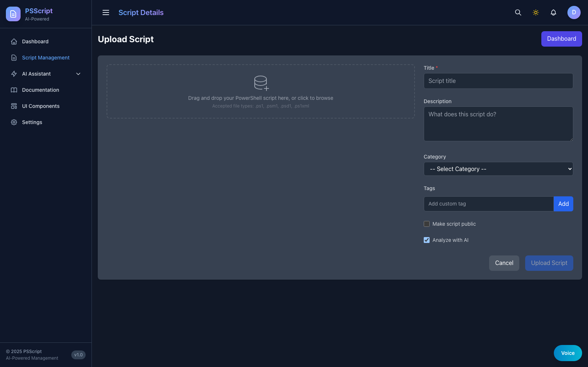
</details>

<details>
<summary><strong>Script Analysis</strong> — AI-powered security and quality scoring</summary>

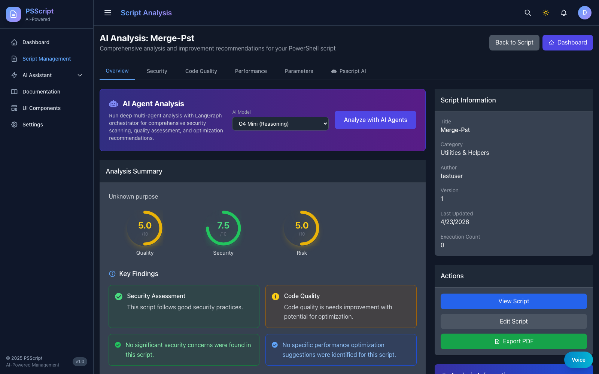
</details>

<details>
<summary><strong>Script Detail</strong> — Version history and code view</summary>

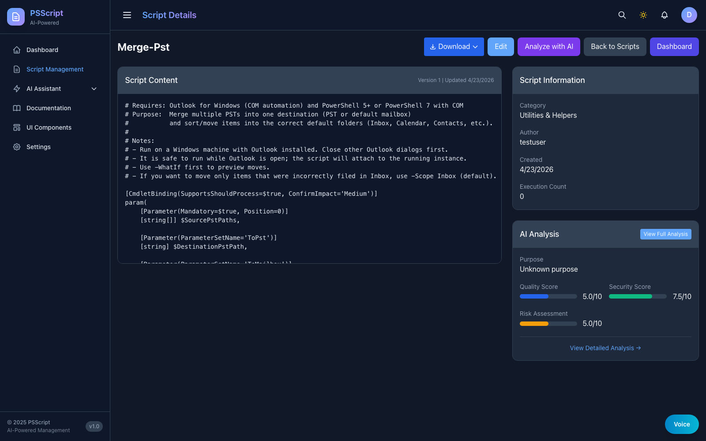
</details>

<details>
<summary><strong>Documentation</strong> — PowerShell docs explorer and crawl tools</summary>

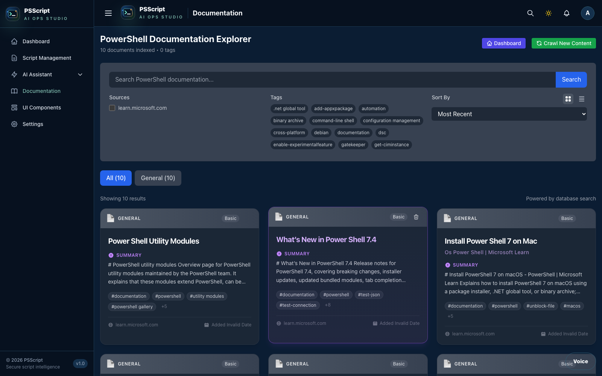
</details>

<details>
<summary><strong>Chat with AI</strong> — Conversational PowerShell assistant</summary>

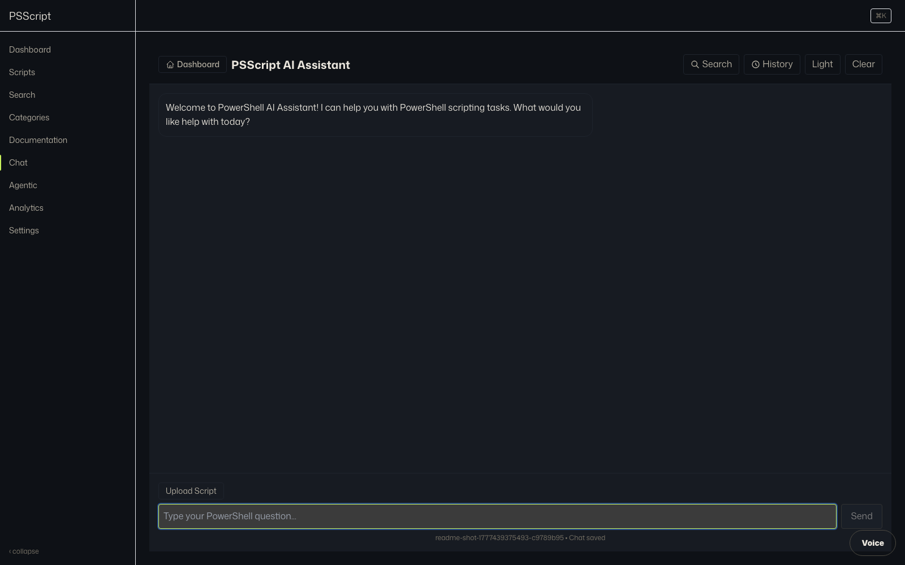
</details>

<details>
<summary><strong>Analytics</strong> — Usage metrics and reporting</summary>

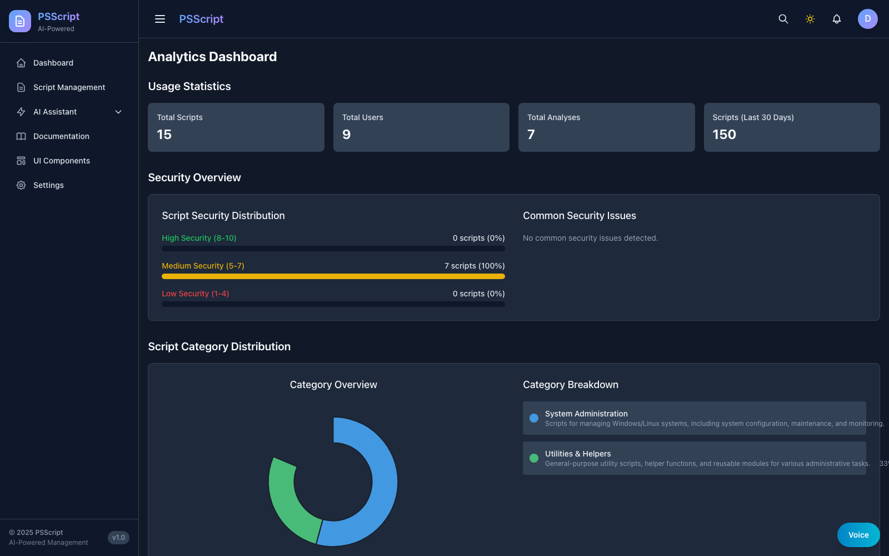
</details>

<details>
<summary><strong>Settings</strong> — Profile and application configuration</summary>


</details>

<details>
<summary><strong>Data Maintenance</strong> — Admin backup, restore, cleanup</summary>

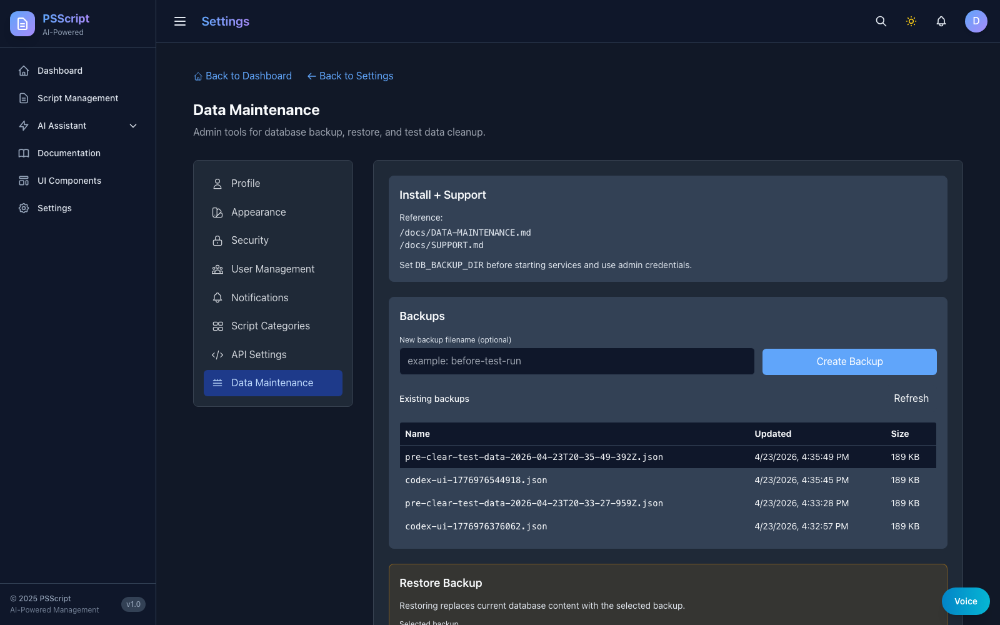
</details>

---

## Quick Start

### Prerequisites

- Node.js 18+
- Python 3.10+
- Docker Engine with `docker compose`

### Full stack (Docker)

```bash
npm run install:all
python -m pip install -r src/ai/requirements.txt
docker compose up -d --build
```

Open `https://127.0.0.1:3090`

### Individual services

```bash
# Backend (port 4000)
cd src/backend && npm install && npm run dev

# Frontend (port 3090)
cd src/frontend && npm install && npm run dev

# AI Service (port 8000)
cd src/ai && pip install -r requirements.txt && python main.py
```

### Local dev auth

The default local stack commonly runs with `DISABLE_AUTH=true` and `VITE_DISABLE_AUTH=true`, so the UI auto-enters the app shell as `dev-admin`. For a real login pass, run a separate frontend/backend pair with both flags set to `false`.

### Current UI shell

The current running UI is a dark PSScript application shell:

- the sidebar and top bar provide navigation across Dashboard, Script Management, AI Assistant, Documentation, UI Components, and Settings
- the dashboard shows script totals, categories, security metrics, activity, and trends from the backend
- script detail and analysis pages show real script content and saved AI-analysis data
- the checked-in screenshots are captured from the running app with backend data, not mock image placeholders

---

## Validation

```bash
# Backend
cd src/backend
npm run typecheck          # TypeScript: 0 errors
npm run lint               # ESLint: 0 errors
npm test -- --runInBand    # Unit tests

# Frontend
cd src/frontend
npm run lint && npm run build

# E2E
npx playwright test --project=chromium

# Cache stress test
cd src/backend && npx jest src/__tests__/cacheService.test.ts --forceExit
```

### Screenshot Refresh

The app-shell screenshots are captured from the standard local frontend on `3090` with the backend running and at least one script with analysis data available. Because that local stack commonly runs with `VITE_DISABLE_AUTH=true`, capture `login.png` from a second auth-enabled frontend:

```bash
# terminal 1: app shell + backend
npm run playwright:stack

# terminal 2: login page
cd src/frontend
VITE_DISABLE_AUTH=false VITE_USE_MOCKS=true npm run dev -- --host 0.0.0.0 --port 3191

# terminal 3: refresh docs/screenshots
SCREENSHOT_BASE_URL=https://127.0.0.1:3090 \
SCREENSHOT_LOGIN_URL=http://127.0.0.1:3191 \
node scripts/capture-screenshots.js
```

### Latest Results (April 24, 2026)

| Suite | Result |
|-------|--------|
| GitHub README audit | Remote `main` checked against the local source |
| Screenshot refresh | Login, dashboard, scripts, upload, script detail, analysis, documentation, chat, analytics, settings, and data maintenance refreshed |
| Screenshot guardrails | Capture script fails instead of saving login redirects, missing script data, or script-analysis loading pages |
| Screenshot files | Empty duplicate `* (1).png` files removed |
| Exported docs | GitHub-facing HTML exports regenerated from current Markdown |

---

## Project Structure

```
psscript/
├── .github/                  # Workflows, issue templates, PR template
├── docs/                     # Active docs, screenshots, exports, archive
├── docs-site/                # Documentation site assets and screenshot variants
├── docker/                   # Docker support services and backup tooling
├── scripts/                  # Operational scripts and validation helpers
├── src/
│   ├── backend/              # Express API (TypeScript)
│   │   └── src/
│   │       ├── controllers/  # Route handlers (modular script CRUD)
│   │       ├── services/     # Cache, OpenAI client, agentic tools
│   │       ├── models/       # Sequelize models (14 tables)
│   │       ├── middleware/    # Auth, security, rate limiting
│   │       └── routes/       # API route definitions
│   ├── frontend/             # React UI (Vite + TypeScript)
│   │   └── src/
│   │       ├── pages/        # Dashboard, Scripts, Chat, Analytics
│   │       ├── components/   # Reusable UI components
│   │       └── services/     # API client, voice, settings
│   └── ai/                   # Python AI service (FastAPI)
│       ├── agents/           # LangGraph, Anthropic, multi-agent
│       ├── guardrails/       # 3-layer input/output validation
│       ├── utils/            # Model router, token counter
│       └── analysis/         # Script analyzer, embeddings
├── tests/e2e/                # Playwright E2E tests
├── crawl4ai-vector-db/       # Support project for crawl/vector search workflows
├── product-website/          # Product/marketing website assets
└── docker-compose.yml        # Full stack orchestration
```

---

## Engineering Notes

<details>
<summary><strong>April 2026 Project Review</strong> — 22 issues fixed, AI models updated</summary>

### Database & Models (9 fixes)
- Added missing `ExecutionLog.output` column
- Fixed `Script.fileHash` from STRING(32) to STRING(64) for SHA-256
- Refactored ChatHistory to consistent class pattern
- Added CASCADE on ScriptAnalysis foreign key
- Fixed ScriptVersion timestamp mismatch
- Standardized FK naming across models
- Added missing indexes (file_hash, visibility compound)
- Updated embedding model default
- Increased password hash field for argon2id compatibility

### API & Backend (13 fixes)
- Removed `@ts-nocheck` from 7 files with proper type declarations
- Fixed default port mismatch (4001 -> 4000)
- Transaction isolation: SERIALIZABLE -> READ COMMITTED
- Added pagination limit guard (max 100)
- Implemented analytics summary endpoint (was TODO stub)
- Made AI analysis non-blocking with retry (exponential backoff)
- Fixed unhandledRejection handler
- Added express-validator to script routes
- Created standardized API response envelope helpers
- Replaced console.warn with Winston in security middleware

### Architecture (3 fixes)
- Extracted 350-line inline cache to standalone `cacheService.ts`
- Added Redis integration with in-memory fallback via ioredis
- Resolved circular dependency (eliminated runtime `require()`)

### AI Updates
- Replaced all deprecated models: gpt-4o -> gpt-4.1, gpt-4o-mini -> gpt-4.1-mini
- Added GPT-5.4 as flagship model, o4-mini for lightweight reasoning
- Updated SDKs: OpenAI Node 6.33.0, Python 2.30.0, LangGraph 1.1.0, LangChain 1.0
- Created shared OpenAI client singleton (replaces 3 separate instances)
- Added Assistants API sunset warning headers

Full details: [PROJECT-REVIEW-2026-04-01.md](./docs/PROJECT-REVIEW-2026-04-01.md) | [AI-FUNCTIONS-REVIEW-2026-04-02.md](./docs/AI-FUNCTIONS-REVIEW-2026-04-02.md)
</details>

<details>
<summary><strong>Key technical decisions</strong></summary>

- JWT auth with refresh token rotation, bcrypt (12 rounds), account lockout
- Script uploads deduplicated via SHA-256 file hashing
- AI analysis runs as fire-and-forget with 2-retry exponential backoff
- Cache: Redis primary (via ioredis) with automatic in-memory fallback
- Structured API responses: `{ success: true, data }` / `{ success: false, error: { code, message } }`
- Multi-model routing: task complexity determines model selection (nano -> mini -> standard -> flagship)
- 3-layer AI guardrails: input validation, context construction, output validation
- Voice pipeline: `gpt-4o-mini-transcribe` -> `gpt-4.1` reasoning -> `gpt-4o-mini-tts`
</details>

---

## Documentation

| Document | Purpose |
|----------|---------|
| [Getting Started](./docs/GETTING-STARTED.md) | Local bootstrap and first-run |
| [Repository Organization](./docs/REPOSITORY-ORGANIZATION.md) | Repo layout, docs taxonomy, and cleanup backlog |
| [Data Maintenance](./docs/DATA-MAINTENANCE.md) | Admin backup, restore, cleanup |
| [Voice API](./docs/README-VOICE-API.md) | Voice/listening implementation |
| [Deployment Platforms](./docs/DEPLOYMENT-PLATFORMS.md) | Render, Netlify, Docker configs |
| [Project Review](./docs/PROJECT-REVIEW-2026-04-01.md) | April 2026 comprehensive review |
| [AI Functions Review](./docs/AI-FUNCTIONS-REVIEW-2026-04-02.md) | AI audit and model migration |
| [Documentation Hub](./docs/index.md) | Full docs index |
| [UI Branding Refresh](./docs/UI-BRANDING-REFRESH-2026-04-23.md) | Current branded UI and screenshot refresh notes |

### Service READMEs

- [Backend](./src/backend/README.md) — Routes, validation, middleware
- [Frontend](./src/frontend/README.md) — Components, pages, state
- [AI Service](./src/ai/README.md) — Models, agents, guardrails

---

<p align="center">
  <sub>Last updated: April 24, 2026</sub>
</p>
