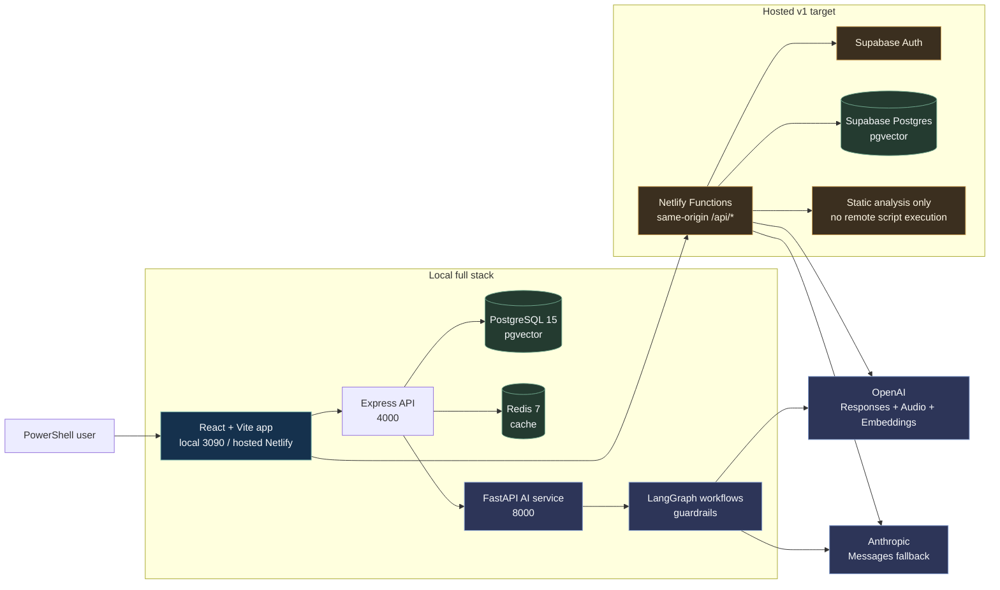
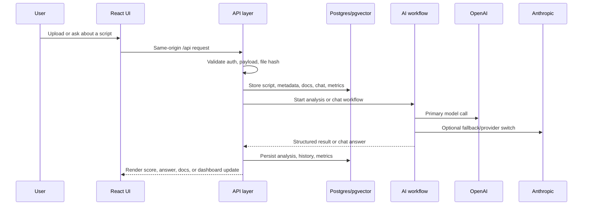

<p align="center">
  <a href="./docs/screenshots/dashboard.png">
    
  </a>
</p>

<p align="center">
  <sub>Dashboard preview from the validated local app shell. Click the image to open the source capture.</sub>
</p>

<h1 align="center">PSScript</h1>

<p align="center">
  <strong>PowerShell Script Management with Agentic AI Analysis</strong>
</p>

<p align="center">
  <strong>Current status:</strong> Browser Use RUN3 passed on April 24, 2026 · Netlify/Supabase hosted path documented · latest app-shell screenshots refreshed
</p>

<p align="center">
  <a href="#quick-start">Quick Start</a> &bull;
  <a href="#features">Features</a> &bull;
  <a href="#architecture">Architecture</a> &bull;
  <a href="#ai-models">AI Models</a> &bull;
  <a href="#screenshots">Screenshots</a> &bull;
  <a href="#documentation">Docs</a>
</p>

---

## Overview

PSScript is a full-stack platform for teams that need to **store, search, analyze, and operate on PowerShell scripts** from one interface. It combines script management with agentic AI workflows, semantic search, voice interactions, and enterprise-grade security analysis.

### How it works

1. Upload or create a PowerShell script in the React frontend
2. The Express API validates, persists with version history in PostgreSQL, and deduplicates via SHA-256 hashing
3. The AI service runs multi-step analysis through GPT-4.1 and LangGraph workflows with security scoring, code quality metrics, and optimization recommendations
4. Results surface in the UI alongside semantic search, documentation, analytics, and admin tooling
5. A voice dock enables speech-to-text dictation and text-to-speech playback across the app

---

## Features

| Area | User Outcome | Current Evidence |
| --- | --- | --- |
| **Script Workspace** | Upload, browse, version, filter, search, inspect, and export PowerShell scripts. | Browser Use RUN3 passed `/scripts`, `/scripts/upload`, and `/scripts/1/analysis`. |
| **AI Analysis** | Security scoring, quality review, remediation guidance, and recommendations. | Script analysis route and AI chat both passed in RUN3. |
| **Agentic Workflows** | Multi-step analysis, orchestration, and assistant flows for complex script work. | `/ai/assistant` and `/ai/agents` screenshots and RUN3 tests passed. |
| **Semantic Search** | Similarity search through pgvector-backed embeddings. | Local schema includes script embeddings; hosted Supabase schema uses `vector(1536)`. |
| **Voice Copilot** | Dictation and speech playback from a docked OpenAI Audio UI. | Voice dock opened in RUN3; microphone permission intentionally skipped. |
| **Documentation Explorer** | Crawl, store, filter, and search PowerShell documentation. | Missing `documentation` table was fixed and docs routes now pass. |
| **Operations + Analytics** | Dashboard metrics, usage reporting, backups, restore, cleanup, and settings. | Dashboard, analytics, settings, and data maintenance screenshots refreshed. |
| **Hosted Deployment** | Netlify SPA/functions plus Supabase Auth/Postgres for production v1. | `netlify.toml`, `netlify/functions/api.ts`, and Supabase migration are checked in. |

---

## Architecture

The local stack runs as a traditional full-stack app. The hosted v1 path keeps the Vite UI on Netlify, moves same-origin API routes into Netlify Functions, and uses Supabase for Auth/Postgres. GitHub renders Mermaid diagrams directly in Markdown, so the diagrams below stay source-controlled and maintainable.



### Service Map

| Runtime | Component | Stack | Current Role |
| --- | --- | --- | --- |
| **Local** | Frontend on `3090` | React 18, TypeScript, Vite, TailwindCSS | Primary app shell, screenshots, and local UI flows. |
| **Local** | Backend on `4000` | Express, TypeScript, Sequelize | Auth, script APIs, analytics, docs, voice proxy, and AI orchestration. |
| **Local** | AI service on `8000` | FastAPI, LangGraph, Python | Model routing, guardrails, script analysis, and voice helpers. |
| **Local** | PostgreSQL + Redis | PostgreSQL 15 + pgvector, Redis 7 | Persistent data, vectors, cache, sessions, analytics. |
| **Hosted** | Netlify | Vite SPA + Functions | Static app hosting and same-origin `/api/*` route surface. |
| **Hosted** | Supabase | Auth, Postgres, Storage-ready | Hosted identity and durable app data for production v1. |

### Request Flow



---

## AI Models

Updated April 26, 2026 from official OpenAI and Anthropic model docs plus checked-in runtime defaults. Deprecated `gpt-4o`, `gpt-4o-mini`, `gpt-5.4`, and legacy Claude IDs are mapped to current configured models in the app settings layer.

| Capability | Primary Model(s) | Fallback / Variant | Repo Evidence |
| --- | --- | --- | --- |
| **Code + PowerShell generation** | `gpt-4.1` | `gpt-5.4-mini` for faster work | `src/backend/src/services/openaiClient.ts`, `src/ai/utils/model_router.py` |
| **Flagship multi-step work** | `gpt-5.5` | `claude-opus-4-7` | Backend model constants and AI router |
| **Low-cost quick tasks** | `gpt-5.4-mini` | `gpt-5.4-nano` | Backend and frontend settings |
| **Reasoning** | `o3` | `o4-mini` for lightweight reasoning | Backend model constants and AI router |
| **Anthropic provider** | `claude-sonnet-4-6` | `claude-opus-4-7`, `claude-haiku-4-5-20251001` | Backend constants and frontend settings |
| **Local embeddings** | `text-embedding-3-large` | Hosted Supabase path uses `text-embedding-3-small` for `vector(1536)` | Backend constants and Netlify/Supabase docs |
| **Text-to-speech** | `gpt-4o-mini-tts` | Voice selection in app settings | `src/ai/voice_service.py` |
| **Speech-to-text** | `gpt-4o-mini-transcribe` | `gpt-4o-transcribe-diarize` for speaker segments | `src/ai/voice_service.py` |

### SDK Versions

| Package | Version in Repo | Used By |
| --- | --- | --- |
| `openai` | `^6.34.0` root / `^6.33.0` backend | Netlify functions, backend AI routes |
| `@anthropic-ai/sdk` | `^0.82.0` root/backend | Claude fallback/provider routes |
| `@supabase/supabase-js` | `^2.89.0` root/frontend | Hosted Supabase Auth/browser client |
| `@netlify/functions` | `^4.2.5` | Hosted API functions |
| `openai` | `>=2.30.0` Python | FastAPI AI and voice service |
| `anthropic` | `>=0.40.0` Python | FastAPI Claude provider |
| `langgraph` | `>=0.2.0` Python | Agentic workflows |
| `langchain` | `>=0.3.0` Python | AI workflow integrations |

> **Note:** The OpenAI Assistants API sunsets on August 26, 2026. The checked-in `/api/assistants` routes already return `Deprecation`, `Sunset`, and successor `Link` headers, and the migration target is the Responses API.

---

## Screenshots

The app-shell images below were regenerated from the running local frontend on `https://127.0.0.1:3090` on April 24, 2026. The login image is preserved from the auth-enabled capture path because the default local stack redirects `/login` when dev auth is enabled. README previews are framed derivatives stored in `docs/screenshots/readme/`; click any preview to open the full source capture.

<table>
  <tr>
    <td width="50%" valign="top">
      <a href="./docs/screenshots/login.png">
        
      </a>
      <br />
      <sub><strong>Login.</strong> Auth-enabled sign-in and demo access.</sub>
    </td>
    <td width="50%" valign="top">
      <a href="./docs/screenshots/dashboard.png">
        
      </a>
      <br />
      <sub><strong>Dashboard.</strong> Health, activity, and AI usage overview.</sub>
    </td>
  </tr>
  <tr>
    <td width="50%" valign="top">
      <a href="./docs/screenshots/scripts.png">
        
      </a>
      <br />
      <sub><strong>Scripts.</strong> Upload, browse, filter, and analyze scripts.</sub>
    </td>
    <td width="50%" valign="top">
      <a href="./docs/screenshots/upload.png">
        
      </a>
      <br />
      <sub><strong>Upload.</strong> Script intake with metadata and preview.</sub>
    </td>
  </tr>
  <tr>
    <td width="50%" valign="top">
      <a href="./docs/screenshots/analysis.png">
        
      </a>
      <br />
      <sub><strong>Script Analysis.</strong> AI-powered security and quality scoring.</sub>
    </td>
    <td width="50%" valign="top">
      <a href="./docs/screenshots/script-detail.png">
        
      </a>
      <br />
      <sub><strong>Script Detail.</strong> Version history and code view.</sub>
    </td>
  </tr>
  <tr>
    <td width="50%" valign="top">
      <a href="./docs/screenshots/documentation.png">
        
      </a>
      <br />
      <sub><strong>Documentation.</strong> PowerShell docs explorer and crawl tools.</sub>
    </td>
    <td width="50%" valign="top">
      <a href="./docs/screenshots/chat.png">
        
      </a>
      <br />
      <sub><strong>Chat with AI.</strong> Conversational PowerShell assistant.</sub>
    </td>
  </tr>
  <tr>
    <td width="50%" valign="top">
      <a href="./docs/screenshots/agentic-assistant.png">
        
      </a>
      <br />
      <sub><strong>Agentic Assistant.</strong> Multi-step AI assistant workspace.</sub>
    </td>
    <td width="50%" valign="top">
      <a href="./docs/screenshots/agent-orchestration.png">
        
      </a>
      <br />
      <sub><strong>Agent Orchestration.</strong> Workflow and orchestration controls.</sub>
    </td>
  </tr>
  <tr>
    <td width="50%" valign="top">
      <a href="./docs/screenshots/analytics.png">
        
      </a>
      <br />
      <sub><strong>Analytics.</strong> Usage metrics and reporting.</sub>
    </td>
    <td width="50%" valign="top">
      <a href="./docs/screenshots/ui-components.png">
        
      </a>
      <br />
      <sub><strong>UI Components.</strong> Current muted button, shell, and component styling.</sub>
    </td>
  </tr>
  <tr>
    <td width="50%" valign="top">
      <a href="./docs/screenshots/settings.png">
        
      </a>
      <br />
      <sub><strong>Settings.</strong> Application configuration overview.</sub>
    </td>
    <td width="50%" valign="top">
      <a href="./docs/screenshots/settings-profile.png">
        
      </a>
      <br />
      <sub><strong>Settings Profile.</strong> Profile and account configuration.</sub>
    </td>
  </tr>
  <tr>
    <td colspan="2" valign="top">
      <a href="./docs/screenshots/data-maintenance.png">
        
      </a>
      <br />
      <sub><strong>Data Maintenance.</strong> Admin backup, restore, and cleanup.</sub>
    </td>
  </tr>
</table>

---

## Quick Start

### Prerequisites

- Node.js 18+
- Python 3.10+
- Docker Engine with `docker compose`

### Full stack (Docker)

```bash
npm run install:all
python -m pip install -r src/ai/requirements.txt
docker compose up -d --build
```

Open `https://127.0.0.1:3090`

### Individual services

```bash
# Backend (port 4000)
cd src/backend && npm install && npm run dev

# Frontend (port 3090)
cd src/frontend && npm install && npm run dev

# AI Service (port 8000)
cd src/ai && pip install -r requirements.txt && python main.py
```

### Local dev auth

The default local stack commonly runs with `DISABLE_AUTH=true` and `VITE_DISABLE_AUTH=true`, so the UI auto-enters the app shell as `dev-admin`. For a real login pass, run a separate frontend/backend pair with both flags set to `false`.

### Current UI shell

The current running UI is a dark PSScript application shell:

- the sidebar and top bar provide navigation across Dashboard, Script Management, AI Assistant, Documentation, UI Components, and Settings
- the dashboard shows script totals, categories, security metrics, activity, and trends from the backend
- script detail and analysis pages show real script content and saved AI-analysis data
- the checked-in screenshots are captured from the running app with backend data, not mock image placeholders

---

## Validation

```bash
# Backend
cd src/backend
npm run typecheck          # TypeScript: 0 errors
npm run lint               # ESLint: 0 errors
npm test -- --runInBand    # Unit tests

# Frontend
cd src/frontend
npm run lint && npm run build

# E2E
npx playwright test --project=chromium

# Cache stress test
cd src/backend && npx jest src/__tests__/cacheService.test.ts --forceExit
```

### Screenshot Refresh

The app-shell screenshots are captured from the standard local frontend on `3090` with the backend running and at least one script with analysis data available. Because that local stack commonly runs with `VITE_DISABLE_AUTH=true`, capture `login.png` from a second auth-enabled frontend:

```bash
# terminal 1: app shell + backend
npm run playwright:stack

# terminal 2: login page
cd src/frontend
VITE_DISABLE_AUTH=false VITE_USE_MOCKS=true npm run dev -- --host 0.0.0.0 --port 3191

# terminal 3: refresh docs/screenshots
SCREENSHOT_BASE_URL=https://127.0.0.1:3090 \
SCREENSHOT_LOGIN_URL=http://127.0.0.1:3191 \
node scripts/capture-screenshots.js

# refresh framed README previews
npm run screenshots:readme
```

### Latest Results (April 24, 2026)

| Check | Current Result | Evidence |
| --- | --- | --- |
| **Browser Use RUN3** | Passed health, auth/session, shell, navigation, analytics, scripts, AI chat, chat controls, Voice Copilot, agent pages, documentation, UI components, settings, 404, and console health. | [BROWSER_USE_QA.md](./BROWSER_USE_QA.md) |
| **README screenshots** | Refreshed app-shell screenshots from `https://127.0.0.1:3090`; preserved login screenshot from auth-enabled capture; generated framed GitHub previews. | `docs/screenshots/*.png`, `docs/screenshots/readme/*.png` |
| **Documentation API** | Fixed missing `documentation` table and retested documentation pages. | `src/db/migrations/20260424_create_documentation_table.sql` |
| **Muted UI brand** | Chat/header/button/Voice Copilot/navbar colors muted and validated in browser. | [UI Branding Refresh](./docs/UI-BRANDING-REFRESH-2026-04-23.md) |
| **Hosted path** | Netlify Functions + Supabase schema documented for production v1. | [Netlify + Supabase Deployment](./docs/NETLIFY-SUPABASE-DEPLOYMENT.md) |

Current QA details are recorded in [BROWSER_USE_QA.md](./BROWSER_USE_QA.md). Destructive or permission-gated actions were intentionally skipped during automated browser testing.

---

## Project Structure

```
psscript/
├── .github/                  # Workflows, issue templates, PR template
├── docs/                     # Active docs, screenshots, exports, archive
├── docs-site/                # Documentation site assets and screenshot variants
├── docker/                   # Docker support services and backup tooling
├── scripts/                  # Operational scripts and validation helpers
├── src/
│   ├── backend/              # Express API (TypeScript)
│   │   └── src/
│   │       ├── controllers/  # Route handlers (modular script CRUD)
│   │       ├── services/     # Cache, OpenAI client, agentic tools
│   │       ├── models/       # Sequelize models (14 tables)
│   │       ├── middleware/    # Auth, security, rate limiting
│   │       └── routes/       # API route definitions
│   ├── frontend/             # React UI (Vite + TypeScript)
│   │   └── src/
│   │       ├── pages/        # Dashboard, Scripts, Chat, Analytics
│   │       ├── components/   # Reusable UI components
│   │       └── services/     # API client, voice, settings
│   └── ai/                   # Python AI service (FastAPI)
│       ├── agents/           # LangGraph, Anthropic, multi-agent
│       ├── guardrails/       # 3-layer input/output validation
│       ├── utils/            # Model router, token counter
│       └── analysis/         # Script analyzer, embeddings
├── tests/e2e/                # Playwright E2E tests
├── crawl4ai-vector-db/       # Support project for crawl/vector search workflows
├── product-website/          # Product/marketing website assets
└── docker-compose.yml        # Full stack orchestration
```

---

## Engineering Notes

<details>
<summary><strong>April 2026 Project Review</strong> — 22 issues fixed, AI models updated</summary>

### Database & Models (9 fixes)
- Added missing `ExecutionLog.output` column
- Fixed `Script.fileHash` from STRING(32) to STRING(64) for SHA-256
- Refactored ChatHistory to consistent class pattern
- Added CASCADE on ScriptAnalysis foreign key
- Fixed ScriptVersion timestamp mismatch
- Standardized FK naming across models
- Added missing indexes (file_hash, visibility compound)
- Updated embedding model default
- Increased password hash field for argon2id compatibility

### API & Backend (13 fixes)
- Removed `@ts-nocheck` from 7 files with proper type declarations
- Fixed default port mismatch (4001 -> 4000)
- Transaction isolation: SERIALIZABLE -> READ COMMITTED
- Added pagination limit guard (max 100)
- Implemented analytics summary endpoint (was TODO stub)
- Made AI analysis non-blocking with retry (exponential backoff)
- Fixed unhandledRejection handler
- Added express-validator to script routes
- Created standardized API response envelope helpers
- Replaced console.warn with Winston in security middleware

### Architecture (3 fixes)
- Extracted 350-line inline cache to standalone `cacheService.ts`
- Added Redis integration with in-memory fallback via ioredis
- Resolved circular dependency (eliminated runtime `require()`)

### AI Updates
- Replaced all deprecated/stale defaults: gpt-4o -> gpt-4.1, gpt-4o-mini -> gpt-5.4-mini, gpt-5.4 -> gpt-5.5
- Added GPT-5.5 as flagship model, o4-mini for lightweight reasoning
- Updated SDKs: OpenAI Node 6.33.0, Python 2.30.0, LangGraph 1.1.0, LangChain 1.0
- Created shared OpenAI client singleton (replaces 3 separate instances)
- Added Assistants API sunset warning headers

Full details: [PROJECT-REVIEW-2026-04-01.md](./docs/PROJECT-REVIEW-2026-04-01.md) | [AI-FUNCTIONS-REVIEW-2026-04-02.md](./docs/AI-FUNCTIONS-REVIEW-2026-04-02.md)
</details>

<details>
<summary><strong>Key technical decisions</strong></summary>

- JWT auth with refresh token rotation, bcrypt (12 rounds), account lockout
- Script uploads deduplicated via SHA-256 file hashing
- AI analysis runs as fire-and-forget with 2-retry exponential backoff
- Cache: Redis primary (via ioredis) with automatic in-memory fallback
- Structured API responses: `{ success: true, data }` / `{ success: false, error: { code, message } }`
- Multi-model routing: task complexity determines model selection (nano -> mini -> standard -> flagship)
- 3-layer AI guardrails: input validation, context construction, output validation
- Voice pipeline: `gpt-4o-mini-transcribe` -> `gpt-5.4-mini` reasoning -> `gpt-4o-mini-tts`
</details>

---

## Documentation

| Document | Purpose |
|----------|---------|
| [Getting Started](./docs/GETTING-STARTED.md) | Local bootstrap and first-run |
| [Current Status](./docs/CURRENT-STATUS-2026-04-24.md) | Current runtime, QA, deployment, and known caveats |
| [Repository Organization](./docs/REPOSITORY-ORGANIZATION.md) | Repo layout, docs taxonomy, and cleanup backlog |
| [Browser Use QA](./BROWSER_USE_QA.md) | Latest browser test matrix, findings, safety skips, and retest results |
| [Data Maintenance](./docs/DATA-MAINTENANCE.md) | Admin backup, restore, cleanup |
| [Voice API](./docs/README-VOICE-API.md) | Voice/listening implementation |
| [Netlify + Supabase Deployment](./docs/NETLIFY-SUPABASE-DEPLOYMENT.md) | Current hosted production path |
| [Deployment Platforms](./docs/DEPLOYMENT-PLATFORMS.md) | Deployment alternatives and legacy split-service notes |
| [Project Review](./docs/PROJECT-REVIEW-2026-04-01.md) | April 2026 comprehensive review |
| [AI Functions Review](./docs/AI-FUNCTIONS-REVIEW-2026-04-02.md) | AI audit and model migration |
| [Documentation Hub](./docs/index.md) | Full docs index |
| [UI Branding Refresh](./docs/UI-BRANDING-REFRESH-2026-04-23.md) | Current muted branded UI and screenshot refresh notes |

### Service READMEs

- [Backend](./src/backend/README.md) — Routes, validation, middleware
- [Frontend](./src/frontend/README.md) — Components, pages, state
- [AI Service](./src/ai/README.md) — Models, agents, guardrails

---

<p align="center">
  <sub>Last updated: April 24, 2026</sub>
</p>
