<!--
  README · Aurora · April 2026
  -------------------------------------------------------------------
  A friendlier futurist. Story-led, conversational, and explanatory —
  the goal is to welcome a reader, not to declare at them. Visuals
  use a warm aurora palette (deep navy + teal/violet/peach orbs +
  organic grain) and a soft serif display, modeled after the 2026
  trend toward "expressive minimalism" and aurora-gradient design.
  -------------------------------------------------------------------
-->

<p align="center">
  <a href="./docs/graphics/hero-aurora.svg">
    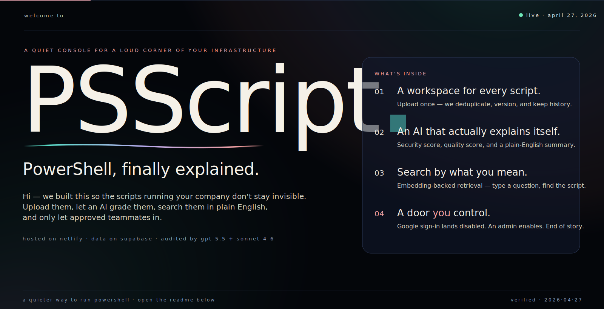
  </a>
</p>

<p align="center">
  
  &nbsp;
  
  &nbsp;
  
  &nbsp;
  
  &nbsp;
  
</p>

<p align="center">
  <sub>
    <a href="#hi">Hi</a> &nbsp;·&nbsp;
    <a href="#the-story">Story</a> &nbsp;·&nbsp;
    <a href="#whats-actually-inside">What's inside</a> &nbsp;·&nbsp;
    <a href="#what-happens-when-you-upload-a-script">Walkthrough</a> &nbsp;·&nbsp;
    <a href="#the-door">The door</a> &nbsp;·&nbsp;
    <a href="#how-its-wired">Wiring</a> &nbsp;·&nbsp;
    <a href="#the-brains">Brains</a> &nbsp;·&nbsp;
    <a href="#what-it-looks-like">Screens</a> &nbsp;·&nbsp;
    <a href="#run-it-yourself">Run it</a> &nbsp;·&nbsp;
    <a href="#did-it-work">Verify</a> &nbsp;·&nbsp;
    <a href="#common-questions">FAQ</a> &nbsp;·&nbsp;
    <a href="#read-more">More</a>
  </sub>
</p>

---

## Hi.

We made PSScript so the PowerShell scripts running your company stop being invisible.

That's the whole pitch. The rest of this README explains *why* it matters, *what's in the box*, and *what happens* when you actually use it. Read top-to-bottom, or jump to a section.

---

## The story.

It's Tuesday morning. Somewhere, a script you've never seen is creating accounts, moving mailboxes, restarting a service, or quietly emptying a folder you'd rather it didn't. Maybe it was written in 2019 by a contractor who left in 2021. Maybe it was forked into `cleanup_v3_DO_NOT_DELETE.ps1` six months ago because nobody felt confident enough to edit the original. Maybe it lives on a share drive with its three slightly-different cousins.

If you're an IT lead, a security engineer, or the person who gets paged when something breaks, you know exactly which scripts we're talking about. You know they exist. You don't know what's in them. You don't know who wrote them. You don't know who can run them. And you definitely don't know which of them are quietly logging credentials, hardcoding tokens, or assuming a permission level nobody granted.

**That's the gap PSScript closes.** Every script lands in one workspace. Every script gets read by an AI that grades it for security and quality, explains what it does in plain English, and points out what to fix. Every script is searchable by *meaning*, not just keywords. And — crucially — none of this is visible to anyone an administrator hasn't explicitly let in.

It's a small thing in a way. We're not trying to replace your shell or rewrite PowerShell. We just thought it was strange that the most-trusted automation language on the planet had no central, governed home. So we made one.

---

## What's actually inside.

<p align="center">
  <a href="./docs/graphics/capabilities-aurora.svg">
    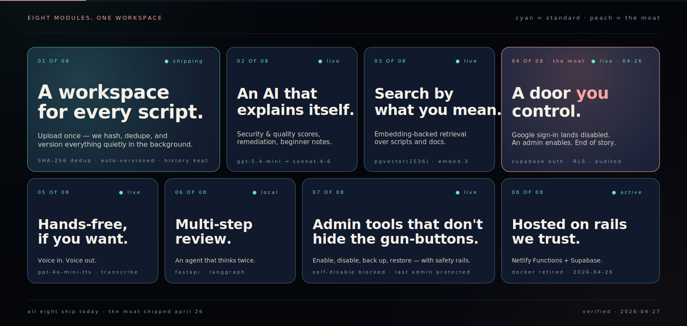
  </a>
</p>

Eight modules. The teal tiles are the standard product surface. The peach tile is the moat — it's why we exist as a hosted product, and it's why your data stays your data.

Briefly, in the order people usually meet them:

- **A workspace for every script.** Drop a `.ps1` in. We hash it (SHA-256), check if we've seen it before, **version it under the existing record** if we have (the new `script_versions` row links back to the original), welcome it if we haven't. History is kept. Nothing gets lost.
- **An AI that grades against a rubric.** A frontier model reads each script and returns a structured **analysis criteria v2026-04-26** payload — security score, quality score, a beginner-friendly summary, a management summary, command-by-command details, **prioritized findings** (each tagged `critical` / `high` / `medium` / `low`), a **remediation plan**, and **test recommendations**. The criteria version and a model confidence number ride along so reviewers can see exactly what they're looking at. We use `gpt-5.4-mini` as the structured-analysis primary, fall back to `claude-sonnet-4-6` text parsed back into JSON, and — if both providers fail or return malformed output — fall back to a deterministic static analyzer that produces the same shape.
- **Search by what you mean.** We embed every script with `text-embedding-3-small` and store the vectors in Postgres via `pgvector(1536)`. Hosted search now combines `websearch_to_tsquery` full-text scoring with an `ILIKE` fallback, paginated and ownership-checked, so you can search for *"the script that rotates the service-account password"* instead of remembering whether someone called it `rotate-svc-pwd.ps1` or `pwd_cycle_FINAL2.ps1`.
- **A door you control.** Google sign-in works — but new identities arrive **disabled**. An admin has to enable them. There is no other way in. (The sub-section below walks through this in detail. It's the most important thing on the page.)
- **Hands-free, if you want.** Voice in (`gpt-4o-mini-transcribe`), voice out (`gpt-4o-mini-tts`). Useful when you're at a whiteboard, not so useful in a quiet office. Optional.
- **Multi-step review, when one pass isn't enough.** A FastAPI + LangGraph agent that thinks twice for higher-stakes scripts. Local-only for now.
- **Admin tools that don't hide the gun-buttons.** User management, enable/disable, categories, settings, backup, restore. With safety rails: you can't disable yourself, and you can't remove the last enabled admin.
- **Hosted on rails we trust.** Netlify Functions for the API, Supabase for everything stateful. Docker has been retired from the active path — see *retired/docker/* if you want the history.

---

## What happens when you upload a script.

Most READMEs list features. We thought it'd be more useful to walk you through what actually happens — from the moment you drop a `.ps1` in, to the moment you see scores on screen.

<p align="center">
  <a href="./docs/graphics/journey-aurora.svg">
    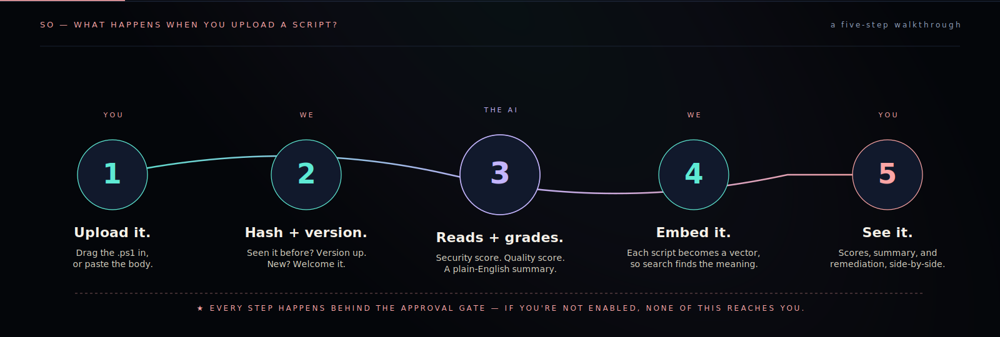
  </a>
</p>

**1. You upload it.** Drag a `.ps1` in, paste the body, or push a batch via the API. The frontend hands it to `/api/scripts` with your bearer token.

**2. We make sure you're allowed to be here.** The hosted API checks two things: (a) your Supabase JWT is valid, and (b) your `app_profiles` row has `is_enabled = true`. If either fails you get `403 account_pending_approval` and nothing else happens. (More on that below.)

**3. We hash it.** SHA-256, server-side. If we've seen this exact script body before, we don't duplicate — we bump the version counter and write a new `script_versions` row under the existing record (with `ON CONFLICT DO NOTHING`, so concurrent uploads don't fight). If it's new, we welcome it as a fresh script.

**4. The AI reads it against a rubric.** We send the script body to the configured model (`gpt-5.4-mini` by default for structured analysis) with a prompt anchored to **analysis criteria v2026-04-26**. The response must include `criteria_version`, `confidence`, security/quality scores, a beginner explanation, a management summary, command-level details, an execution summary, prioritized findings, a remediation plan, and test recommendations. If OpenAI is down or the JSON won't parse, we fall back to `claude-sonnet-4-6` and re-parse the text. If *that* fails too, `shouldUseStaticAnalysisFallback` flips on and a deterministic PowerShell static analyzer produces the same payload shape — a degraded answer is still a structured answer.

**5. We embed it for search.** A separate call to `text-embedding-3-small` produces a 1536-dimension vector. We upsert that into Supabase via `pgvector` so the next person searching for "the script that does X" finds it without remembering the filename. We also record per-call `ai_metrics` (prompt / completion / total tokens, estimated cost, provider, model, latency, success or failure) on a best-effort write — analytics never block a user request.

**6. You see the result.** The frontend renders scores side-by-side with the script source, the summary above the code, a dedicated **Criteria tab** showing the rubric version and confidence, prioritized findings as a triaged list, the remediation plan as a checklist, test recommendations beneath, and **version history** one click away on the script-detail page. From upload to visible: usually a couple of seconds.

> **One quiet thing worth noticing:** every step above happens *behind* the approval gate. If you weren't enabled by an admin, your upload is rejected at step 2 and the AI never sees your script. That's the whole point.

---

## The door.

<p align="center">
  <a href="./docs/graphics/google-oauth-approval-flow.svg">
    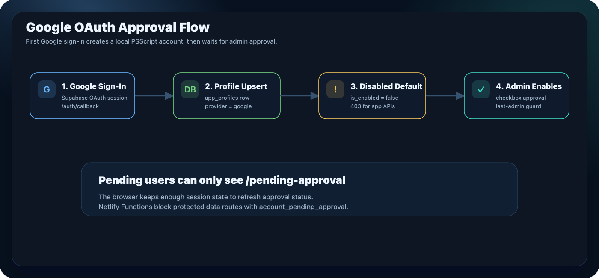
  </a>
</p>

If you only read one section of this README, read this one.

Most "Sign in with Google" implementations have a problem: anyone, anywhere, with any Google account, can complete the OAuth handshake. That's by design — Google is happy to vouch that you are who you say you are. But it doesn't say anything about whether *you* should have access to *this app*. Lots of apps just trust that handshake. We don't.

Here's how the door actually works:

- Password login and Google OAuth both go through **Supabase Auth** in the browser.
- The hosted API validates the bearer token against Supabase Auth on **every** request.
- The first time a user signs in, `/api/auth/me` creates an `app_profiles` row for them.
- New profiles default to `is_enabled = false`. Always. The only exception is the email listed in `DEFAULT_ADMIN_EMAIL` — that one comes up enabled so the system has a first administrator.
- Disabled users see exactly one thing: a `/pending-approval` page that says "ask your admin to enable you." Every protected API returns `403 account_pending_approval` for them.
- An admin enables a user by ticking a checkbox in **Settings → User Management**. That's it. No extra steps. No emails. No tokens.
- The backend will not let you disable your own admin account, and it will not let you remove the last enabled admin. We checked, you'll get an error and a polite explanation.
- The **first** administrator is no longer free for the taking. The default-admin bootstrap now requires `DEFAULT_ADMIN_EMAIL`, `DEFAULT_ADMIN_PASSWORD`, *and* a one-time `x-bootstrap-token` header that has to match `DEFAULT_ADMIN_BOOTSTRAP_TOKEN`. Forgetting any of the three returns a hard error and the bootstrap path stays closed.
- Underneath, Supabase **Row Level Security** policies check `current_app_profile_is_enabled()` — so even if an attacker bypassed the API somehow, the database itself wouldn't return rows to a disabled identity. The 2026-04-27 RLS migration also tightened search and similarity policies so vector lookups respect the same gate.

> **Heads up:** Google OAuth credentials and the Supabase redirect allow-list still need to be configured outside this repo. Google Cloud should redirect to Supabase Auth (`/auth/v1/callback`); Supabase should redirect back to this app (`/auth/callback`). The full setup is in [Netlify + Supabase Deployment](./docs/NETLIFY-SUPABASE-DEPLOYMENT.md).

---

## How it's wired.

<p align="center">
  <a href="./docs/graphics/architecture-aurora.svg">
    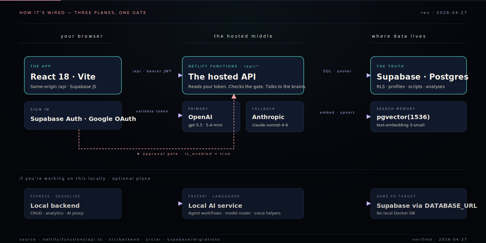
  </a>
</p>

We tried to keep this honest. It's three planes:

| Plane | Component | Stack | What it does |
| :--- | :--- | :--- | :--- |
| **Your browser** | React app          | React 18 · Vite · TypeScript · Tailwind                            | Renders the app. Talks to `/api`. Holds the OAuth callback.              |
| **Hosted middle** | Netlify Functions  | TypeScript · `@netlify/functions` · `pg` · OpenAI / Anthropic SDKs | Reads your token. Checks the gate. Talks to the brains. Talks to Supabase. |
| **Where data lives** | Supabase           | Auth · Postgres · pgvector                                         | Identity. Profiles. Scripts. Analyses. Embeddings. The truth.            |
| **(Local dev only)** | Express backend    | Node · Express · Sequelize                                         | A second backend you can run locally for development.                    |
| **(Local dev only)** | FastAPI service    | Python · LangGraph · OpenAI · Anthropic                            | The agent runtime — multi-step review, model routing, voice helpers.     |

The local-dev plane is optional. You don't need either of those services to use PSScript in production — they exist so people working on the codebase have something to iterate against.

> **A mental model that helps:** *Your browser asks. The middle decides. The truth lives in Supabase.* Everything else is a flavor of those three things.

---

## The brains.

The defaults below reflect the **state of this repo on April 28, 2026**. Provider model availability moves around — by account, by region, by week — so we keep model IDs overrideable through environment variables. If you upgrade or change a provider, update one env var and you're done.

| What it's for | We default to | We fall back to | Where to look |
| :--- | :--- | :--- | :--- |
| Hosted text / chat              | `gpt-5.5`                   | `claude-sonnet-4-6`                          | `netlify/functions/api.ts`           |
| Hosted structured analysis      | `gpt-5.4-mini`              | Anthropic text fallback (parsed as JSON)     | `netlify/functions/api.ts`           |
| Hosted embeddings               | `text-embedding-3-small`    | 1536 dim, matches `vector(1536)`             | `netlify/functions/api.ts`, migrations |
| Voice — speak                   | `gpt-4o-mini-tts`           | voice defaults to `marin`                    | `netlify/functions/api.ts`           |
| Voice — listen                  | `gpt-4o-mini-transcribe`    | `gpt-4o-transcribe-diarize`                  | `netlify/functions/api.ts`           |
| Local AI service                | Router-controlled OpenAI / Anthropic | Configurable in `src/ai/config.py`  | `src/ai/`                            |

We re-checked the upstream model docs while writing this:

- OpenAI &middot; <https://platform.openai.com/docs/models>
- Anthropic &middot; <https://docs.anthropic.com/en/docs/about-claude/models>
- Supabase Google Auth &middot; <https://supabase.com/docs/guides/auth/social-login/auth-google>
- Netlify Functions &middot; <https://docs.netlify.com/functions/overview/>

---

## What it looks like.

A small four-up — the door, the workspace it protects, the analysis that justifies the door, and the admin tool that operates it. The full capture set is in the collapsible block below.

<table>
  <tr>
    <td width="50%" valign="top">
      <a href="./docs/screenshots/login.png">
        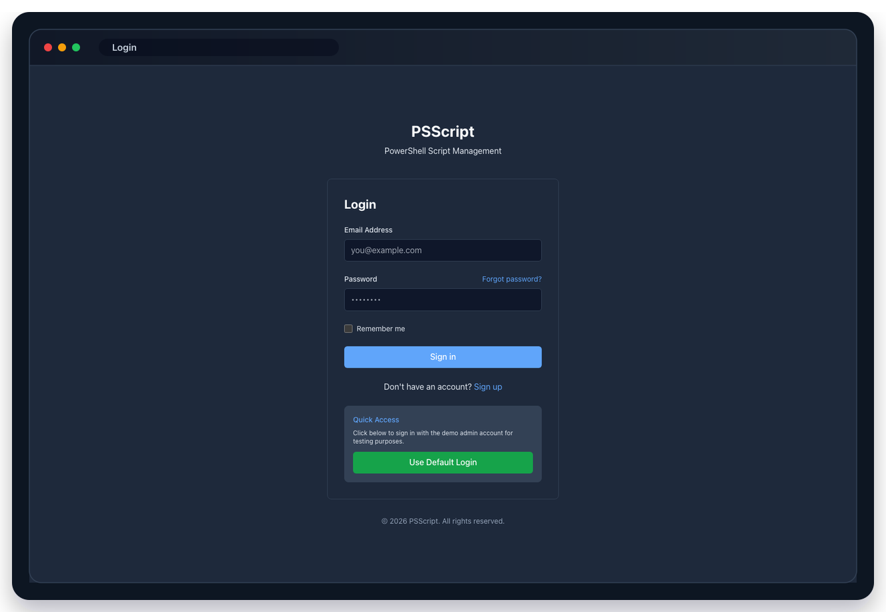
      </a>
      <br/>
      <sub><strong>The door.</strong> Password and Google OAuth, both via Supabase.</sub>
    </td>
    <td width="50%" valign="top">
      <a href="./docs/screenshots/scripts.png">
        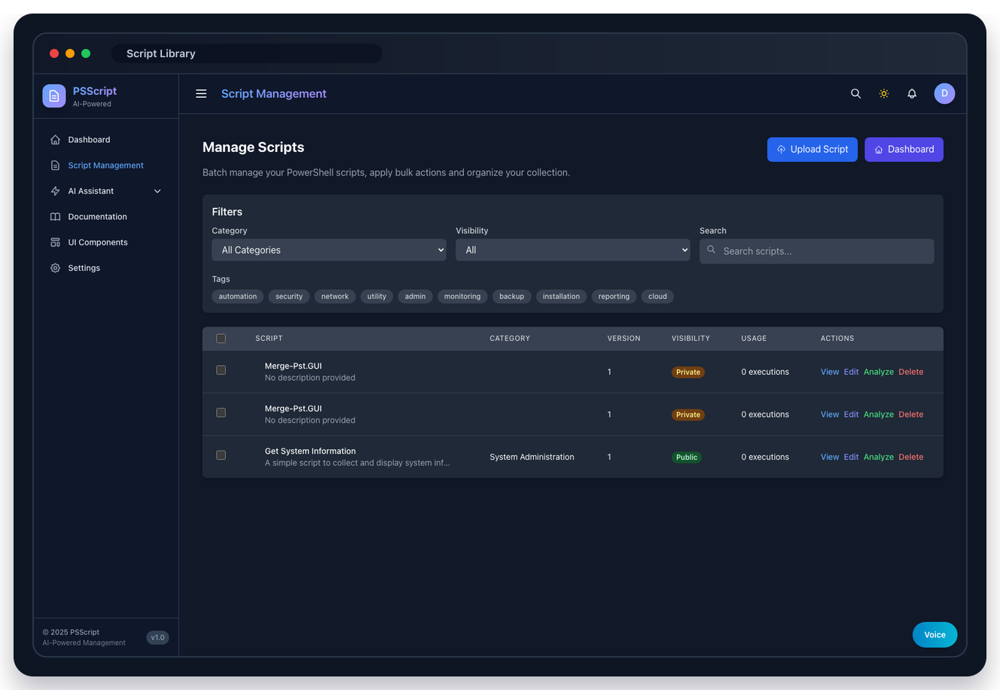
      </a>
      <br/>
      <sub><strong>The workspace.</strong> Browse, filter, analyze, export.</sub>
    </td>
  </tr>
  <tr>
    <td width="50%" valign="top">
      <a href="./docs/screenshots/analysis.png">
        
      </a>
      <br/>
      <sub><strong>The analysis.</strong> Security + quality, with remediation.</sub>
    </td>
    <td width="50%" valign="top">
      <a href="./docs/screenshots/data-maintenance.png">
        
      </a>
      <br/>
      <sub><strong>The admin desk.</strong> Backup, restore, cleanup, approval.</sub>
    </td>
  </tr>
</table>

<details>
<summary><strong>The rest of the captures</strong> &nbsp;<sub>· dashboard · upload · script detail · documentation · chat · agentic assistant · agent orchestration · analytics · UI components · settings · pending approval</sub></summary>
<br/>

<table>
  <tr>
    <td width="50%" valign="top">
      <a href="./docs/screenshots/dashboard.png">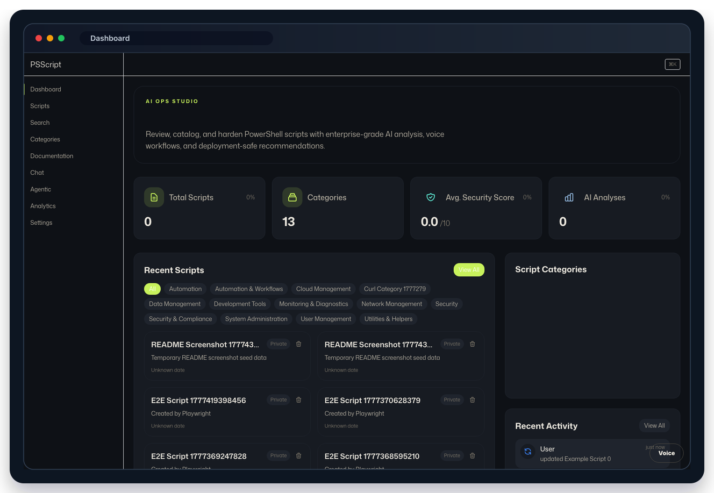</a>
      <br/><sub><strong>Dashboard.</strong> Health, activity, AI usage at a glance.</sub>
    </td>
    <td width="50%" valign="top">
      <a href="./docs/screenshots/pending-approval.png">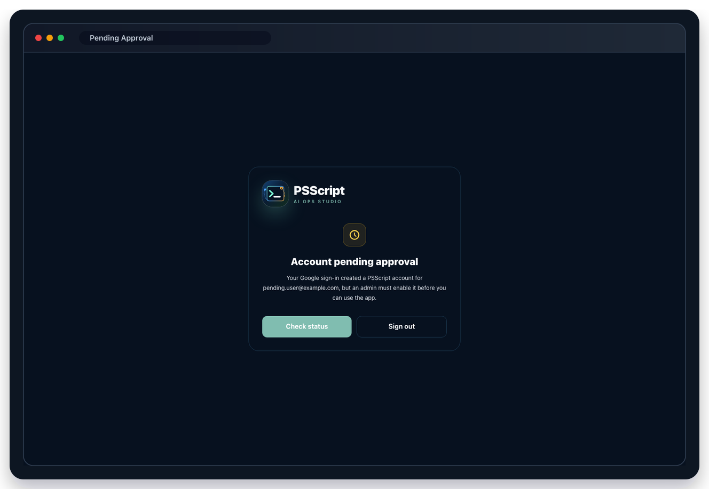</a>
      <br/><sub><strong>Pending approval.</strong> What a not-yet-enabled user sees.</sub>
    </td>
  </tr>
  <tr>
    <td width="50%" valign="top">
      <a href="./docs/screenshots/upload.png">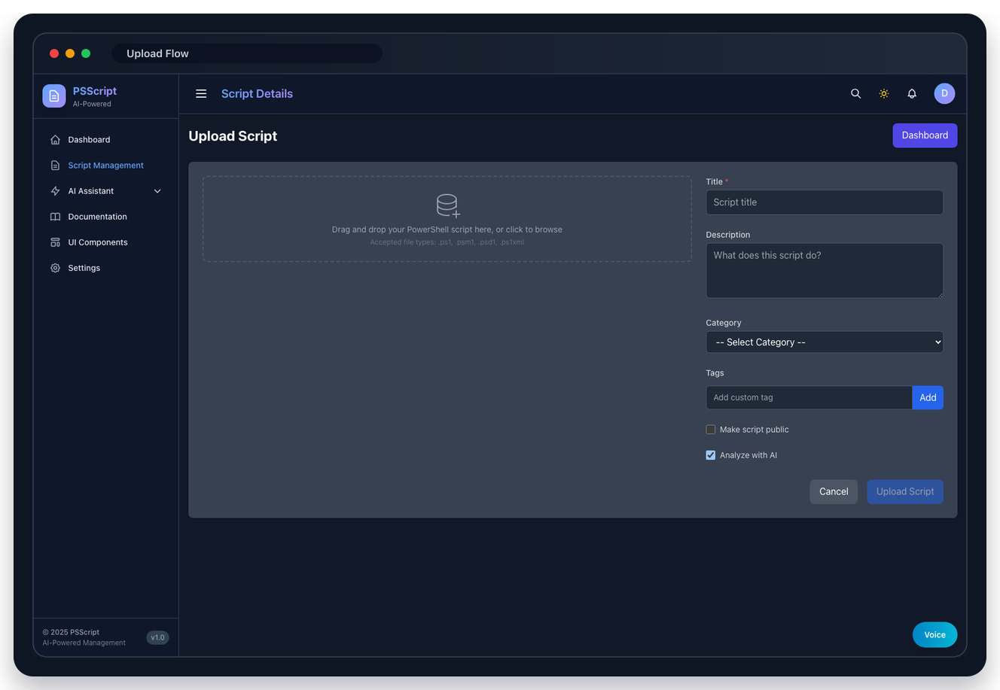</a>
      <br/><sub><strong>Upload.</strong> Script intake with metadata and preview.</sub>
    </td>
    <td width="50%" valign="top">
      <a href="./docs/screenshots/script-detail.png">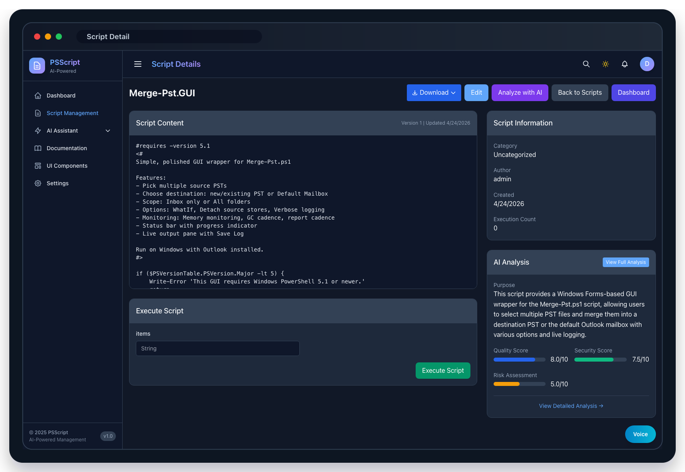</a>
      <br/><sub><strong>Script detail.</strong> Version history alongside the source.</sub>
    </td>
  </tr>
  <tr>
    <td width="50%" valign="top">
      <a href="./docs/screenshots/documentation.png">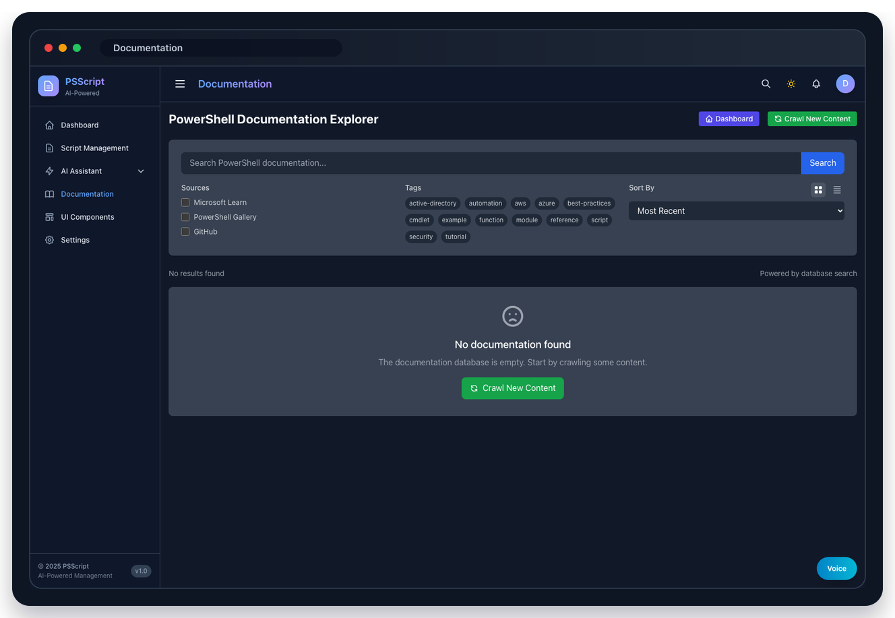</a>
      <br/><sub><strong>Documentation.</strong> PowerShell docs explorer and crawl tools.</sub>
    </td>
    <td width="50%" valign="top">
      <a href="./docs/screenshots/chat.png">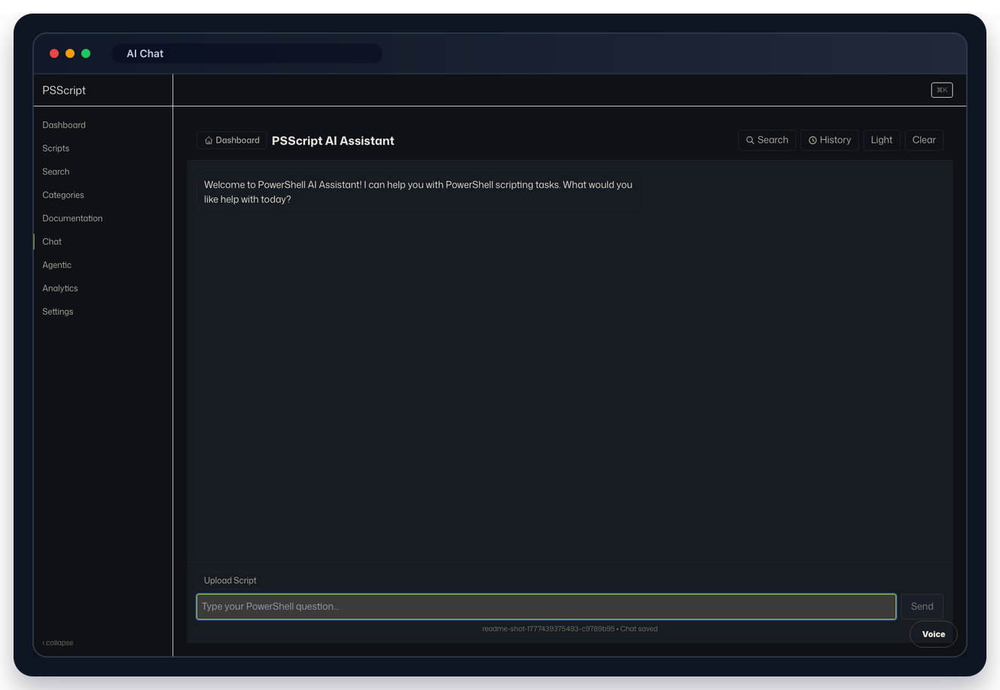</a>
      <br/><sub><strong>Chat.</strong> A conversational PowerShell assistant.</sub>
    </td>
  </tr>
  <tr>
    <td width="50%" valign="top">
      <a href="./docs/screenshots/agentic-assistant.png">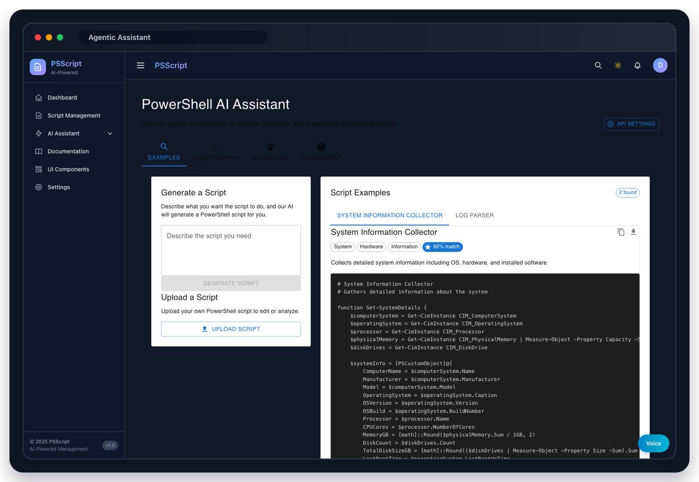</a>
      <br/><sub><strong>Agentic assistant.</strong> Multi-step review workspace.</sub>
    </td>
    <td width="50%" valign="top">
      <a href="./docs/screenshots/agent-orchestration.png">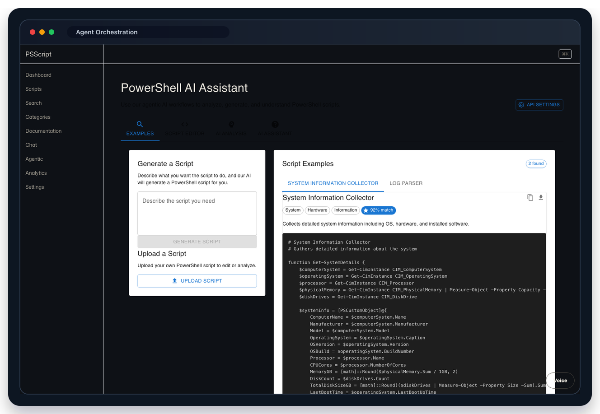</a>
      <br/><sub><strong>Agent orchestration.</strong> Workflow controls.</sub>
    </td>
  </tr>
  <tr>
    <td width="50%" valign="top">
      <a href="./docs/screenshots/analytics.png">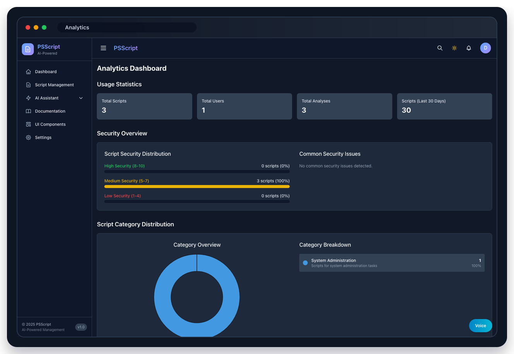</a>
      <br/><sub><strong>Analytics.</strong> Usage metrics and reporting.</sub>
    </td>
    <td width="50%" valign="top">
      <a href="./docs/screenshots/ui-components.png">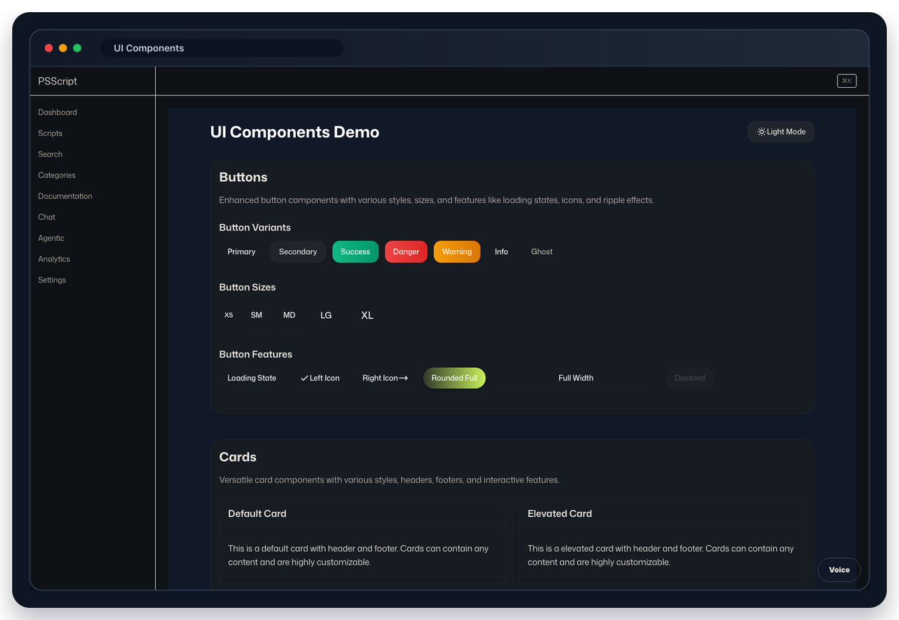</a>
      <br/><sub><strong>UI components.</strong> The shell and component styling.</sub>
    </td>
  </tr>
  <tr>
    <td colspan="2" valign="top">
      <a href="./docs/screenshots/settings-profile.png">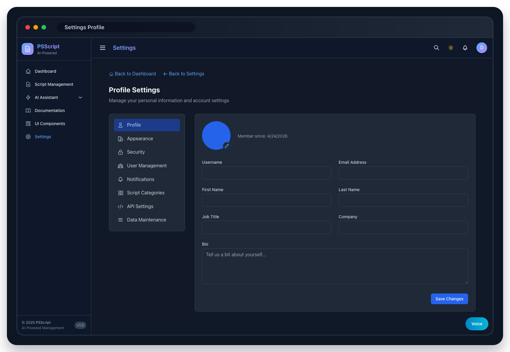</a>
      <br/><sub><strong>Settings profile.</strong> Profile and account configuration.</sub>
    </td>
  </tr>
</table>

</details>

---

## Run it yourself.

If you want to bring this up locally or push it to your own Netlify + Supabase, here's the short version. The long version is in [Setup Guide With Screenshots](./docs/SETUP-WITH-SCREENSHOTS.md), [Getting Started](./docs/GETTING-STARTED.md), and [Netlify + Supabase Deployment](./docs/NETLIFY-SUPABASE-DEPLOYMENT.md).

### You'll need

- **Node.js 20+** and **Python 3.10+**.
- A **Supabase project** with the migrations in `supabase/migrations/` applied (filename order matters; the list is below).
- A **Supabase pooler `DATABASE_URL`**.
- An **OpenAI** key, an **Anthropic** key, or both. The hosted path uses OpenAI primary with Anthropic fallback by default, so having both is ideal.

### Install

```bash
npm install
npm install --prefix src/frontend
npm install --prefix src/backend
python -m pip install -r src/ai/requirements.txt
```

### Set the environment

These go in `.env` for local development and in **Netlify environment variables** for hosted deploys. *Never* expose `SUPABASE_SERVICE_ROLE_KEY`, `DATABASE_URL`, or any provider key to the browser — those live server-side only.

```bash
DATABASE_URL=postgresql://...supabase pooler URL...
DB_PROFILE=supabase
DB_SSL=true
DB_SSL_REJECT_UNAUTHORIZED=true
SUPABASE_URL=https://your-project.supabase.co
SUPABASE_ANON_KEY=...
SUPABASE_SERVICE_ROLE_KEY=...
DEFAULT_ADMIN_EMAIL=admin@example.com
DEFAULT_ADMIN_PASSWORD=change-me                # required since 2026-04-28
DEFAULT_ADMIN_BOOTSTRAP_TOKEN=change-me         # required; sent as x-bootstrap-token
VITE_SUPABASE_URL=https://your-project.supabase.co
VITE_SUPABASE_ANON_KEY=...
VITE_HOSTED_STATIC_ANALYSIS_ONLY=true
```

> The local Postgres fallback that used to be implicit was retired in the 2026-04-28 hardening — `DATABASE_URL` must point at Supabase (or a Supabase-compatible Postgres) for the hosted code path to come up.

### Apply the migrations (in order)

```text
supabase/migrations/20260424_hosted_schema.sql
supabase/migrations/20260425_scripts_file_hash_uniqueness.sql
supabase/migrations/20260425_user_management_schema_fixes.sql
supabase/migrations/20260426_supabase_advisor_fixes.sql
supabase/migrations/20260426_z_google_oauth_approval_gate.sql
supabase/migrations/20260427_hosted_search_similarity_rls_fixes.sql
```

### Run it locally

```bash
# AI service — only needed if you're testing local AI workflows
cd src/ai
python -m uvicorn main:app --host 0.0.0.0 --port 8000

# Backend API
cd src/backend
npm run dev

# Frontend
cd src/frontend
npm run dev
```

Open `https://127.0.0.1:3090` if you've set TLS cert env vars, or follow the URL the Vite dev server prints. (The first thing you'll see is the login screen — sign in with `DEFAULT_ADMIN_EMAIL` and you're in.)

### Run it hosted

```bash
npm run build:netlify
netlify dev
```

---

## Did it work?

Recent verification from this working tree:

```bash
# Frontend focused auth tests
cd src/frontend
npm run test:run -- --pool=threads --maxWorkers=1 \
  src/pages/__tests__/Login.test.tsx \
  src/contexts/__tests__/AuthContext.test.tsx

# Frontend production build
cd src/frontend
npm run build

# Netlify function TypeScript check
npx tsc --noEmit --target ES2020 --module commonjs \
  --moduleResolution node --esModuleInterop --skipLibCheck --types node \
  netlify/functions/api.ts \
  netlify/functions/_shared/auth.ts \
  netlify/functions/_shared/db.ts \
  netlify/functions/_shared/env.ts \
  netlify/functions/_shared/http.ts
```

| What we ran | How it went |
| :--- | :--- |
| Focused frontend auth tests        | <code>● 10 / 10 passed</code> |
| Frontend production build          | <code>● passed</code> &middot; `src/frontend/dist` regenerated |
| Netlify function TypeScript check  | <code>● passed</code> |
| README image framing               | <code>● regenerated</code> via `npm run screenshots:readme` |
| Login / pending screenshots        | <code>● recaptured</code> from the current frontend build |

<details>
<summary><strong>How to refresh the screenshots yourself</strong></summary>

```bash
# Capture app screenshots from a running app target
SCREENSHOT_BASE_URL=https://127.0.0.1:3090 \
SCREENSHOT_LOGIN_URL=http://127.0.0.1:3191 \
node scripts/capture-screenshots.js

# Generate README frames
npm run screenshots:readme

# Regenerate README graphics
node scripts/generate-readme-graphics.mjs
```

To capture the login and pending-approval screens specifically, bring the frontend up against your real Supabase project:

```bash
cd src/frontend
VITE_DISABLE_AUTH=false \
VITE_SUPABASE_URL=https://your-project.supabase.co \
VITE_SUPABASE_ANON_KEY=... \
npm run dev -- --host 127.0.0.1 --port 3191
```

</details>

---

## Common questions.

A few things people tend to ask when they first see this — paraphrased and answered honestly.

<details>
<summary><strong>"Wait, isn't this just a fancy file browser for `.ps1` files?"</strong></summary>
<br/>
The file browser is the easy part. The hard part — the part that took us months — is the governance layer: SHA-256 dedup, version history, semantic search across embeddings, and an approval gate that defaults to <em>off</em>. Without those, you have a nicer share drive. With them, you have a console you can hand to a security review and not lose sleep.
</details>

<details>
<summary><strong>"Why Google OAuth specifically? Why not SAML / Azure AD / Okta?"</strong></summary>
<br/>
Google OAuth is the path that's shipping today, because Supabase Auth supports it natively and most of our early users already use Google Workspace. SAML and Microsoft Entra are on the roadmap but not in this build. If you need them now, the architecture supports them — Supabase Auth has the providers; we just haven't enabled them in the UI yet.
</details>

<details>
<summary><strong>"What stops the AI from leaking my scripts?"</strong></summary>
<br/>
Two things. First, requests to OpenAI and Anthropic respect each provider's data-handling commitments — see their model docs (linked above) for current details on training and retention. Second, you can override the model IDs and provider entirely through environment variables, so if you have a private deployment of either provider (Azure OpenAI, Anthropic on Bedrock, etc.), point us at that. The hosted defaults are sensible; they're not the only option.
</details>

<details>
<summary><strong>"Why retire Docker?"</strong></summary>
<br/>
Because we were maintaining two production paths and only shipping on one of them. The Netlify + Supabase path covers all current production needs, the Docker assets had drifted out of date, and the cost of keeping two paths green was no longer worth it. The old runtime files are preserved under <code>retired/docker/</code> for reference — they're not deleted, just no longer in the active build.
</details>

<details>
<summary><strong>"How does this compare to PSScriptAnalyzer?"</strong></summary>
<br/>
PSScriptAnalyzer is a static-analysis linter. We use it conceptually as one of several inputs — and you can keep using it standalone. PSScript is a workspace and governance layer on top: identity, versioning, AI-graded review, semantic search, and admin controls. Different tools, complementary jobs.
</details>

<details>
<summary><strong>"Can a non-admin do anything destructive?"</strong></summary>
<br/>
Not in the hosted path, no. Non-admin users can upload, view, search, and run AI analysis on scripts they're allowed to see. They cannot enable other users, cannot disable existing users, cannot delete other users' data, cannot edit categories, and cannot run data-maintenance backups or restores. The Settings → User Management surface is admin-only and the backend enforces it.
</details>

---

## Read more.

| Document | What's in it |
| :--- | :--- |
| [Getting Started](./docs/GETTING-STARTED.md)                                 | Local bootstrap and first-run notes                                          |
| [Setup Guide With Screenshots](./docs/SETUP-WITH-SCREENSHOTS.md)             | Full component setup — Supabase, Netlify, local services, screenshots, validation |
| [Netlify + Supabase Deployment](./docs/NETLIFY-SUPABASE-DEPLOYMENT.md)       | The real hosted path — env vars, Google OAuth, redirect setup                |
| [Repository Organization](./docs/REPOSITORY-ORGANIZATION.md)                 | Repo layout and docs taxonomy                                                |
| [Browser Use QA](./BROWSER_USE_QA.md)                                        | Browser test matrix and validation history                                   |
| [Data Maintenance](./docs/DATA-MAINTENANCE.md)                               | Admin backup, restore, cleanup                                               |
| [Voice API](./docs/README-VOICE-API.md)                                      | Voice / listening implementation                                             |
| [Deployment Platforms](./docs/DEPLOYMENT-PLATFORMS.md)                       | Alternatives and legacy split-service notes                                  |
| [Project Review · 2026-04-01](./docs/PROJECT-REVIEW-2026-04-01.md)           | April 2026 comprehensive review                                              |
| [AI Functions Review · 2026-04-02](./docs/AI-FUNCTIONS-REVIEW-2026-04-02.md) | AI audit and model migration notes                                           |
| [AI Analysis Criteria · 2026-04-26](./docs/AI-ANALYSIS-CRITERIA-2026-04-26.md) | The graded rubric — weighted criteria, output shape, persistence strategy   |
| [AI Functions Review · 2026-04-27](./docs/AI-FUNCTIONS-REVIEW-2026-04-27.md) | Hosted-AI parity and hardening pass                                          |
| [Analytics Capture Plan · 2026-04-27](./docs/ANALYTICS-CAPTURE-PLAN-2026-04-27.md) | `ai_metrics` schema, processes, and rollout                              |
| [Supabase DB Review · 2026-04-27](./docs/SUPABASE-DB-REVIEW-2026-04-27.md)   | Database review covering search, similarity, and RLS                         |
| [Supabase DB Fix Implementation · 2026-04-27](./docs/SUPABASE-DB-FIX-IMPLEMENTATION-2026-04-27.md) | What landed in the 2026-04-27 RLS / search migration             |
| [Performance Test Design · 2026-04-27](./docs/PROJECT-PERFORMANCE-TEST-DESIGN-2026-04-27.md) | How we plan to load-test the hosted path                          |
| [Project Test Results · 2026-04-28](./docs/PROJECT-TEST-RESULTS-2026-04-28.md) | The latest pass — including criteria-payload validation                    |
| [Documentation Hub](./docs/index.md)                                         | Full docs index                                                              |

---

### Behind the curtain

<details>
<summary><strong>The approval gate, in detail</strong></summary>

- `app_profiles.is_enabled` gates hosted app access.
- Google-created profiles default to disabled.
- `/auth/me` may return disabled profile status so the pending page can render.
- All protected hosted APIs require an enabled profile.
- Admin user management can enable pending profiles.
- The backend blocks self-disable and last-enabled-admin removal.
- Supabase RLS policies check `current_app_profile_is_enabled()` for direct table access.

</details>

<details>
<summary><strong>Why local auth still exists alongside hosted</strong></summary>

- Hosted mode uses Supabase Auth sessions and Netlify Functions — that's the production path.
- Local Express auth still exists for local / non-hosted flows so contributors can iterate without spinning up Supabase.
- The current Google OAuth approval work intentionally targets hosted Supabase only.

</details>

<details>
<summary><strong>What "retired Docker" actually means</strong></summary>

The Docker configuration was retired from the active root project and moved under `retired/docker/`. Local validation should use Supabase Postgres through `DATABASE_URL`. We left the files in place rather than deleting them — they're not part of CI, but they're useful as a reference if anyone ever needs to reconstruct the old runtime.

</details>

<details>
<summary><strong>Project structure</strong></summary>

```text
psscript/
├── docs/                     # Current documentation, graphics, screenshots, exports, archive
│   ├── graphics/             # README diagrams and presentation graphics
│   └── screenshots/          # Source screenshots and framed README previews
├── netlify/functions/        # Hosted same-origin API functions
├── scripts/                  # Operational, validation, screenshot, image-generation helpers
├── src/
│   ├── backend/              # Local Express API
│   ├── frontend/             # React + Vite UI
│   └── ai/                   # FastAPI / LangGraph AI service
├── supabase/migrations/      # Hosted Supabase schema and RLS migrations
├── tests/e2e/                # Playwright E2E tests
└── retired/docker/           # Historical Docker runtime, no longer active
```

</details>

---

<!-- ── COLOPHON ──────────────────────────────────────────────────────── -->

<p align="center">
  <sub>
    <em>Colophon.</em> &nbsp;
    Display set in a soft serif stack — <code>GT Sectra Display</code>, <code>Tiempos Headline</code>, <code>Söhne Breit</code>.
    Body in a friendly sans — <code>Söhne</code>, <code>Geist</code>, <code>Aeonik</code>.
    Marginalia in <code>Berkeley Mono</code> &middot; <code>Geist Mono</code>.
    Palette: navy <code>#0E1525</code>, ivory <code>#F5F1E8</code>, aurora teal <code>#5EEAD4</code>, soft violet <code>#C4B5FD</code>, warm peach <code>#FCA5A5</code>.
  </sub>
</p>

<p align="center">
  <sub>Verified April 28, 2026 &nbsp;·&nbsp; Hosted on Netlify &nbsp;·&nbsp; Data on Supabase &nbsp;·&nbsp; Graded against analysis criteria v2026-04-26 &nbsp;·&nbsp; Audited by gpt-5.5 with sonnet-4-6 fallback &nbsp;·&nbsp; Made with care.</sub>
</p>
