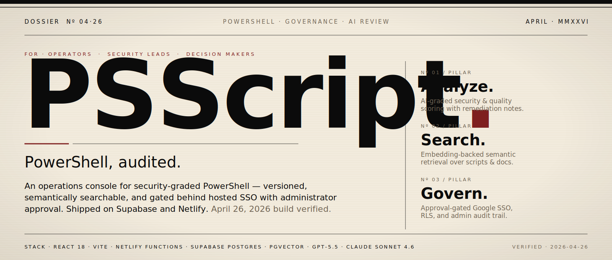
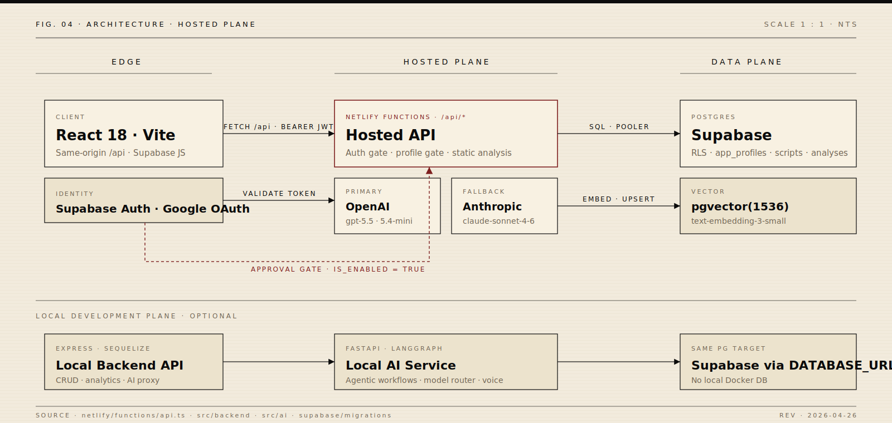

<!--
  README · Editorial dossier · April 2026
  -----------------------------------------------------------------
  Aesthetic: cream paper, ink black, oxblood accent. Heavy serif
  display, monospace marginalia, hairline rules. Numbered sections
  like a quarterly briefing. Designed for operators, security
  leads, and decision-makers — not for landing-page tourists.
  -----------------------------------------------------------------
-->

<p align="center">
  <a href="./docs/graphics/hero.svg">
    
  </a>
</p>

<!-- ── DATELINE STRIP ─────────────────────────────────────────────────── -->

<table align="center" width="100%">
  <tr>
    <td align="center" width="20%">
      <sub><code>STATUS</code></sub><br/>
      <strong>Build verified</strong><br/>
      <sub>2026 · 04 · 26</sub>
    </td>
    <td align="center" width="20%">
      <sub><code>RUNTIME</code></sub><br/>
      <strong>Hosted</strong><br/>
      <sub>Netlify · Supabase</sub>
    </td>
    <td align="center" width="20%">
      <sub><code>IDENTITY</code></sub><br/>
      <strong>Approval-gated SSO</strong><br/>
      <sub>Google OAuth · admin enable</sub>
    </td>
    <td align="center" width="20%">
      <sub><code>INTELLIGENCE</code></sub><br/>
      <strong>OpenAI &middot; Anthropic</strong><br/>
      <sub>gpt-5.5 · sonnet-4-6</sub>
    </td>
    <td align="center" width="20%">
      <sub><code>RETRIEVAL</code></sub><br/>
      <strong>pgvector(1536)</strong><br/>
      <sub>text-embedding-3-small</sub>
    </td>
  </tr>
</table>

<p align="center">
  <sub>
    <code>Nº 01</code> <a href="#nº-01--the-brief">Brief</a> &nbsp;·&nbsp;
    <code>Nº 02</code> <a href="#nº-02--the-wedge">Wedge</a> &nbsp;·&nbsp;
    <code>Nº 03</code> <a href="#nº-03--the-surface">Surface</a> &nbsp;·&nbsp;
    <code>Nº 04</code> <a href="#nº-04--the-architecture">Architecture</a> &nbsp;·&nbsp;
    <code>Nº 05</code> <a href="#nº-05--the-approval-gate">Approval Gate</a> &nbsp;·&nbsp;
    <code>Nº 06</code> <a href="#nº-06--the-stack--models">Stack &amp; Models</a> &nbsp;·&nbsp;
    <code>Nº 07</code> <a href="#nº-07--in-practice">In Practice</a> &nbsp;·&nbsp;
    <code>Nº 08</code> <a href="#nº-08--operate-it">Operate It</a> &nbsp;·&nbsp;
    <code>Nº 09</code> <a href="#nº-09--validation">Validation</a> &nbsp;·&nbsp;
    <code>Nº 10</code> <a href="#nº-10--reading-list">Reading List</a>
  </sub>
</p>

---

## Nº 01 — The Brief

> **PowerShell is the unsupervised mezzanine of enterprise IT.** It runs identity, mail flow, endpoints, cloud — and almost no organization can tell you who wrote which script, when, against which environment, with which permissions. PSScript is the operations console for that mezzanine.

PowerShell underwrites Microsoft 365, Azure, Intune, on-prem AD, MDM rollouts, and the long tail of internal automation. The scripts that hold those systems together are typically authored in a notepad, version-controlled by filename suffix, and reviewed — if at all — by a skim. Discovery happens during incidents.

PSScript replaces the share-drive-and-Slack workflow with a single workspace where every script is uploaded once (deduplicated by SHA-256), versioned automatically, graded for security and quality by a frontier LLM, indexed for semantic retrieval, and only available to identities an administrator has explicitly approved.

The current production direction is **Netlify + Supabase, hosted-first**. Local Docker has been retired. Hosted authentication uses Supabase Auth with a Google OAuth approval gate that defaults new identities to *disabled* and requires an enabled administrator to enable them.

---

## Nº 02 — The Wedge

|  | Before PSScript | With PSScript |
| :--- | :--- | :--- |
| **Storage** | Share drive, OneDrive, three forks of the same `cleanup.ps1` | Single workspace, SHA-256 dedup, automatic versioning |
| **Review** | Ad-hoc skim by whoever has time | LLM-graded security & quality scores with remediation guidance |
| **Discovery** | `Ctrl-F` across folders, hope someone remembers | Embedding-backed semantic search across scripts and docs |
| **Access** | Whoever has the link | Approval-gated Google SSO, RLS-enforced, self-disable blocked |
| **Audit** | "Who changed this?" — silence | Profiles, version history, admin actions, query metrics |
| **Onboarding** | Slack the senior engineer | Beginner explanation, management summary, AI chat for context |

The wedge isn't another script editor. It's the **governance surface** that finally makes a PowerShell estate inspectable without slowing the people who write the scripts.

---

## Nº 03 — The Surface

<table>
  <tr>
    <th align="left" width="22%"><code>CAPABILITY</code></th>
    <th align="left" width="58%">PROMISE</th>
    <th align="left" width="20%">STATUS</th>
  </tr>
  <tr>
    <td><strong>Script Workspace</strong></td>
    <td>Upload, browse, version, filter, inspect, and export PowerShell assets from one console.</td>
    <td><sub><code>● SHIPPING</code></sub></td>
  </tr>
  <tr>
    <td><strong>AI Analysis</strong></td>
    <td>Security score, quality score, beginner explanation, management summary, remediation notes.</td>
    <td><sub><code>● SHIPPING</code></sub></td>
  </tr>
  <tr>
    <td><strong>Agentic Workflows</strong></td>
    <td>Multi-step assistant and orchestration for deeper review, powered by FastAPI + LangGraph.</td>
    <td><sub><code>● SHIPPING (LOCAL)</code></sub></td>
  </tr>
  <tr>
    <td><strong>Semantic Search</strong></td>
    <td>Embedding-backed retrieval over scripts &amp; documentation via Supabase <code>vector(1536)</code>.</td>
    <td><sub><code>● SHIPPING</code></sub></td>
  </tr>
  <tr>
    <td><strong>Voice Copilot</strong></td>
    <td>Hands-free interaction via OpenAI speech-to-text and text-to-speech.</td>
    <td><sub><code>● SHIPPING</code></sub></td>
  </tr>
  <tr>
    <td><strong>Hosted Auth</strong></td>
    <td>Supabase password &amp; Google OAuth, with first-login profiles disabled until an admin approves.</td>
    <td><sub><code>● SHIPPING (2026-04-26)</code></sub></td>
  </tr>
  <tr>
    <td><strong>Admin Operations</strong></td>
    <td>User management, enable/pending status, categories, settings, data maintenance.</td>
    <td><sub><code>● SHIPPING</code></sub></td>
  </tr>
  <tr>
    <td><strong>Deployment</strong></td>
    <td>Netlify Functions + Supabase Postgres &amp; Auth — the hosted-first path.</td>
    <td><sub><code>● ACTIVE</code></sub></td>
  </tr>
</table>

---

## Nº 04 — The Architecture

<p align="center">
  <a href="./docs/graphics/architecture-editorial.svg">
    
  </a>
</p>

| Plane | Component | Stack | Role |
| :--- | :--- | :--- | :--- |
| **Edge** | React app | React 18 · Vite · TypeScript · Tailwind | App shell, OAuth callback, dashboard, scripts, AI pages, settings |
| **Hosted** | Netlify Functions | TypeScript · `@netlify/functions` · `pg` · OpenAI/Anthropic SDKs | Same-origin `/api/*`, Supabase token validation, profile gate, hosted analysis |
| **Data** | Supabase | Auth · Postgres · pgvector | Durable identity and app data for hosted v1 |
| **Local Dev** | Express backend | Node · Express · Sequelize | Local development API, CRUD, analytics, AI proxy |
| **Local Dev** | FastAPI service | Python · LangGraph · OpenAI · Anthropic | Agentic workflows, guardrails, model routing, voice helpers |

### Request Flow

```
upload  ─►  auth gate  ─►  payload &  ─►  Postgres &     ─►  AI provider  ─►  rendered scores,
            (Supabase     dedup check     pgvector              (primary →        explanations,
            JWT + profile  (SHA-256)      (scripts,             fallback)         remediation,
            enabled?)                     analyses,                                search results
                                          embeddings,
                                          metrics)
```

A user uploads a script. The hosted API validates auth, payload shape, permissions, and duplicate file hashes. Script metadata, versions, analyses, metrics, and embeddings persist to Postgres. AI providers return structured review output. The UI renders scores, explanations, remediation guidance, search results, and analytics.

---

## Nº 05 — The Approval Gate

<p align="center">
  <a href="./docs/graphics/google-oauth-approval-flow.svg">
    
  </a>
</p>

> **The default for a brand-new identity is *disabled*.** That is the entire point. Anyone the world over can complete a Google OAuth handshake; that does not entitle them to see your script estate.

The hosted auth path is intentionally gated, in layers:

- Password login and Google OAuth use Supabase Auth in the browser.
- The Netlify API validates bearer tokens against Supabase Auth on every request.
- `/api/auth/me` creates or updates the matching local `app_profiles` row.
- New Google profiles default to `is_enabled = false`, except `DEFAULT_ADMIN_EMAIL`.
- Disabled users can see `/pending-approval`; protected APIs return `403 account_pending_approval`.
- Admins enable users from **Settings → User Management** with the *Enabled* checkbox.
- The backend prevents disabling your own admin account, and prevents removing the last enabled admin.
- Supabase **Row Level Security** policies check `current_app_profile_is_enabled()` for direct table access — defense in depth.

Supabase dashboard setup is still required for Google OAuth credentials and redirect allow-list entries. See *[Netlify + Supabase Deployment](./docs/NETLIFY-SUPABASE-DEPLOYMENT.md)*.

---

## Nº 06 — The Stack &amp; Models

The defaults below reflect the **configured state of this repo as of April 26, 2026**. Provider model availability shifts by account and date, so production deploys keep model IDs overrideable through environment variables.

| Capability | Configured Default | Fallback / Variant | Repo Evidence |
| :--- | :--- | :--- | :--- |
| **Hosted text / chat** | `gpt-5.5` | `claude-sonnet-4-6` | `netlify/functions/api.ts` |
| **Hosted structured analysis** | `gpt-5.4-mini` | Anthropic text fallback with JSON parsing | `netlify/functions/api.ts` |
| **Hosted embeddings** | `text-embedding-3-small` | 1536-dim, matches Supabase `vector(1536)` | `netlify/functions/api.ts`, Supabase migrations |
| **Voice TTS** | `gpt-4o-mini-tts` | voice setting defaults to `marin` | `netlify/functions/api.ts` |
| **Voice STT** | `gpt-4o-mini-transcribe` | `gpt-4o-transcribe-diarize` | `netlify/functions/api.ts` |
| **Local AI service** | Router-controlled OpenAI / Anthropic | Configurable in `src/ai/config.py` | `src/ai/` |

References checked while preparing this dossier:

- OpenAI model docs &middot; <https://platform.openai.com/docs/models>
- Anthropic model docs &middot; <https://docs.anthropic.com/en/docs/about-claude/models>
- Supabase Google Auth &middot; <https://supabase.com/docs/guides/auth/social-login/auth-google>
- Netlify Functions docs &middot; <https://docs.netlify.com/functions/overview/>

---

## Nº 07 — In Practice

A curated four-up of the product surface — login, the workspace it protects, the analysis that justifies the approval gate, and the admin control that operates it. The full capture set is collapsed below.

<table>
  <tr>
    <td width="50%" valign="top">
      <a href="./docs/screenshots/login.png">
        
      </a>
      <br/>
      <sub><code>FIG. A</code> &nbsp; <strong>Login.</strong> Hosted auth — password and Google OAuth.</sub>
    </td>
    <td width="50%" valign="top">
      <a href="./docs/screenshots/scripts.png">
        
      </a>
      <br/>
      <sub><code>FIG. B</code> &nbsp; <strong>Workspace.</strong> Browse, filter, and analyze the estate.</sub>
    </td>
  </tr>
  <tr>
    <td width="50%" valign="top">
      <a href="./docs/screenshots/analysis.png">
        
      </a>
      <br/>
      <sub><code>FIG. C</code> &nbsp; <strong>Analysis.</strong> Security + quality scoring with remediation.</sub>
    </td>
    <td width="50%" valign="top">
      <a href="./docs/screenshots/data-maintenance.png">
        
      </a>
      <br/>
      <sub><code>FIG. D</code> &nbsp; <strong>Admin.</strong> Backup, restore, cleanup, and approval.</sub>
    </td>
  </tr>
</table>

<details>
<summary><strong>Additional captures</strong> &nbsp;<sub>· dashboard · upload · script detail · documentation · chat · agentic assistant · agent orchestration · analytics · UI components · settings · pending approval</sub></summary>
<br/>

<table>
  <tr>
    <td width="50%" valign="top">
      <a href="./docs/screenshots/dashboard.png"></a>
      <br/><sub><strong>Dashboard.</strong> Health, activity, AI usage.</sub>
    </td>
    <td width="50%" valign="top">
      <a href="./docs/screenshots/pending-approval.png"></a>
      <br/><sub><strong>Pending Approval.</strong> First-login Google users wait for admin enablement.</sub>
    </td>
  </tr>
  <tr>
    <td width="50%" valign="top">
      <a href="./docs/screenshots/upload.png"></a>
      <br/><sub><strong>Upload.</strong> Script intake with metadata and preview.</sub>
    </td>
    <td width="50%" valign="top">
      <a href="./docs/screenshots/script-detail.png"></a>
      <br/><sub><strong>Script Detail.</strong> Version history and code view.</sub>
    </td>
  </tr>
  <tr>
    <td width="50%" valign="top">
      <a href="./docs/screenshots/documentation.png"></a>
      <br/><sub><strong>Documentation.</strong> PowerShell docs explorer and crawl tools.</sub>
    </td>
    <td width="50%" valign="top">
      <a href="./docs/screenshots/chat.png"></a>
      <br/><sub><strong>Chat with AI.</strong> Conversational PowerShell assistant.</sub>
    </td>
  </tr>
  <tr>
    <td width="50%" valign="top">
      <a href="./docs/screenshots/agentic-assistant.png"></a>
      <br/><sub><strong>Agentic Assistant.</strong> Multi-step AI workspace.</sub>
    </td>
    <td width="50%" valign="top">
      <a href="./docs/screenshots/agent-orchestration.png"></a>
      <br/><sub><strong>Agent Orchestration.</strong> Workflow controls.</sub>
    </td>
  </tr>
  <tr>
    <td width="50%" valign="top">
      <a href="./docs/screenshots/analytics.png"></a>
      <br/><sub><strong>Analytics.</strong> Usage metrics and reporting.</sub>
    </td>
    <td width="50%" valign="top">
      <a href="./docs/screenshots/ui-components.png"></a>
      <br/><sub><strong>UI Components.</strong> Current button, shell, and component styling.</sub>
    </td>
  </tr>
  <tr>
    <td colspan="2" valign="top">
      <a href="./docs/screenshots/settings-profile.png"></a>
      <br/><sub><strong>Settings Profile.</strong> Profile and account configuration.</sub>
    </td>
  </tr>
</table>

</details>

---

## Nº 08 — Operate It

### Prerequisites

- **Node.js** 20+ &middot; **Python** 3.10+
- **Supabase project** with the hosted migrations applied
- **Supabase pooler** `DATABASE_URL`
- **OpenAI** and / or **Anthropic** provider keys

### Install

```bash
npm install
npm install --prefix src/frontend
npm install --prefix src/backend
python -m pip install -r src/ai/requirements.txt
```

### Environment

Set in `.env` for local development and in **Netlify** for hosted deploys:

```bash
DATABASE_URL=postgresql://...supabase pooler URL...
DB_PROFILE=supabase
DB_SSL=true
DB_SSL_REJECT_UNAUTHORIZED=true
SUPABASE_URL=https://your-project.supabase.co
SUPABASE_ANON_KEY=...
SUPABASE_SERVICE_ROLE_KEY=...
DEFAULT_ADMIN_EMAIL=admin@example.com
VITE_SUPABASE_URL=https://your-project.supabase.co
VITE_SUPABASE_ANON_KEY=...
VITE_HOSTED_STATIC_ANALYSIS_ONLY=true
```

> **Never expose** `SUPABASE_SERVICE_ROLE_KEY`, `DATABASE_URL`, or provider API keys to the browser. Hosted secrets live in Netlify environment variables; local secrets live in `.env` and never in source.

Apply Supabase migrations in filename order:

```text
supabase/migrations/20260424_hosted_schema.sql
supabase/migrations/20260425_scripts_file_hash_uniqueness.sql
supabase/migrations/20260425_user_management_schema_fixes.sql
supabase/migrations/20260426_supabase_advisor_fixes.sql
supabase/migrations/20260426_z_google_oauth_approval_gate.sql
```

### Run Local Services

```bash
# AI service — optional unless testing local AI workflows
cd src/ai
python -m uvicorn main:app --host 0.0.0.0 --port 8000

# Backend API
cd src/backend
npm run dev

# Frontend
cd src/frontend
npm run dev
```

Open `https://127.0.0.1:3090` when TLS cert env vars are set, or the Vite URL printed by the frontend dev server.

### Hosted Mode

```bash
npm run build:netlify
netlify dev
```

---

## Nº 09 — Validation

Recent verification from this working tree:

```bash
# Frontend focused auth tests
cd src/frontend
npm run test:run -- --pool=threads --maxWorkers=1 \
  src/pages/__tests__/Login.test.tsx \
  src/contexts/__tests__/AuthContext.test.tsx

# Frontend production build
cd src/frontend
npm run build

# Netlify function TypeScript check
npx tsc --noEmit --target ES2020 --module commonjs \
  --moduleResolution node --esModuleInterop --skipLibCheck --types node \
  netlify/functions/api.ts \
  netlify/functions/_shared/auth.ts \
  netlify/functions/_shared/db.ts \
  netlify/functions/_shared/env.ts \
  netlify/functions/_shared/http.ts
```

| Check | Result |
| :--- | :--- |
| Focused frontend auth tests | <code>● 10 / 10 passed</code> |
| Frontend production build | <code>● passed</code> &middot; <code>src/frontend/dist</code> regenerated |
| Netlify function TypeScript check | <code>● passed</code> |
| README image framing | <code>● regenerated</code> via `npm run screenshots:readme` |
| Login / pending screenshots | <code>● recaptured</code> from current frontend build, 2026-04-26 |

<details>
<summary><strong>Screenshot refresh</strong></summary>

```bash
# Capture app screenshots from a running app target
SCREENSHOT_BASE_URL=https://127.0.0.1:3090 \
SCREENSHOT_LOGIN_URL=http://127.0.0.1:3191 \
node scripts/capture-screenshots.js

# Generate README frames
npm run screenshots:readme

# Regenerate README graphics
node scripts/generate-readme-graphics.mjs
```

The login and pending approval screenshots can be captured from a hosted-auth frontend with:

```bash
cd src/frontend
VITE_DISABLE_AUTH=false \
VITE_SUPABASE_URL=https://your-project.supabase.co \
VITE_SUPABASE_ANON_KEY=... \
npm run dev -- --host 127.0.0.1 --port 3191
```

</details>

---

## Nº 10 — Reading List

| Document | Purpose |
| :--- | :--- |
| [Getting Started](./docs/GETTING-STARTED.md) | Local bootstrap and first-run notes |
| [Netlify + Supabase Deployment](./docs/NETLIFY-SUPABASE-DEPLOYMENT.md) | Hosted production path, env vars, Google OAuth setup |
| [Repository Organization](./docs/REPOSITORY-ORGANIZATION.md) | Repo layout, docs taxonomy, cleanup notes |
| [Browser Use QA](./BROWSER_USE_QA.md) | Browser test matrix and validation history |
| [Data Maintenance](./docs/DATA-MAINTENANCE.md) | Admin backup, restore, cleanup |
| [Voice API](./docs/README-VOICE-API.md) | Voice / listening implementation |
| [Deployment Platforms](./docs/DEPLOYMENT-PLATFORMS.md) | Deployment alternatives and legacy split-service notes |
| [Project Review · 2026-04-01](./docs/PROJECT-REVIEW-2026-04-01.md) | April 2026 comprehensive review |
| [AI Functions Review · 2026-04-02](./docs/AI-FUNCTIONS-REVIEW-2026-04-02.md) | AI audit and model migration notes |
| [Documentation Hub](./docs/index.md) | Full docs index |

---

### Engineering Notes

<details>
<summary><strong>Hosted Google OAuth approval gate</strong></summary>

- `app_profiles.is_enabled` gates hosted app access.
- Google-created profiles default to disabled.
- `/auth/me` may return disabled profile status so the pending page can render.
- All protected hosted APIs require an enabled profile.
- Admin user management can enable pending profiles.
- The backend blocks self-disable and last-enabled-admin removal.
- Supabase RLS policies check `current_app_profile_is_enabled()` for direct table access.

</details>

<details>
<summary><strong>Local vs hosted auth</strong></summary>

- Hosted mode uses Supabase Auth sessions and Netlify Functions.
- Local Express auth still exists for local / non-hosted flows.
- The current Google OAuth work intentionally targets hosted Supabase only.

</details>

<details>
<summary><strong>Retired Docker runtime</strong></summary>

Docker configuration was retired from the active root project and moved under `retired/docker/`. Local validation should use Supabase Postgres through `DATABASE_URL`; do not reintroduce local Docker databases for the hosted path.

</details>

<details>
<summary><strong>Project structure</strong></summary>

```text
psscript/
├── docs/                     # Current documentation, graphics, screenshots, exports, archive
│   ├── graphics/             # README diagrams and presentation graphics
│   └── screenshots/          # Source screenshots and framed README previews
├── netlify/functions/        # Hosted same-origin API functions
├── scripts/                  # Operational, validation, screenshot, image-generation helpers
├── src/
│   ├── backend/              # Local Express API
│   ├── frontend/             # React + Vite UI
│   └── ai/                   # FastAPI / LangGraph AI service
├── supabase/migrations/      # Hosted Supabase schema and RLS migrations
├── tests/e2e/                # Playwright E2E tests
└── retired/docker/           # Historical Docker runtime, no longer active
```

</details>

---

<!-- ── COLOPHON ──────────────────────────────────────────────────────── -->

<p align="center">
  <sub>
    <code>COLOPHON</code> &nbsp;·&nbsp;
    Display set in a serif stack (Charter, Iowan Old Style, Source Serif).
    Marginalia in a monospace stack (JetBrains Mono, IBM Plex Mono).
    Palette: ink black <code>#0B0B0B</code>, paper cream <code>#F2EBDD</code>, oxblood <code>#7E1F1F</code>.
  </sub>
</p>

<p align="center">
  <sub>Verified 2026-04-26 &nbsp;·&nbsp; Hosted on Netlify &nbsp;·&nbsp; Data on Supabase &nbsp;·&nbsp; Audited by GPT-5.5 with Sonnet 4.6 fallback</sub>
</p>
