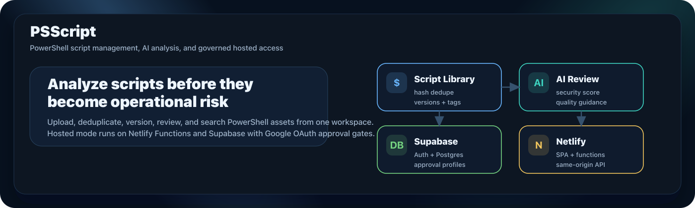
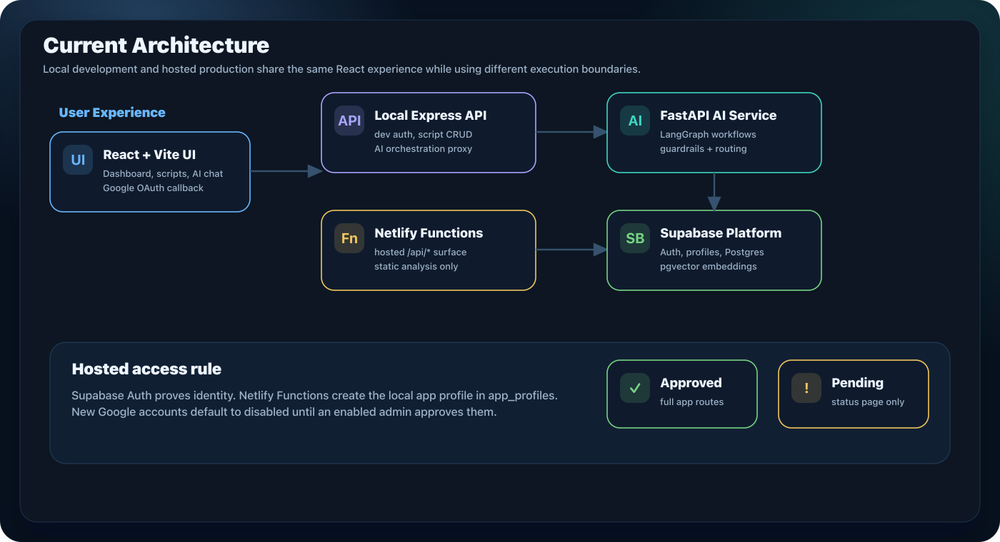
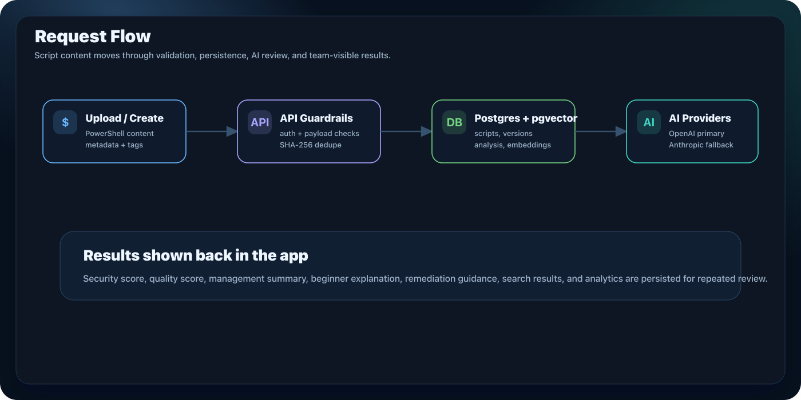

<p align="center">
  <a href="./docs/graphics/banner.png">
    
  </a>
</p>

<h1 align="center">PSScript</h1>

<p align="center">
  <strong>PowerShell script management, AI analysis, semantic search, and governed hosted access.</strong>
</p>

<p align="center">
  <strong>Current status:</strong> April 26, 2026 build verified · hosted Netlify/Supabase path active · Google OAuth approval gate implemented · Docker runtime retired
</p>

<p align="center">
  <a href="#quick-start">Quick Start</a> &bull;
  <a href="#features">Features</a> &bull;
  <a href="#architecture">Architecture</a> &bull;
  <a href="#hosted-auth">Hosted Auth</a> &bull;
  <a href="#screenshots">Screenshots</a> &bull;
  <a href="#validation">Validation</a> &bull;
  <a href="#documentation">Docs</a>
</p>

---

## Overview

PSScript is a full-stack workspace for teams that need to store, search, review, and govern PowerShell scripts. The app combines a React operations UI, script versioning, SHA-256 deduplication, AI-assisted security analysis, semantic search with pgvector, voice features, and admin controls.

The current production direction is **Netlify + Supabase**:

- Netlify serves the Vite frontend and same-origin `/api/*` Functions.
- Supabase Auth owns hosted user identity.
- Supabase Postgres stores app data, profiles, scripts, analysis, embeddings, and metrics.
- Google OAuth users get a local `app_profiles` account on first login, but remain disabled until an enabled admin approves them.

Local development now points at Supabase Postgres through `DATABASE_URL`. Docker assets were retired to [`retired/docker/`](./retired/docker/README.md) and are kept only for reference.

---

## Features

| Area | What It Does | Current State |
| --- | --- | --- |
| **Script Workspace** | Upload, browse, version, filter, inspect, and export PowerShell scripts. | Active in the React app and hosted API surface. |
| **AI Analysis** | Produces security score, quality score, beginner explanation, management summary, and remediation guidance. | OpenAI primary path with Anthropic fallback configuration. |
| **Agentic Workflows** | Supports multi-step assistant and orchestration workflows for script review. | Local AI service uses FastAPI and LangGraph. |
| **Semantic Search** | Stores embeddings for script/document search with pgvector. | Hosted Supabase schema uses `vector(1536)`. |
| **Voice Copilot** | Speech-to-text and text-to-speech support for hands-free interaction. | OpenAI Audio models configured. |
| **Hosted Auth** | Supabase password login plus Google OAuth with admin approval. | Implemented on April 26, 2026. |
| **Admin Operations** | User management, enabled/pending status, categories, settings, and data maintenance. | User Management now exposes the approval checkbox. |
| **Deployment** | Netlify Functions + Supabase Postgres/Auth for hosted v1. | Current active deployment path. |

---

## Architecture

<p align="center">
  <a href="./docs/graphics/architecture.png">
    
  </a>
</p>

| Runtime | Component | Stack | Current Role |
| --- | --- | --- | --- |
| **Frontend** | React app | React 18, Vite, TypeScript, TailwindCSS | Main app shell, hosted OAuth callback, dashboard, scripts, AI pages, and settings. |
| **Hosted API** | Netlify Functions | TypeScript, `@netlify/functions`, `pg`, OpenAI/Anthropic SDKs | Same-origin `/api/*`, Supabase Auth token validation, profile gate, hosted static analysis. |
| **Hosted Data** | Supabase | Auth, Postgres, pgvector | Durable identity and app data for hosted v1. |
| **Local API** | Express backend | Node, Express, Sequelize | Local development API, script CRUD, analytics, and AI orchestration proxy. |
| **Local AI** | FastAPI service | Python, LangGraph, OpenAI, Anthropic | Agentic workflows, guardrails, model routing, voice helpers. |

### Request Flow

<p align="center">
  <a href="./docs/graphics/request-flow.png">
    
  </a>
</p>

1. A user uploads or creates a PowerShell script.
2. The API validates auth, payload shape, permissions, and duplicate file hashes.
3. Script metadata, versions, analysis, metrics, and embeddings persist to Postgres.
4. AI providers return structured review output.
5. The UI renders scores, explanations, remediation guidance, search results, and analytics.

---

## Hosted Auth

<p align="center">
  <a href="./docs/graphics/google-oauth-approval-flow.png">
    
  </a>
</p>

Hosted auth is intentionally gated:

- Password login and Google OAuth use Supabase Auth in the browser.
- The Netlify API validates bearer tokens against Supabase Auth.
- `/api/auth/me` creates or updates the matching local `app_profiles` row.
- New Google profiles default to `is_enabled = false`, except the `DEFAULT_ADMIN_EMAIL`.
- Disabled users can see `/pending-approval`, but protected app APIs return `403 account_pending_approval`.
- Admins enable users from Settings > User Management with the Enabled checkbox.
- The backend prevents disabling your own admin account and prevents removing the last enabled admin.
- RLS defense-in-depth checks enabled profiles for direct table access.

Supabase dashboard setup is still required for Google OAuth credentials and redirect allow-list entries. See [Netlify + Supabase Deployment](./docs/NETLIFY-SUPABASE-DEPLOYMENT.md).

---

## AI Models

This table reflects the **configured defaults in this repo** as of April 26, 2026. Provider model availability can vary by account and date, so production deploys should keep model IDs overrideable through environment variables.

| Capability | Configured Default | Fallback / Variant | Repo Evidence |
| --- | --- | --- | --- |
| **Hosted text/chat** | `gpt-5.5` | `claude-sonnet-4-6` | `netlify/functions/api.ts` |
| **Hosted structured analysis** | `gpt-5.4-mini` | Anthropic text fallback with JSON parsing | `netlify/functions/api.ts` |
| **Hosted embeddings** | `text-embedding-3-small` | 1536 dimensions for Supabase `vector(1536)` | `netlify/functions/api.ts`, Supabase migrations |
| **Voice TTS** | `gpt-4o-mini-tts` | voice setting defaults to `marin` | `netlify/functions/api.ts` |
| **Voice STT** | `gpt-4o-mini-transcribe` | `gpt-4o-transcribe-diarize` | `netlify/functions/api.ts` |
| **Local AI service** | Router-controlled OpenAI/Anthropic models | Configurable in `src/ai/config.py` and router utilities | `src/ai/` |

References checked while refreshing this README:

- OpenAI model docs: https://platform.openai.com/docs/models
- Anthropic model docs: https://docs.anthropic.com/en/docs/about-claude/models
- Supabase Google Auth: https://supabase.com/docs/guides/auth/social-login/auth-google
- Netlify Functions docs: https://docs.netlify.com/functions/overview/

---

## Screenshots

Screenshots below are current README assets as of April 26, 2026. Login and pending approval were recaptured from the current hosted-auth frontend build. The other app-shell captures remain current April 26 app captures and were reframed for GitHub display with the updated README image pipeline. Click a preview to open the full source image.

<table>
  <tr>
    <td width="50%" valign="top">
      <a href="./docs/screenshots/login.png">
        
      </a>
      <br />
      <sub><strong>Login.</strong> Hosted auth login with Google OAuth.</sub>
    </td>
    <td width="50%" valign="top">
      <a href="./docs/screenshots/pending-approval.png">
        
      </a>
      <br />
      <sub><strong>Pending Approval.</strong> First-login Google users wait for admin enablement.</sub>
    </td>
  </tr>
  <tr>
    <td width="50%" valign="top">
      <a href="./docs/screenshots/dashboard.png">
        
      </a>
      <br />
      <sub><strong>Dashboard.</strong> Health, activity, and AI usage overview.</sub>
    </td>
    <td width="50%" valign="top">
      <a href="./docs/screenshots/scripts.png">
        
      </a>
      <br />
      <sub><strong>Scripts.</strong> Upload, browse, filter, and analyze scripts.</sub>
    </td>
  </tr>
  <tr>
    <td width="50%" valign="top">
      <a href="./docs/screenshots/upload.png">
        
      </a>
      <br />
      <sub><strong>Upload.</strong> Script intake with metadata and preview.</sub>
    </td>
    <td width="50%" valign="top">
      <a href="./docs/screenshots/analysis.png">
        
      </a>
      <br />
      <sub><strong>Script Analysis.</strong> AI-powered security and quality scoring.</sub>
    </td>
  </tr>
  <tr>
    <td width="50%" valign="top">
      <a href="./docs/screenshots/script-detail.png">
        
      </a>
      <br />
      <sub><strong>Script Detail.</strong> Version history and code view.</sub>
    </td>
    <td width="50%" valign="top">
      <a href="./docs/screenshots/documentation.png">
        
      </a>
      <br />
      <sub><strong>Documentation.</strong> PowerShell docs explorer and crawl tools.</sub>
    </td>
  </tr>
  <tr>
    <td width="50%" valign="top">
      <a href="./docs/screenshots/chat.png">
        
      </a>
      <br />
      <sub><strong>Chat with AI.</strong> Conversational PowerShell assistant.</sub>
    </td>
    <td width="50%" valign="top">
      <a href="./docs/screenshots/agentic-assistant.png">
        
      </a>
      <br />
      <sub><strong>Agentic Assistant.</strong> Multi-step AI assistant workspace.</sub>
    </td>
  </tr>
  <tr>
    <td width="50%" valign="top">
      <a href="./docs/screenshots/agent-orchestration.png">
        
      </a>
      <br />
      <sub><strong>Agent Orchestration.</strong> Workflow and orchestration controls.</sub>
    </td>
    <td width="50%" valign="top">
      <a href="./docs/screenshots/analytics.png">
        
      </a>
      <br />
      <sub><strong>Analytics.</strong> Usage metrics and reporting.</sub>
    </td>
  </tr>
  <tr>
    <td width="50%" valign="top">
      <a href="./docs/screenshots/ui-components.png">
        
      </a>
      <br />
      <sub><strong>UI Components.</strong> Current button, shell, and component styling.</sub>
    </td>
    <td width="50%" valign="top">
      <a href="./docs/screenshots/settings-profile.png">
        
      </a>
      <br />
      <sub><strong>Settings Profile.</strong> Profile and account configuration.</sub>
    </td>
  </tr>
  <tr>
    <td colspan="2" valign="top">
      <a href="./docs/screenshots/data-maintenance.png">
        
      </a>
      <br />
      <sub><strong>Data Maintenance.</strong> Admin backup, restore, and cleanup.</sub>
    </td>
  </tr>
</table>

---

## Quick Start

### Prerequisites

- Node.js 20+ recommended
- Python 3.10+
- Supabase project with the hosted migrations applied
- Supabase pooler `DATABASE_URL`
- OpenAI and/or Anthropic provider keys for AI features

### Install

```bash
npm install
npm install --prefix src/frontend
npm install --prefix src/backend
python -m pip install -r src/ai/requirements.txt
```

### Environment

Set these in `.env` for local development and in Netlify for hosted deploys:

```bash
DATABASE_URL=postgresql://...supabase pooler URL...
DB_PROFILE=supabase
DB_SSL=true
DB_SSL_REJECT_UNAUTHORIZED=true
SUPABASE_URL=https://your-project.supabase.co
SUPABASE_ANON_KEY=...
SUPABASE_SERVICE_ROLE_KEY=...
DEFAULT_ADMIN_EMAIL=admin@example.com
VITE_SUPABASE_URL=https://your-project.supabase.co
VITE_SUPABASE_ANON_KEY=...
VITE_HOSTED_STATIC_ANALYSIS_ONLY=true
```

Apply Supabase migrations in filename order:

```bash
supabase/migrations/20260424_hosted_schema.sql
supabase/migrations/20260425_scripts_file_hash_uniqueness.sql
supabase/migrations/20260425_user_management_schema_fixes.sql
supabase/migrations/20260426_supabase_advisor_fixes.sql
supabase/migrations/20260426_z_google_oauth_approval_gate.sql
```

### Run Local Services

```bash
# AI service, optional unless testing local AI workflows
cd src/ai
python -m uvicorn main:app --host 0.0.0.0 --port 8000

# Backend API
cd src/backend
npm run dev

# Frontend
cd src/frontend
npm run dev
```

Open `https://127.0.0.1:3090` when TLS cert env vars are set, or the Vite URL printed by the frontend dev server.

### Hosted Mode

```bash
npm run build:netlify
netlify dev
```

Use Netlify environment variables for Supabase keys, database URL, and AI provider keys. Do not expose `SUPABASE_SERVICE_ROLE_KEY`, `DATABASE_URL`, or provider API keys to the browser.

---

## Validation

Recent verification from this working tree:

```bash
# Frontend focused auth tests
cd src/frontend
npm run test:run -- --pool=threads --maxWorkers=1 src/pages/__tests__/Login.test.tsx src/contexts/__tests__/AuthContext.test.tsx

# Frontend production build
cd src/frontend
npm run build

# Netlify function TypeScript check
npx tsc --noEmit --target ES2020 --module commonjs --moduleResolution node --esModuleInterop --skipLibCheck --types node \
  netlify/functions/api.ts \
  netlify/functions/_shared/auth.ts \
  netlify/functions/_shared/db.ts \
  netlify/functions/_shared/env.ts \
  netlify/functions/_shared/http.ts
```

Latest results:

| Check | Result |
| --- | --- |
| Focused frontend auth tests | 10 tests passed |
| Frontend production build | Passed, `src/frontend/dist` regenerated |
| Netlify function TypeScript check | Passed |
| README image framing | Regenerated with `npm run screenshots:readme` |
| Login/pending screenshots | Recaptured from current frontend build on April 26, 2026 |

### Screenshot Refresh

```bash
# Capture app screenshots from a running app target
SCREENSHOT_BASE_URL=https://127.0.0.1:3090 \
SCREENSHOT_LOGIN_URL=http://127.0.0.1:3191 \
node scripts/capture-screenshots.js

# Generate README frames
npm run screenshots:readme

# Regenerate README graphics
node scripts/generate-readme-graphics.mjs
```

The login and pending approval screenshots can be captured from a hosted-auth frontend with:

```bash
cd src/frontend
VITE_DISABLE_AUTH=false \
VITE_SUPABASE_URL=https://your-project.supabase.co \
VITE_SUPABASE_ANON_KEY=... \
npm run dev -- --host 127.0.0.1 --port 3191
```

---

## Project Structure

```text
psscript/
├── docs/                     # Current documentation, graphics, screenshots, exports, archive
├── docs/graphics/            # README diagrams and presentation graphics
├── docs/screenshots/         # Source screenshots and framed README previews
├── netlify/functions/        # Hosted same-origin API functions
├── scripts/                  # Operational, validation, screenshot, and image-generation helpers
├── src/
│   ├── backend/              # Local Express API
│   ├── frontend/             # React + Vite UI
│   └── ai/                   # FastAPI/LangGraph AI service
├── supabase/migrations/      # Hosted Supabase schema and RLS migrations
├── tests/e2e/                # Playwright E2E tests
└── retired/docker/           # Historical Docker runtime assets, no longer active
```

---

## Engineering Notes

<details>
<summary><strong>Hosted Google OAuth Approval Gate</strong></summary>

- `app_profiles.is_enabled` gates hosted app access.
- Google-created profiles default to disabled.
- `/auth/me` may return disabled profile status so the pending page can render.
- All protected hosted APIs require an enabled profile.
- Admin user management can enable pending profiles.
- The backend blocks self-disable and last-enabled-admin removal.
- Supabase RLS policies now check `current_app_profile_is_enabled()` for direct table access.
</details>

<details>
<summary><strong>Local vs Hosted Auth</strong></summary>

- Hosted mode uses Supabase Auth sessions and Netlify Functions.
- Local Express auth still exists for local/non-hosted flows.
- The current requested Google OAuth work intentionally targets hosted Supabase only.
</details>

<details>
<summary><strong>Retired Docker Runtime</strong></summary>

Docker configuration was retired from the active root project and moved under `retired/docker/`. Current local validation should use Supabase Postgres through `DATABASE_URL`; do not reintroduce local Docker databases for the hosted path.
</details>

---

## Documentation

| Document | Purpose |
| --- | --- |
| [Getting Started](./docs/GETTING-STARTED.md) | Local bootstrap and first-run notes |
| [Netlify + Supabase Deployment](./docs/NETLIFY-SUPABASE-DEPLOYMENT.md) | Current hosted production path, env vars, and Google OAuth setup |
| [Repository Organization](./docs/REPOSITORY-ORGANIZATION.md) | Repo layout, docs taxonomy, and cleanup notes |
| [Browser Use QA](./BROWSER_USE_QA.md) | Browser test matrix and validation history |
| [Data Maintenance](./docs/DATA-MAINTENANCE.md) | Admin backup, restore, and cleanup |
| [Voice API](./docs/README-VOICE-API.md) | Voice/listening implementation |
| [Deployment Platforms](./docs/DEPLOYMENT-PLATFORMS.md) | Deployment alternatives and legacy split-service notes |
| [Project Review](./docs/PROJECT-REVIEW-2026-04-01.md) | April 2026 comprehensive review |
| [AI Functions Review](./docs/AI-FUNCTIONS-REVIEW-2026-04-02.md) | AI audit and model migration notes |
| [Documentation Hub](./docs/index.md) | Full docs index |

---

<p align="center">
  <sub>Last updated: April 26, 2026</sub>
</p>
