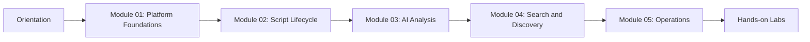

# PSScript Training Suite

AI-powered PowerShell operations training, packaged for onboarding, compliance, and day-2 operations. Built in the style of polished GitHub READMEs (à la Supabase/PostHog) but tailored to this platform.

## What you’ll learn (at a glance)

| Capability | What it teaches | Key screens/assets |
| --- | --- | --- |
| Script intake | Uploads, tagging, versioning, hash-based dedup |  |
| AI analysis | Security scoring, fix recommendations, audit notes |  |
| Discovery | Keyword + vector search, documentation explorer, crawl |  |
| AI copilots | Chat assistant, agentic workflows, history |  |
| Operations | Analytics, API usage, exports, training links |  |

## Feature tour (README-style checklist)

- [x] Script library with categories, owners, version history, and file-hash dedup
- [x] AI analysis pipeline (scorecards, recommendations, remediation notes)
- [x] Documentation explorer + crawler for command references and context storage
- [x] Chat/agent experiences for “how to fix” and “explain this script” prompts
- [x] Analytics dashboards for adoption, security posture, and training coverage
- [x] Export kit (HTML, PDF, DOCX) plus Playwright screenshot automation

## Architecture and flows


## Screenshot gallery

- Login + default access: 
- Dashboard with stats and activity: 
- Script detail with metadata: 
- Upload with live preview: 
- AI analysis + recommendations: 
- Documentation explorer: 
- Chat assistant: 
- Analytics + ops KPIs: 
- Settings with training links: 

## Audience and outcomes

| Audience | Goals | Outcome artifacts |
| --- | --- | --- |
| Script authors | Upload, categorize, analyze, and improve scripts | Curated script library with analysis reports |
| Security reviewers | Evaluate risk, audit findings, track fixes | Security scorecards and remediation notes |
| Platform admins | Operate services, manage users, tune data | Environment runbook and health checklist |

## Training roadmap




## Curriculum map

| Module | Description | Duration | File |
| --- | --- | --- | --- |
| Module 01 | Platform Foundations | 45 min | `modules/module-01-foundations.md` |
| Module 02 | Script Lifecycle | 60 min | `modules/module-02-lifecycle.md` |
| Module 03 | AI Analysis and Security | 75 min | `modules/module-03-analysis.md` |
| Module 04 | Search and Discovery | 45 min | `modules/module-04-search.md` |
| Module 05 | Operations and Governance | 60 min | `modules/module-05-operations.md` |

## Labs

| Lab | Goal | File |
| --- | --- | --- |
| Lab 01 | Upload and analyze a script | `labs/lab-01-upload-analyze.md` |
| Lab 02 | Vector search and similarity | `labs/lab-02-vector-search.md` |
| Lab 03 | Documentation and AI chat workflows | `labs/lab-03-docs-chat.md` |
| Lab 04 | Analytics and governance checks | `labs/lab-04-analytics.md` |
| Lab 05 | Settings and training resources | `TRAINING-GUIDE.md` |

## Suggested schedules

| Option | Duration | Focus |
| --- | --- | --- |
| Fast start | 1 day | Core workflows and 2 labs |
| Standard | 2 days | All modules and all labs |
| Deep dive | 3 days | Modules, labs, and ops review |

## Environment setup (mock-friendly)

1) Start everything with sample data:

```bash
./start-all-mock.sh
```

2) Ports:

- Frontend: http://localhost:3002
- Backend API: http://localhost:4000/api
- AI service: http://localhost:8000

3) Capture screenshots (Playwright):

```bash
./scripts/capture-readme-screenshots.sh
```

Screens land in `docs/screenshots/`.

## Exported formats (print kit)

Generate HTML, PDF, and DOCX:

```bash
scripts/export-docs.sh --all
```

Key outputs (after export):

- `docs/exports/pdf/Training-Suite.pdf`
- `docs/exports/pdf/Training-Guide.pdf`
- `docs/exports/docx/Training-Suite.docx`
- `docs/exports/docx/Training-Guide.docx`
- `docs/exports/pdf/README.pdf` (project README)

## Assessment rubric

| Skill area | Basic | Proficient | Advanced |
| --- | --- | --- | --- |
| Script hygiene | Upload and tag scripts | Adds categories and metadata | Enforces naming and dedup rules |
| AI analysis | Runs analysis | Applies recommendations | Creates reusable fixes and notes |
| Search | Keyword search | Uses filters | Uses vector similarity effectively |
| Operations | Starts services | Reads logs | Diagnoses and remediates issues |

## Support and troubleshooting

- Demo access: `../LOGIN-CREDENTIALS.md`
- Support + operational playbooks: `../SUPPORT.md`
- Infrastructure setup: `../../DOCKER-QUICKSTART.md`
- References/inspirations: `../REFERENCE-SOURCES.md` (GitHub README patterns)

## Visual reference


