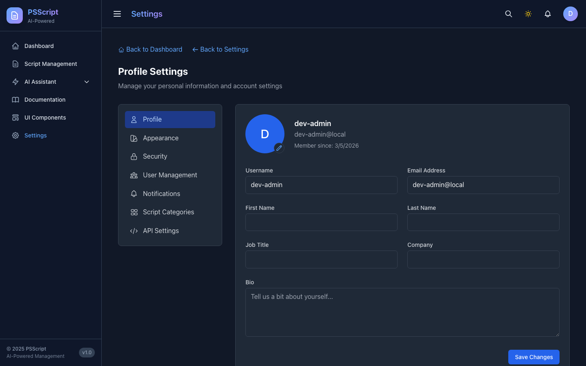

# Authentication Improvements

_Last updated: March 5, 2026_



## Current auth model

- JWT-based backend authentication for protected APIs
- Shared backend auth middleware across normal protected routes and admin DB maintenance routes
- Local frontend development commonly runs with `VITE_DISABLE_AUTH=true`, which creates a `dev-admin` session automatically

## Improvements now reflected in code

### Unified protected-route behavior

The backend no longer maintains a second legacy JWT middleware for admin maintenance routes.
This removes request-shape drift and secret-source drift between login-issued tokens and admin-only APIs.

### Clear auth error semantics

Authentication-related APIs return structured error payloads with stable error codes.
Common examples include:

- `validation_error`
- `invalid_credentials`
- `missing_token`
- `invalid_token_format`
- `token_expired`
- `email_already_exists`
- `username_already_exists`

### DB uniqueness conflicts return `409`

Registration and profile updates now translate uniqueness races into explicit `409 Conflict` responses instead of generic `500` failures.

### Local development behavior

The current checked-in local environment uses:

```bash
VITE_DISABLE_AUTH=true
```

That means:

- `/login` redirects into the authenticated app shell
- frontend screenshots taken in the default local environment show the `dev-admin` session
- real login testing requires turning auth back on before starting the frontend

## Credential guidance

Do not treat historical documentation references to `admin@psscript.com / ChangeMe1!` as current source-of-truth credentials.
In the current repo:

- local auth-disabled mode is the default frontend workflow
- demo-login fallbacks in frontend code point to `admin@example.com / admin123` only when auth is enabled and matching seed data exists
- deployed environments should use their actual seeded or managed credentials

## Validation

Use backend tests for auth-path validation:

```bash
cd src/backend && npm run build
cd src/backend && npm test -- --runInBand
```

If you need to test the real login UI instead of the local dev bypass, set `VITE_DISABLE_AUTH=false` and restart the frontend.
