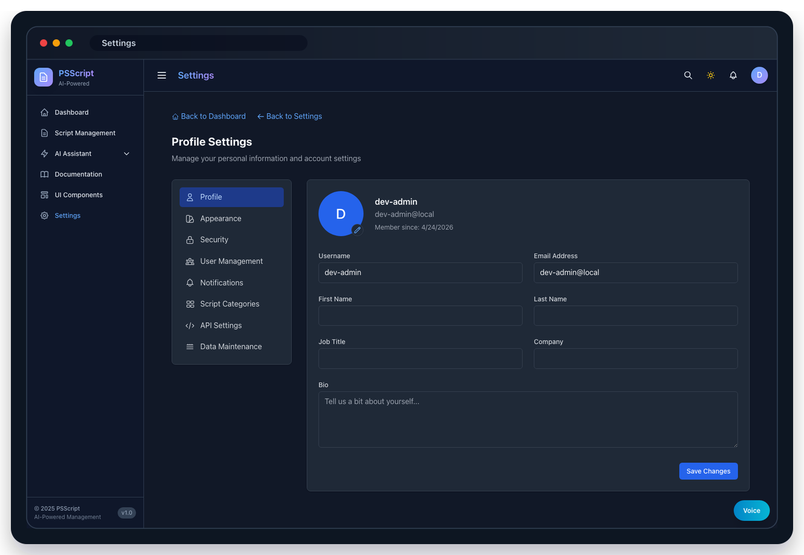

# PSScript Setup Guide With Screenshots

_Last updated: April 27, 2026_

This guide shows how to set up every active component in the current PSScript application:

- React/Vite frontend
- Express backend API
- FastAPI AI service
- Supabase Auth, Postgres, storage, `pgvector`, and approval-gated Google OAuth
- Netlify hosted deployment
- local validation, screenshots, and PDF documentation export

Docker is retired from the active setup. Historical Docker files are preserved under `retired/docker/`, but new development and validation should use the local services below with a hosted Supabase database.


## 1. Runtime Map

| Component | Active role | Local URL | Hosted role |
| --- | --- | --- | --- |
| Frontend | React app, OAuth callback, script/documentation UI | `https://127.0.0.1:3090` | Netlify static site |
| Backend API | local development API, validation, AI/document routes | `https://127.0.0.1:4000` | Netlify Functions provide hosted `/api/*` |
| AI service | local LangGraph/voice/agent workflows | `http://127.0.0.1:8000` | optional local-only service |
| Supabase | Auth, Postgres, RLS, `pgvector`, approval gate | hosted Supabase project | hosted Supabase project |
| Netlify | production frontend and Functions runtime | optional `netlify dev` | production deploy |


## 2. Prerequisites

Install these locally:

- Node.js 20+
- npm 10+
- Python 3.10+
- Netlify CLI if deploying hosted: `npm install -g netlify-cli`
- Supabase project access
- OpenAI API key, Anthropic API key, or both

Install project dependencies:

```bash
npm install
npm install --prefix src/frontend
npm install --prefix src/backend
python3 -m pip install -r src/ai/requirements.txt
```

If your shell exposes `python` instead of `python3`, use `python`. The Playwright stack script accepts either.

## 3. Supabase Setup

Create a Supabase project, then apply the migrations in filename order:

```text
supabase/migrations/20260424_hosted_schema.sql
supabase/migrations/20260425_scripts_file_hash_uniqueness.sql
supabase/migrations/20260425_user_management_schema_fixes.sql
supabase/migrations/20260426_supabase_advisor_fixes.sql
supabase/migrations/20260426_z_google_oauth_approval_gate.sql
```

After migration, confirm:

- the `vector` extension exists
- `app_profiles` exists
- `scripts`, `script_analysis`, `script_embeddings`, `documentation_items`, and `ai_metrics` exist
- RLS policies are enabled for hosted tables
- `current_app_profile_is_enabled()` exists

The approval gate depends on `app_profiles.is_enabled`. New Google OAuth users are inserted disabled, then an admin enables them in User Management.


## 4. Google OAuth Approval Gate

Configure Google OAuth in both Google Cloud and Supabase:

1. In Google Cloud, create an OAuth web client.
2. Add redirect URLs:
   - `https://YOUR_NETLIFY_SITE/auth/callback`
   - `http://localhost:3090/auth/callback`
   - `https://127.0.0.1:3090/auth/callback`
3. In Supabase, enable Google under Auth Providers.
4. Paste the Google client ID and secret into Supabase.
5. In Supabase Auth URL configuration, add the hosted and local callback URLs.
6. Set `DEFAULT_ADMIN_EMAIL` to the first administrator's email.

Flow:

1. User signs in with Google.
2. Supabase creates or resolves the Auth user.
3. `/api/auth/me` creates or updates the matching `app_profiles` row.
4. New users default to `is_enabled = false`.
5. Disabled users see Pending Approval and protected API calls return `403 account_pending_approval`.
6. An enabled admin opens Settings -> User Management and enables the user.


## 5. Environment Variables

Create `.env` at the repo root for local development:

```bash
DATABASE_URL=postgresql://...supabase-pooler-url...
DB_PROFILE=supabase
DB_SSL=true
DB_SSL_REJECT_UNAUTHORIZED=true

SUPABASE_URL=https://your-project.supabase.co
SUPABASE_ANON_KEY=...
SUPABASE_SERVICE_ROLE_KEY=...
DEFAULT_ADMIN_EMAIL=admin@example.com

OPENAI_API_KEY=...
OPENAI_MODEL=gpt-5.5
OPENAI_ANALYSIS_MODEL=gpt-5.4-mini
OPENAI_EMBEDDING_MODEL=text-embedding-3-small
OPENAI_MAX_OUTPUT_TOKENS=1600
OPENAI_ANALYSIS_MAX_OUTPUT_TOKENS=1800

ANTHROPIC_API_KEY=...
ANTHROPIC_MODEL=claude-sonnet-4-6
ANTHROPIC_MAX_TOKENS=1600

VOICE_TTS_MODEL=gpt-4o-mini-tts
VOICE_TTS_VOICE=marin
VOICE_STT_MODEL=gpt-4o-mini-transcribe
VOICE_STT_DIARIZE_MODEL=gpt-4o-transcribe-diarize
VOICE_MAX_BASE64_CHARS=16000000

VITE_SUPABASE_URL=https://your-project.supabase.co
VITE_SUPABASE_ANON_KEY=...
VITE_HOSTED_STATIC_ANALYSIS_ONLY=true
```

Keep these server-side only:

- `DATABASE_URL`
- `SUPABASE_SERVICE_ROLE_KEY`
- `OPENAI_API_KEY`
- `ANTHROPIC_API_KEY`

Only `VITE_*` values are meant for the browser.

## 6. Start All Local Components

The recommended local path is Playwright's stack launcher. It reads `.env`, starts missing services, and checks health:

```bash
npx playwright test tests/e2e/project-review-validation.spec.ts --project=chromium
```

For manual startup, use three terminals:

```bash
# Terminal 1: AI service
cd src/ai
python3 -m uvicorn main:app --host 0.0.0.0 --port 8000
```

```bash
# Terminal 2: backend API
cd src/backend
npm run dev
```

```bash
# Terminal 3: frontend
cd src/frontend
npm run dev -- --host 0.0.0.0 --port 3090
```

Open:

```text
https://127.0.0.1:3090
```

The default local Playwright/development mode can run with auth disabled for fast validation. Hosted-mode testing should run with Supabase Auth enabled.

## 7. Component Checks

Run these checks after startup:

```bash
curl -sk https://127.0.0.1:4000/api/health
curl -s http://127.0.0.1:8000/health
```

Expected backend health includes database and cache status. Expected AI health includes a `status` field.

Then run builds and tests:

```bash
cd src/backend
npm run build
npm test -- --runInBand --forceExit
```

```bash
cd src/frontend
npm run build
```

```bash
cd /Users/morlock/fun/02_PowerShell_Projects/psscript
npx playwright test --project=chromium
```

The latest full Chromium validation on April 27, 2026 passed with 37 passed and 3 intentionally skipped tests.

## 8. Upload And AI Analysis Smoke Test

Use the Script Management page to confirm the AI analysis path:

1. Open Script Management.
2. Upload or paste a `.ps1` script.
3. Confirm the script appears in the list.
4. Open the script detail page.
5. Confirm the AI-generated summary, security score, quality score, and remediation content are populated.


The current document-analysis flow also stores richer report metadata:

- `keyFindings`
- `riskNotes`
- `recommendedActions`
- extracted PowerShell commands
- extracted PowerShell modules
- code examples when present

## 9. Documentation AI Scanning

Use the Documentation page to crawl and analyze PowerShell documentation:

1. Open Documentation.
2. Start a crawl or load existing documentation items.
3. Open a documentation item.
4. Confirm Key Insights, Findings Summary, Risk Notes, and Recommended Actions render in the detail modal.


The backend prompt asks the model for an audit-ready JSON response. If the model returns invalid JSON, the parser falls back to a deterministic local summary so the UI still renders useful output.

## 10. Admin And Data Maintenance

Open Settings for admin workflows:

- Profile and account settings
- User Management approval gate
- Categories
- Data Maintenance backup/restore/cleanup
- API settings




Admin safety rules:

- disabled users cannot access protected APIs
- admins cannot disable themselves
- the app prevents removal of the last enabled admin
- hosted RLS policies enforce enabled-profile checks at the database layer

## 11. Feature Surface After Setup

After the infrastructure is healthy, verify the main application modules:

| Module | What to verify | Screenshot |
| --- | --- | --- |
| Dashboard | recent scripts, metrics, and navigation load without console errors | `docs/screenshots/readme/dashboard.png` |
| Script upload | `.ps1` selection, validation, upload, and analysis trigger | `docs/screenshots/readme/upload.png` |
| Script detail | source view, metadata, AI summary, scores, and remediation | `docs/screenshots/readme/script-detail.png` |
| Documentation | crawled documentation, AI insights, findings, risks, actions | `docs/screenshots/readme/documentation.png` |
| Chat assistant | model-backed chat route and response rendering | `docs/screenshots/readme/chat.png` |
| Agentic assistant | local multi-step agent UI and orchestration status | `docs/screenshots/readme/agentic-assistant.png` |
| Analytics | cost, token, usage, and model-performance cards | `docs/screenshots/readme/analytics.png` |
| UI components | shared component library and visual regression surface | `docs/screenshots/readme/ui-components.png` |


## 12. Hosted Netlify Deployment

Set the same server-side environment variables in Netlify, plus the browser variables:

```text
DATABASE_URL
DB_SSL
DB_SSL_REJECT_UNAUTHORIZED
SUPABASE_URL
SUPABASE_ANON_KEY
SUPABASE_SERVICE_ROLE_KEY
DEFAULT_ADMIN_EMAIL
OPENAI_API_KEY
OPENAI_MODEL
OPENAI_ANALYSIS_MODEL
OPENAI_EMBEDDING_MODEL
ANTHROPIC_API_KEY
ANTHROPIC_MODEL
VOICE_TTS_MODEL
VOICE_STT_MODEL
VITE_SUPABASE_URL
VITE_SUPABASE_ANON_KEY
VITE_HOSTED_STATIC_ANALYSIS_ONLY
```

Build command:

```bash
npm run build:netlify
```

Netlify serves:

- frontend from `src/frontend/dist`
- API from `netlify/functions/api.ts`
- same-origin API routes under `/api/*`

After deploy, validate:

```bash
curl https://YOUR_NETLIFY_SITE/api/health
```

Then verify in the browser:

- login renders
- Google OAuth callback returns to the app
- first admin is enabled
- new Google user lands on Pending Approval
- enabled users can upload scripts
- AI analysis returns structured output
- documentation analysis renders findings and recommendations

## 13. Screenshots

Refresh screenshots from a running local app:

```bash
SCREENSHOT_BASE_URL=https://127.0.0.1:3090 \
SCREENSHOT_LOGIN_URL=https://127.0.0.1:3090 \
node scripts/capture-screenshots.js
```

Generate README-framed screenshots:

```bash
npm run screenshots:readme
```

Important screenshot files:

| Screenshot | File |
| --- | --- |
| Login | `docs/screenshots/readme/login.png` |
| Pending approval | `docs/screenshots/readme/pending-approval.png` |
| Dashboard | `docs/screenshots/readme/dashboard.png` |
| Scripts | `docs/screenshots/readme/scripts.png` |
| Script analysis | `docs/screenshots/readme/analysis.png` |
| Upload | `docs/screenshots/readme/upload.png` |
| Documentation | `docs/screenshots/readme/documentation.png` |
| Chat | `docs/screenshots/readme/chat.png` |
| Analytics | `docs/screenshots/readme/analytics.png` |
| Agentic assistant | `docs/screenshots/readme/agentic-assistant.png` |
| Settings | `docs/screenshots/readme/settings.png` |
| Data maintenance | `docs/screenshots/readme/data-maintenance.png` |

## 14. PDF Report Export

Generate HTML and PDF documentation exports:

```bash
.venv/bin/python scripts/export-docs.py
node scripts/export-docs.mjs README.html
```

Generated outputs:

- `docs/exports/html/`
- `docs/exports/pdf/README.pdf`

The PDF template uses print-aware CSS, A4 sizing, code/table styling, a cover page, headers, and page numbers.

## 15. Troubleshooting

| Symptom | Likely cause | Fix |
| --- | --- | --- |
| `relation "users" does not exist` | code or old service is pointed at hosted Supabase but assumes legacy local schema | use current code; hosted schema uses `app_profiles` |
| Browser `/api/*` returns proxy `ECONNREFUSED` | retired Docker frontend is still running on `3090` | stop old Docker frontend/backend and run the local stack |
| `python is required` | machine only exposes `python3` | current `scripts/playwright-stack.sh` accepts `python3`; pull latest or set `PYTHON=python3` |
| Google sign-in works but user cannot enter app | approval gate is working | enable the user in Settings -> User Management |
| `/api/health` is degraded on Netlify | missing Supabase or provider env vars | add Netlify env vars and redeploy |
| AI analysis is empty | missing provider key or model failure | check `OPENAI_API_KEY`, `OPENAI_ANALYSIS_MODEL`, `ANTHROPIC_API_KEY`, and backend logs |

## 16. Reference Docs

- [Root README](../README.md)
- [Getting Started](./GETTING-STARTED.md)
- [Netlify + Supabase Deployment](./NETLIFY-SUPABASE-DEPLOYMENT.md)
- [Data Maintenance](./DATA-MAINTENANCE.md)
- [Voice API](./README-VOICE-API.md)
- [Management Playbook](./MANAGEMENT-PLAYBOOK.md)
