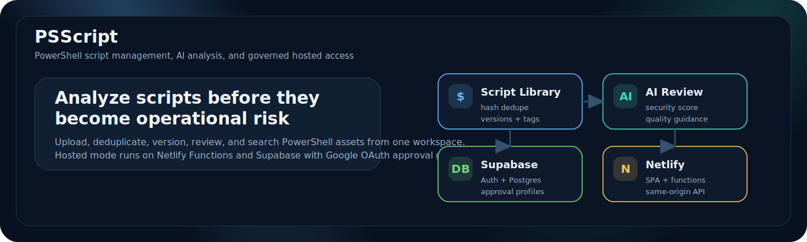

# PSScript Documentation Hub

Welcome to the documentation hub for PSScript Manager. Use this page to navigate onboarding, deployment, and feature documentation.

## Quick links

- Getting started: `GETTING-STARTED.md`
- Docker setup: `../DOCKER-QUICKSTART.md`
- Management playbook: `MANAGEMENT-PLAYBOOK.md`
- Training suite: `training-suite/README.md`
- Training guide: `training-suite/TRAINING-GUIDE.md`
- Support: `SUPPORT.md`

## Platform overview

## Documentation map

| Area | Description | Link |
| --- | --- | --- |
| Onboarding | Setup, accounts, first run | `GETTING-STARTED.md` |
| Docker | Infrastructure setup | `../DOCKER-QUICKSTART.md` |
| Vector search | pgvector and embeddings | `README-VECTOR-SEARCH.md` |
| Voice API | Voice features | `README-VOICE-API.md` |
| Management | Rollout plan and KPIs | `MANAGEMENT-PLAYBOOK.md` |
| Training | Modules and labs | `training-suite/README.md` |
| Support | Triage and operations | `SUPPORT.md` |
| Reference sources | Style inspirations | `REFERENCE-SOURCES.md` |

## Exported formats

Run `scripts/export-docs.sh --all` to generate HTML, PDF, and DOCX exports in `docs/exports/`.

With the backend running, exports are available at http://localhost:4000/docs/exports/.

## UI snapshot

