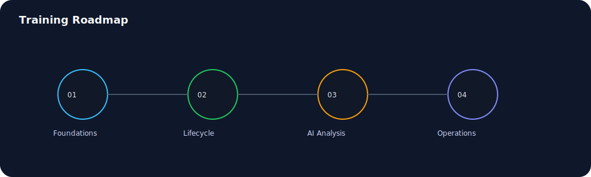
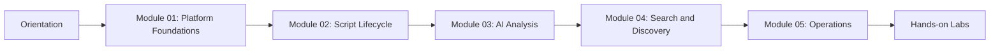
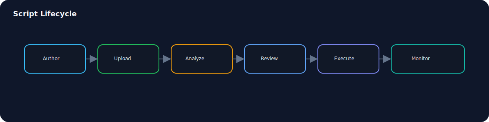

# PSScript Training Suite

This training suite is a structured onboarding and enablement program for PSScript Manager. It includes modules, hands-on labs, and operational checklists for script authors, security reviewers, and platform admins.

## Audience and outcomes

| Audience | Goals | Outcome artifacts |
| --- | --- | --- |
| Script authors | Upload, categorize, analyze, and improve scripts | Curated script library with analysis reports |
| Security reviewers | Evaluate risk, audit findings, track fixes | Security scorecards and remediation notes |
| Platform admins | Operate services, manage users, tune data | Environment runbook and health checklist |

## Training paths





## Workflow visuals




## Suggested schedules

| Option | Duration | Focus |
| --- | --- | --- |
| Fast start | 1 day | Core workflows and 2 labs |
| Standard | 2 days | All modules and all labs |
| Deep dive | 3 days | Modules, labs, and ops review |

## Environment setup

Required services and ports:
- Frontend: http://localhost:3002
- Backend API: http://localhost:4000/api
- AI service: http://localhost:8000

Mock mode setup:

```bash
./start-all-mock.sh
```

## Curriculum map

| Module | Description | Duration | File |
| --- | --- | --- | --- |
| Module 01 | Platform Foundations | 45 min | `modules/module-01-foundations.md` |
| Module 02 | Script Lifecycle | 60 min | `modules/module-02-lifecycle.md` |
| Module 03 | AI Analysis and Security | 75 min | `modules/module-03-analysis.md` |
| Module 04 | Search and Discovery | 45 min | `modules/module-04-search.md` |
| Module 05 | Operations and Governance | 60 min | `modules/module-05-operations.md` |

## Labs

| Lab | Goal | File |
| --- | --- | --- |
| Lab 01 | Upload and analyze a script | `labs/lab-01-upload-analyze.md` |
| Lab 02 | Vector search and similarity | `labs/lab-02-vector-search.md` |
| Lab 03 | Documentation and AI chat workflows | `labs/lab-03-docs-chat.md` |
| Lab 04 | Analytics and governance checks | `labs/lab-04-analytics.md` |
| Lab 05 | Settings and training resources | `TRAINING-GUIDE.md` |

## Training guide

Use the full guide for a single, end-to-end walkthrough with screenshots and sample actions:

- `TRAINING-GUIDE.md`

## Management resources

For phased rollout, KPI planning, and governance cadence, use:

- `../MANAGEMENT-PLAYBOOK.md`

## Exported formats

Generate HTML and PDF exports with:

```bash
scripts/export-docs.sh
```

Outputs land in `docs/exports/`.

Key exports:

- `docs/exports/pdf/Training-Guide.pdf`
- `docs/exports/pdf/Training-Suite.pdf`
- `docs/exports/docx/Training-Guide.docx`
- `docs/exports/docx/Training-Suite.docx`

## Assessment rubric

| Skill area | Basic | Proficient | Advanced |
| --- | --- | --- | --- |
| Script hygiene | Upload and tag scripts | Adds categories and metadata | Enforces naming and dedup rules |
| AI analysis | Runs analysis | Applies recommendations | Creates reusable fixes and notes |
| Search | Keyword search | Uses filters | Uses vector similarity effectively |
| Operations | Starts services | Reads logs | Diagnoses and remediates issues |

## Screenshot catalog

All training screenshots are captured via Playwright and stored in `../screenshots/`. See the root README for the capture workflow.

## Support and troubleshooting

- Use `../LOGIN-CREDENTIALS.md` for demo accounts
- Use `../SUPPORT.md` for support and operational playbooks
- Use `../../DOCKER-QUICKSTART.md` for infrastructure setup
- Use GitHub Issues for bugs or feature requests
