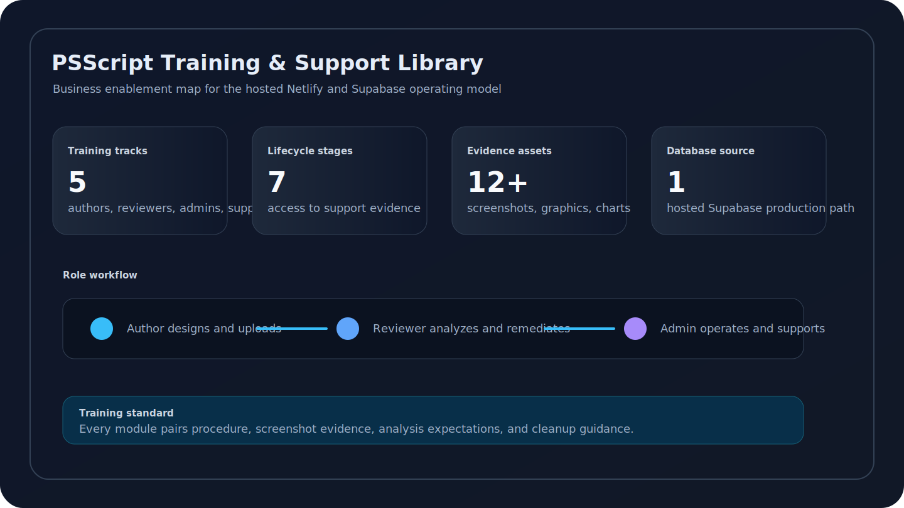
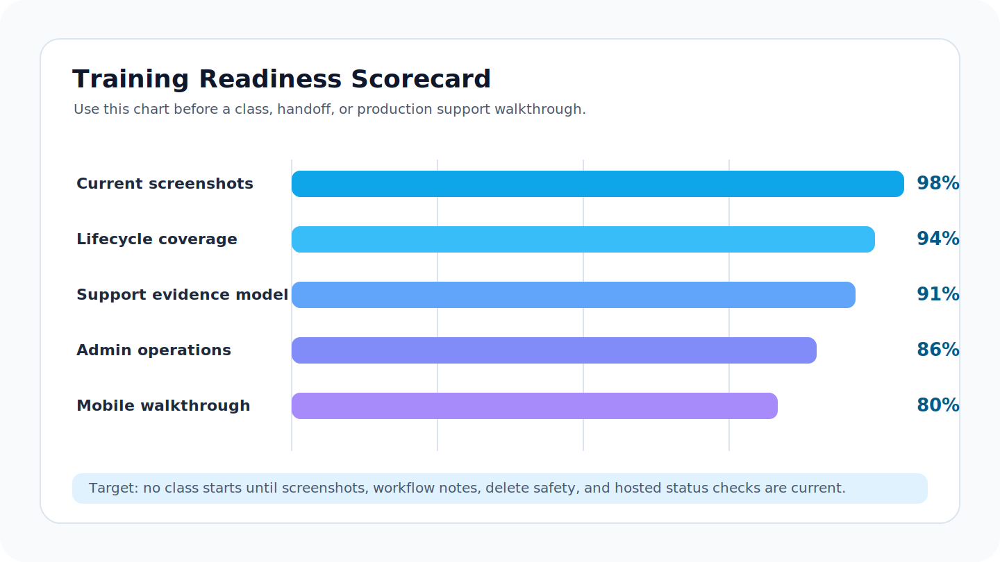
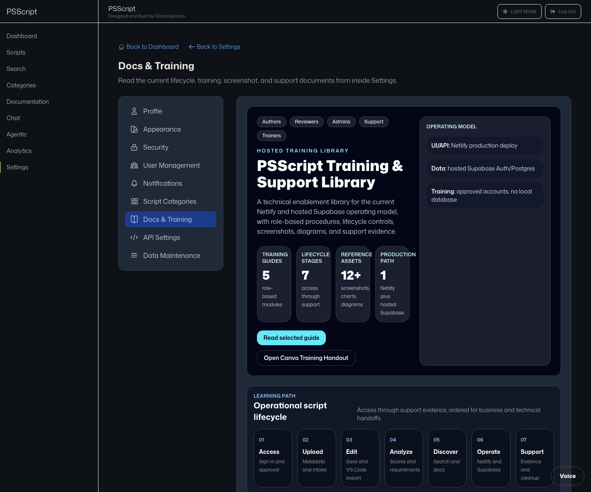

# PSScript Screenshot Atlas

Last updated: April 29, 2026.

This atlas indexes the current training screenshots for the hosted PSScript app. Use these images in support notes, training decks, onboarding guides, and release evidence.

## Business Visual Pack

Use this section when building a formal training handout, support SOP, or onboarding packet. The charts explain the operating structure; the screenshots prove the current app state.

## Production Screens

| Screenshot | Path | Use |
| --- | --- | --- |
| Login | `../screenshots/readme/login.png` | Supabase sign-in, Google OAuth entry, approval-gated access |
| Pending approval | `../screenshots/readme/pending-approval.png` | Account enablement support and admin approval training |
| Dashboard | `../screenshots/readme/dashboard.png` | First-run orientation and mobile/desktop layout validation |
| Scripts | `../screenshots/readme/scripts.png` | Library review, filters, selection, delete, and bulk actions |
| Upload | `../screenshots/readme/upload.png` | Script intake, metadata, tags, hosted 4 MB upload limit |
| Script edit and VS Code export | `../screenshots/readme/script-edit-vscode.png` | Hosted edit, save, and `.ps1` export for local VS Code review |
| Script detail | `../screenshots/readme/script-detail.png` | Metadata review, script state, version and analysis entry point |
| Analysis | `../screenshots/readme/analysis.png` | AI criteria, scoring, remediation, findings, PDF export |
| Analysis runtime requirements | `../screenshots/readme/analysis-runtime-requirements.png` | PowerShell version, module, and .NET assembly requirements before execution |
| Documentation | `../screenshots/readme/documentation.png` | Documentation-assisted review and search context |
| Chat | `../screenshots/readme/chat.png` | AI assistant conversation workflow |
| Agentic assistant | `../screenshots/readme/agentic-assistant.png` | `/agentic` route support and assistant landing behavior |
| Agent orchestration | `../screenshots/readme/agent-orchestration.png` | Multi-step AI workflow and coordination view |
| Analytics | `../screenshots/readme/analytics.png` | Usage, score, and governance trend review |
| Settings | `../screenshots/readme/settings.png` | Admin and user settings orientation |
| Settings docs and training | `../screenshots/readme/settings-docs-training.png` | Business and technical training library, Canva link, charts, and screenshot references |
| Settings profile | `../screenshots/readme/settings-profile.png` | Profile state, role, and account support |
| Settings appearance | `../screenshots/readme/settings-appearance.png` | Light/dark mode, muted accent, font size, and accessibility controls |
| Data maintenance | `../screenshots/readme/data-maintenance.png` | Backup-first maintenance and test data cleanup |
| UI components | `../screenshots/readme/ui-components.png` | Design-system reference and support copy alignment |

## Primary Screenshot Gallery

## Graphics

| Graphic | Path | Use |
| --- | --- | --- |
| Lifecycle map | `../graphics/script-lifecycle-map-2026-04-29.svg` | Explain the full lifecycle from design intake through support |
| Support suite map | `../graphics/training-support-suite-map-2026-04-29.svg` | Explain the relationship between training, labs, screenshots, and support |
| Support escalation ladder | `../graphics/support-escalation-ladder-2026-04-29.svg` | Explain severity triage and escalation evidence |
| Business training dashboard | `../graphics/training-corporate-dashboard-2026-04-29.svg` | Explain the full enablement package |
| Readiness scorecard | `../graphics/training-readiness-scorecard-2026-04-29.svg` | Check class readiness before handoff |
| Role workflow | `../graphics/training-role-workflow-2026-04-29.svg` | Explain role responsibilities across the lifecycle |
| Architecture aurora | `../graphics/architecture-aurora.svg` | Explain Netlify, Supabase, API, and browser flow |
| Analysis pipeline | `../graphics/analysis-pipeline.svg` | Explain script analysis and report generation |
| Security scorecard | `../graphics/security-scorecard.svg` | Explain score interpretation and remediation priority |

## Capture Standard

- Capture the hosted production app unless the exercise explicitly says mock mode.
- Include the full route and active state being taught.
- Do not capture real secrets, customer names, or production-only sensitive scripts.
- When a screenshot supports a bug, include the browser viewport, route, timestamp, and the active Netlify deploy.
- Refresh screenshots after UI changes that affect layout, copy, navigation, limits, or support flows.

## Review Checklist

- Image path exists in the repository.
- Screenshot matches the current production UI.
- No private credentials, tokens, or real user data are visible.
- The image is readable at documentation width.
- The surrounding text explains what the reader should notice.
