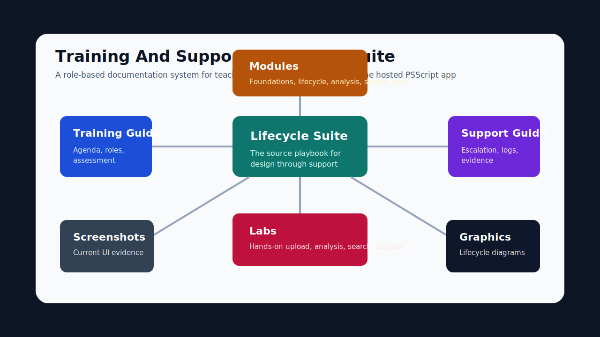

# PSScript Script Lifecycle And Support Suite

Last updated: April 29, 2026.

This document is the professional training and support playbook for script design and management in PSScript. It is written for script authors, reviewers, admins, and support staff working against the hosted Netlify and Supabase production architecture.

## Executive Summary

PSScript manages PowerShell script work through a governed lifecycle:

1. Design the script with clear intent, safe parameters, examples, and test expectations.
2. Upload the script to the hosted app with accurate metadata.
3. Review the script detail page for identity, ownership, category, tags, and version state.
4. Run or review AI analysis using the current criteria payload.
5. Remediate findings and document accepted risk.
6. Export a PDF report for evidence.
7. Search and reuse approved patterns through keyword, vector, documentation, and assistant workflows.
8. Delete or bulk-delete only disposable test data or approved records.
9. Support issues with screenshots, deploy evidence, Netlify Function logs, and Supabase logs.

## Corporate Lifecycle Model

The lifecycle is taught as a role-based operating workflow. Authors own script intent and metadata, reviewers own analysis interpretation and remediation decisions, admins own access and hosted operations, and support owns evidence capture and escalation.

### Lifecycle Evidence Graph

| Stage | Screenshot or graphic | Evidence checkpoint |
| --- | --- | --- |
| Access | `../screenshots/readme/login.png` | approved account reaches app shell |
| Upload | `../screenshots/readme/upload.png` | script record stores with complete metadata |
| Edit | `../screenshots/readme/script-edit-vscode.png` | `.ps1` export opens in local tooling |
| Analyze | `../screenshots/readme/analysis-runtime-requirements.png` | score, findings, PowerShell version, modules, and assemblies are visible |
| Discover | `../screenshots/readme/documentation.png` | script or policy can be found by search or documentation |
| Operate | `../screenshots/readme/data-maintenance.png` | admin confirms backup-first controls |
| Support | `../graphics/support-escalation-ladder-2026-04-29.svg` | case includes route, deploy id, logs, and screenshot |

## Source Guidance Used

The April 2026 training model is aligned with:

- Microsoft PowerShell publishing guidance: use PSScriptAnalyzer, include documentation and examples, include tests, sign code where appropriate, and use semantic versioning. Source: <https://learn.microsoft.com/en-us/powershell/gallery/concepts/publishing-guidelines?view=powershellget-3.x>
- Netlify Functions guidance: UI and Functions are deployed together, Functions are immutable per deploy, and buffered synchronous Functions have request and response payload limits. Source: <https://docs.netlify.com/build/functions/overview/>
- Supabase RLS guidance: Supabase maps requests to `anon` and `authenticated` Postgres roles and policies should be explicit for those roles. Source: <https://supabase.com/docs/guides/database/postgres/row-level-security>
- Supabase production checklist: enable RLS, SSL enforcement, MFA, backups, and performance/security review before production operations. Source: <https://supabase.com/docs/guides/deployment/going-into-prod>

## Roles

| Role | Primary work | Evidence they produce |
| --- | --- | --- |
| Script author | Design, upload, metadata, remediation | Script file, tags, description, analysis result |
| Reviewer | Security, quality, operational fit | Findings, remediation notes, approval decision |
| Admin | Access approval, data maintenance, deploy health | User state, backup records, deploy id, logs |
| Support | Reproduction, triage, escalation | Screenshots, route, payload status, timestamps |

## Training Outcomes By Audience

| Audience | Minimum outcome | Deep outcome | Evidence checkpoint |
| --- | --- | --- | --- |
| Basic user | Can sign in, browse scripts, search, read documentation, and export an analysis PDF | Can explain what a score means and when to ask for reviewer help | Search route, script id, PDF filename |
| New beginner | Can upload a disposable PowerShell script with complete metadata | Can edit metadata, open a `.ps1` export in VS Code, and rerun analysis after a change | Upload screenshot, detail page, analysis screen |
| Senior engineer | Can validate security, quality, maintainability, PowerShell version, modules, assemblies, and remediation | Can compare similar scripts and approve reuse only when dependencies and risks are understood | Findings summary, runtime requirements, accepted-risk note |
| Admin or support | Can approve users, verify hosted health, collect logs, and handle disposable delete tests | Can diagnose upload, export, delete, and data maintenance issues using Netlify and Supabase evidence | Role, route, deploy id, request/log window |
| C-level management | Can describe the governed script lifecycle and why hosted Supabase is the source of record | Can read readiness scorecards and escalation evidence without needing implementation details | Lifecycle map, readiness summary, escalation path |

## What Good Training Looks Like

Each session should include a short explanation, a live or screenshot-backed walkthrough, a learner action, and an evidence check. Do not mark a learner complete because they watched a demo. Mark them complete when they can use the hosted app in the correct role, produce the expected proof, and avoid unsafe production-data actions.

## Lifecycle Standard

| Stage | Goal | App surface | Completion evidence |
| --- | --- | --- | --- |
| 1. Intake | Define problem, owner, environment, and risk | Outside app plus Scripts | Intake note or ticket |
| 2. Design | Write safe PowerShell with examples and test plan | Upload preparation | `.ps1` script, comments, sample usage |
| 3. Upload | Store script in hosted Supabase through Netlify API | Upload | Script record with metadata |
| 4. Review | Validate metadata, ownership, and version state | Scripts and script detail | Screenshot or script id |
| 5. Analyze | Score security, quality, maintainability, and risk | Analysis | Criteria version, score, findings |
| 6. Remediate | Fix findings or record accepted risk | Analysis and detail | Updated script or risk note |
| 7. Export | Produce portable evidence | Analysis PDF export | PDF file, not JSON |
| 8. Discover | Reuse patterns safely | Search, docs, chat, assistant | Search result or assistant transcript |
| 9. Govern | Track health, trends, and cleanup | Analytics and Settings | Backup, cleanup, audit notes |
| 10. Support | Resolve incidents using hosted evidence | Support workflow | Reproduction, logs, resolution |

## Script Design Checklist

Use this checklist before upload:

- Name functions with approved PowerShell Verb-Noun style when possible.
- Include comment-based help for reusable scripts.
- Provide examples for important parameters.
- Avoid hardcoded secrets, tokens, tenant IDs, and environment-specific paths.
- Use parameter validation for required user input.
- Prefer `SupportsShouldProcess` for operations that modify or delete resources.
- Include safe defaults and clear failure behavior.
- Add tests or manual verification steps for the expected environment.
- Run static analysis when available and document any accepted findings.
- Record owner, system, category, and operational impact in metadata.

## Upload And Metadata Standard

Required metadata:

| Field | Standard |
| --- | --- |
| Title | Clear script name, preferably Verb-Noun for script/function identity |
| Description | One or two sentences that explain purpose and operational impact |
| Category | Current taxonomy value used by the app |
| Tags | Technology, team, system, risk, and lifecycle tags |
| Owner | Team or person accountable for future changes |
| Version note | What changed and why, when re-uploading |

Hosted uploads are intentionally capped at 4 MB in the UI. Larger scripts should be split, compressed into documented release artifacts outside this app, or reviewed for embedded binary/content misuse.

## AI Analysis Standard

Reviewers should read analysis output in this order:

1. Criteria version and confidence.
2. Security score and critical findings.
3. Quality and maintainability findings.
4. Remediation recommendations.
5. Testing recommendations.
6. PDF export result.

An analysis is not complete until the reviewer can answer:

- What are the highest-risk behaviors?
- What should be fixed before execution?
- What risk is accepted, by whom, and why?
- Does the downloaded report open as a PDF?

## Search And Reuse Standard

Use search to avoid rewriting unsafe or duplicate scripts:

- Keyword search for known cmdlets, systems, ticket identifiers, and tags.
- Vector search for intent-based discovery.
- Documentation search for policy and implementation context.
- Assistant workflows for explanation, remediation ideas, and review summaries.

Search results are advisory. Reviewers still validate the actual script, metadata, and analysis result before reuse.

## Delete And Cleanup Standard

Delete behavior must be intentional:

- Delete only disposable test records or records approved for removal.
- Confirm the script id, title, owner, and environment before deletion.
- Use bulk delete only after selecting the exact target records.
- For data maintenance cleanup, create or confirm a backup first.
- Attach support evidence when deletion fails: route, response status, script ids, user role, and timestamp.

## Support Operating Model

Every support case should include:

- Route and production or deploy-preview URL.
- Active user role and whether the account is enabled.
- Screenshot of the failed state.
- Exact reproduction steps.
- Netlify deploy id and Function log window.
- Supabase Auth/database log window for data, auth, upload, delete, backup, or RLS issues.
- Expected behavior and actual behavior.

## Lab Sequence

| Lab | Lifecycle coverage |
| --- | --- |
| Lab 01 | Design, upload, metadata, analysis, PDF export |
| Lab 02 | Search, similarity, reuse, and duplicate avoidance |
| Lab 03 | Documentation and assistant-assisted review |
| Lab 04 | Analytics, health, deploy, and governance checks |
| Lab 05 | Support evidence, deletion, cleanup, and escalation |

## Completion Criteria

A trainee completes the lifecycle when they can:

- Explain why hosted Supabase is the database of record.
- Upload a safe script with complete metadata.
- Interpret the analysis criteria, scores, findings, remediation, and confidence.
- Export a PDF and verify it is not JSON.
- Use search and assistant workflows without treating AI output as final approval.
- Delete test data safely and prove cleanup.
- Collect enough support evidence for an admin or developer to reproduce a hosted issue.
