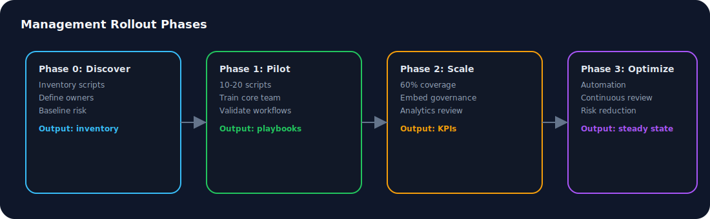
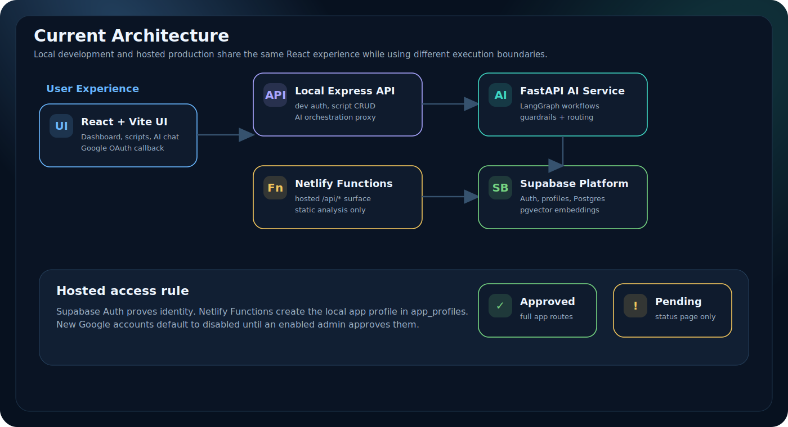
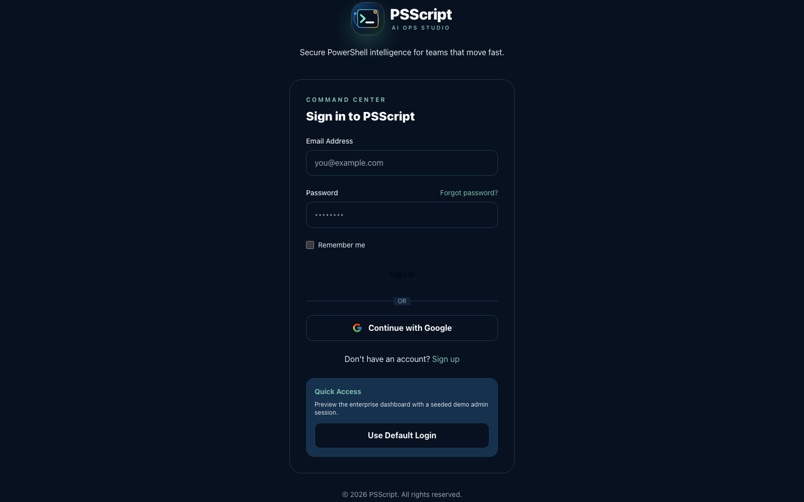
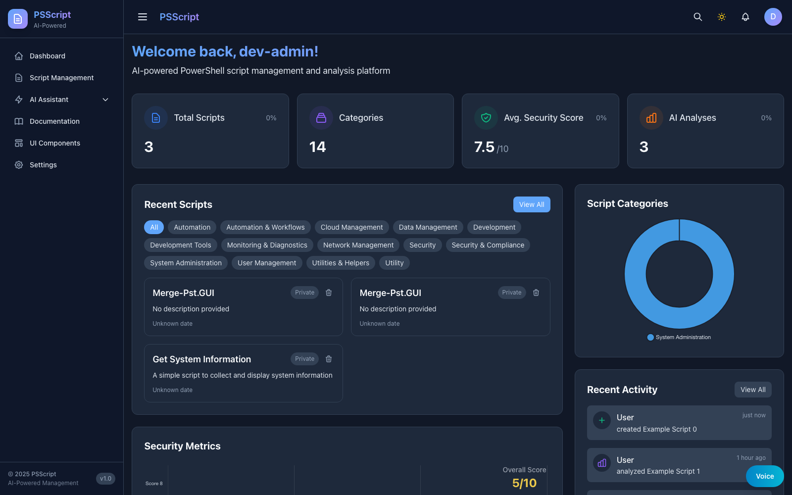
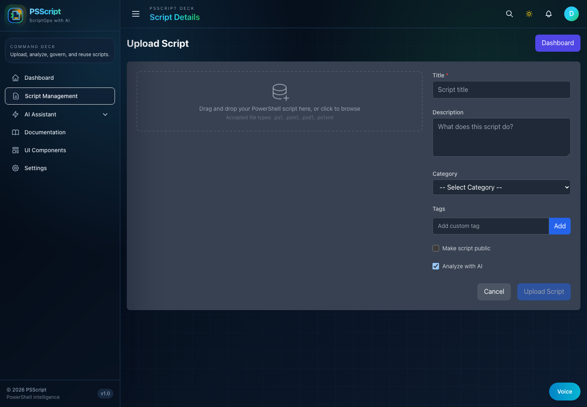
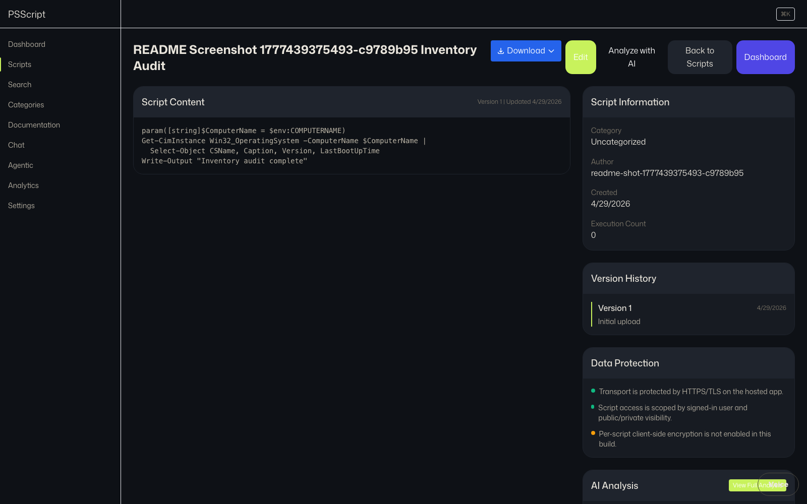
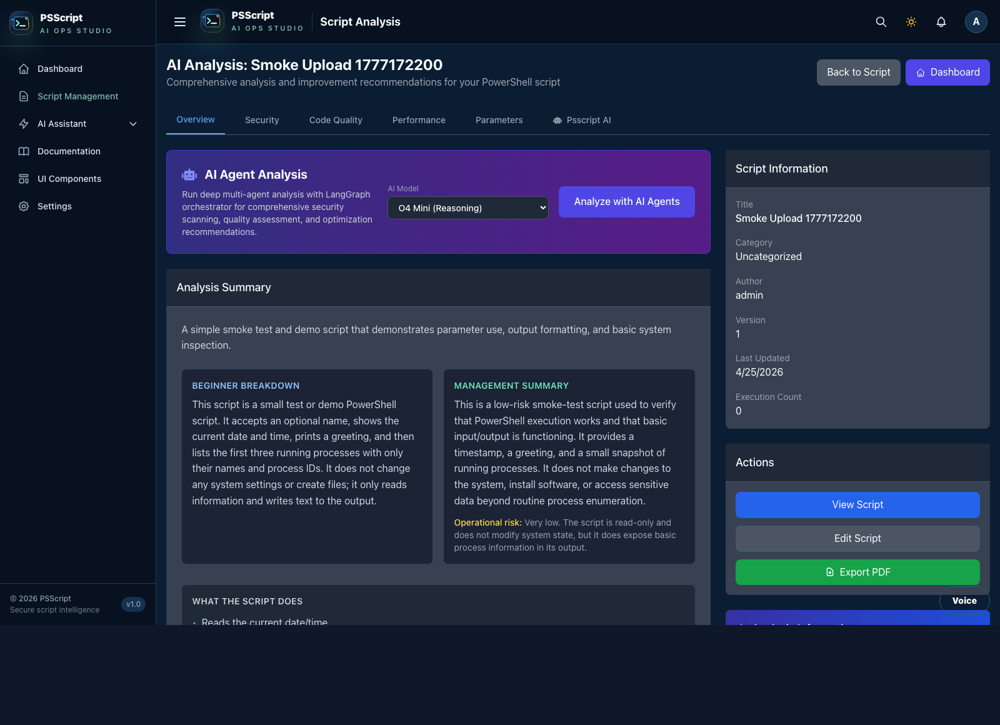
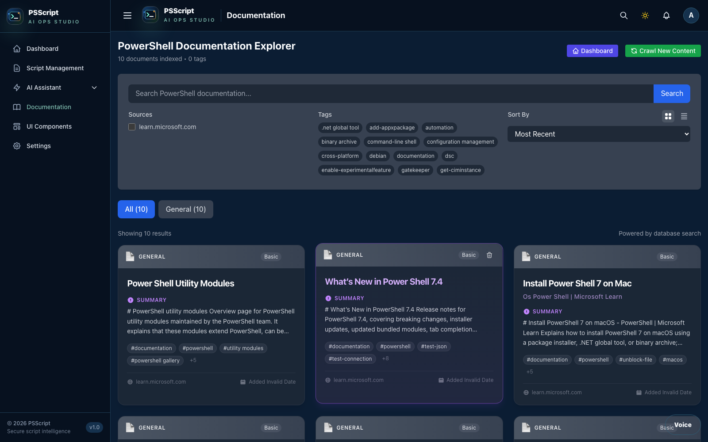
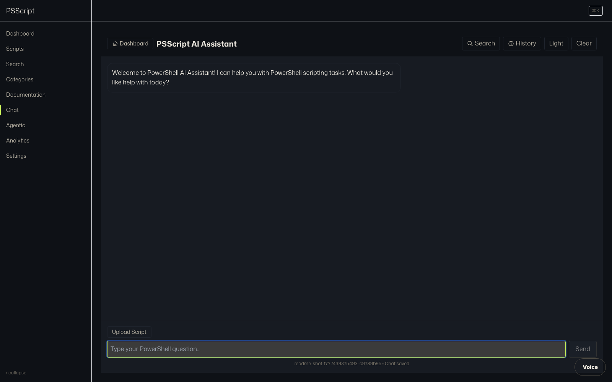
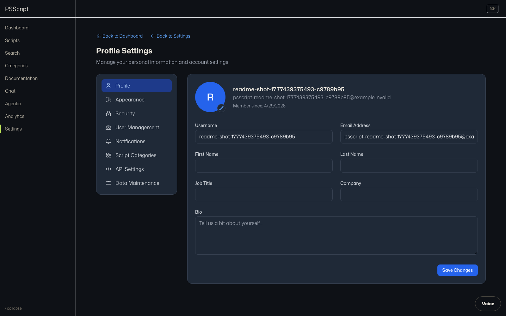

# PSScript Training Guide

This guide is a full training and enablement program for PSScript Manager. It includes walkthroughs, screenshots, labs, sample actions, and operational checklists.

## Table of Contents

- [Program overview](#program-overview)
- [System overview](#system-overview)
- [Training roadmap](#training-roadmap)
- [Environment setup](#environment-setup)
- [Role-based paths](#role-based-paths)
- [Module breakdown](#module-breakdown)
- [Hands-on labs](#hands-on-labs)
- [Sample actions](#sample-actions)
- [Operational readiness](#operational-readiness)
- [Appendix: Troubleshooting](#appendix-troubleshooting)

## Program overview

PSScript Manager is a full workflow platform for PowerShell scripts. This training builds capability across authoring, analysis, search, and operations.

Expected outcomes:
- Scripts are organized, tagged, and versioned
- AI analysis is used to identify and remediate risks
- Similar scripts can be found via vector search
- Analytics and audit trails are used for governance

Management rollout details live in `../MANAGEMENT-PLAYBOOK.md`.

## Program phases (management alignment)



## System overview




## Training roadmap


## Environment setup

Recommended setup uses mock mode so training can run without external dependencies.

```bash
./start-all-mock.sh
```

Default ports:
- Frontend: http://localhost:3002
- Backend API: http://localhost:4000/api
- AI service: http://localhost:8000

## Role-based paths

| Role | Focus | Primary modules |
| --- | --- | --- |
| Script author | Upload, analyze, improve | 01, 02, 03 |
| Security reviewer | Risk review, approvals | 03, 04, 05 |
| Platform admin | Operations, reliability | 01, 05 |

## Module breakdown

| Module | Objectives | Key screen |
| --- | --- | --- |
| Module 01: Foundations | Navigate UI, find docs, understand services | Dashboard | 
| Module 02: Script Lifecycle | Upload, tag, version scripts | Upload | 
| Module 03: AI Analysis | Read scores and recommendations | Analysis | 
| Module 04: Search | Use keyword + vector search | Scripts | 
| Module 05: Operations | Review analytics and logs | Analytics | 

## Hands-on labs

### Lab 01: Sign in and orient

1. Open the login screen and use Default Login.
2. Review the dashboard stats cards and recent scripts.
3. Locate Scripts, Documentation, and Analytics in the sidebar.





### Lab 02: Upload and analyze a script

1. Navigate to Upload.
2. Upload `test-script.ps1` and add tags.
3. Preview analysis, then submit.
4. Open the script detail view and review scores.







### Lab 03: Documentation and AI chat

1. Open Documentation and search for a cmdlet.
2. Capture an example in your notes.
3. Open AI Chat and ask for safe usage patterns.





### Lab 04: Analytics and governance

1. Open Analytics and review usage metrics.
2. Identify top activity areas.
3. Document a governance checklist for releases.


### Lab 05: Settings and training resources

1. Open Settings and review API usage and notifications.
2. Locate the Documentation and Training section.
3. Confirm the Training Suite link opens the guide.
4. Verify the local PDF export loads at `http://localhost:4000/docs/exports/pdf/Training-Guide.pdf`.



## Sample actions

### Example: Upload via API

```bash
curl -X POST http://localhost:4000/api/scripts \
  -H "Authorization: Bearer <token>" \
  -F "file=@test-script.ps1" \
  -F "title=Reset-UserPassword" \
  -F "description=Reset AD user password" \
  -F "tags=security,active-directory"
```

### Example: Run analysis

```bash
curl -X POST http://localhost:8000/analyze \
  -H "Content-Type: application/json" \
  -d '{"content": "Get-ADUser -Filter *", "type": "security"}'
```

### Example: Vector search

```bash
curl http://localhost:4000/api/scripts/1/similar
```

```bash
curl -X POST http://localhost:8000/similar \
  -H "Content-Type: application/json" \
  -d '{"content": "active directory onboarding", "limit": 5}'
```

## Operational readiness

### Governance checklist

- Scripts are tagged, categorized, and have an owner
- Security score is reviewed and exceptions are documented
- Duplicates are prevented by hash check
- Analysis results are logged and stored
- Analytics reflect script usage and review cadence

### Security scorecard


### Scorecard rubric

| Signal | Description | Target |
| --- | --- | --- |
| Security score | Weighted risk score from AI analysis | >= 7.5 |
| High-risk findings | Count of high severity issues | 0 |
| Remediation SLA | Days to close high-risk findings | <= 7 |
| Ownership coverage | Scripts with owner tag | 100% |
| Review cadence | Days between audits | <= 30 |

### Operational checks

| Area | Check | Target |
| --- | --- | --- |
| Backend | Health endpoint | 200 OK |
| Database | pgvector enabled | true |
| AI service | Analyze endpoint | 200 OK |
| Cache | Redis reachable | Optional |
| UI | Dashboard load | < 3 seconds |

For deeper triage and support patterns, see `../SUPPORT.md`.

## Appendix: Troubleshooting

| Issue | Likely cause | Fix |
| --- | --- | --- |
| Upload fails | Backend not running | Start backend on port 4000 |
| Analysis empty | AI service down | Start AI service or mock mode |
| Search returns none | Embeddings missing | Run embedding generation |
| Docs empty | Crawl not completed | Run documentation crawl |
