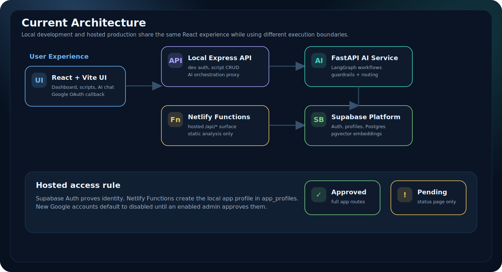
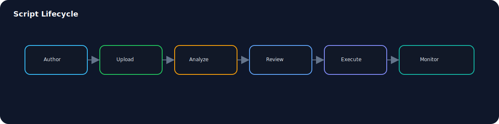
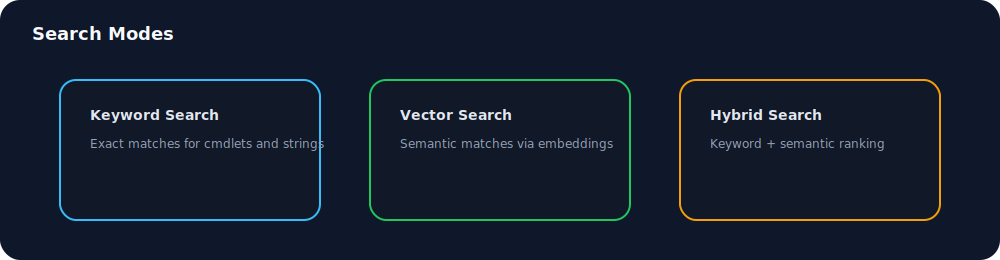
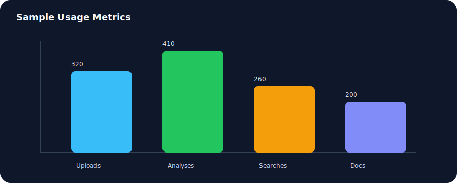
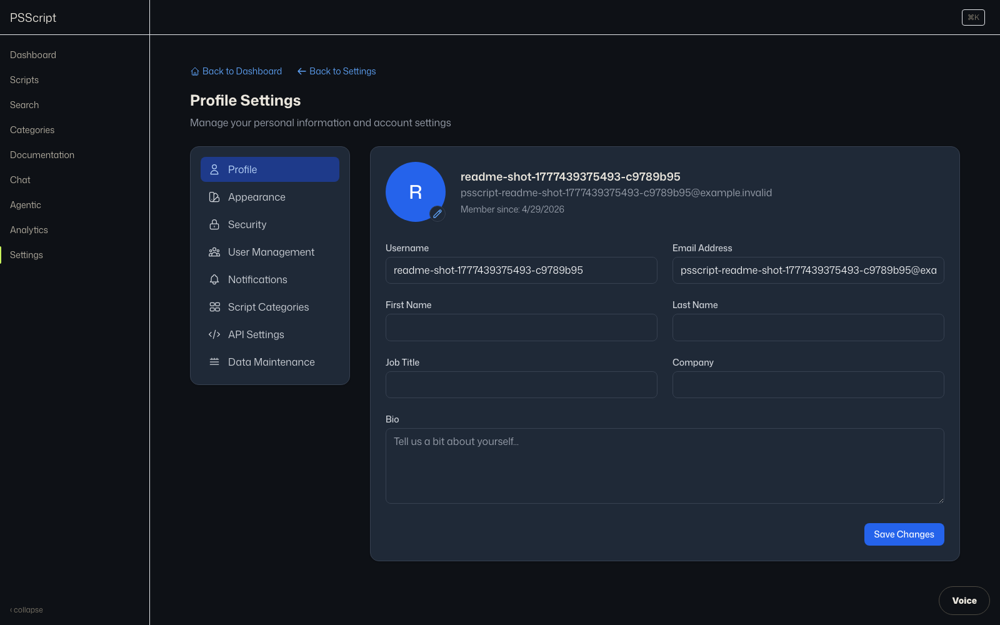
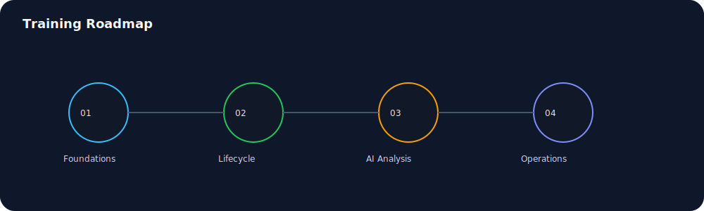

# PSScript Training Guide

End-to-end walkthrough of the PowerShell Script Manager. Includes flows, screenshots, labs, tables, sample actions, and operational checklists. Built for hands-on enablement and printable exports.

Last refreshed: April 23, 2026, with current command-deck branding and screenshots.

## Table of Contents

- [Program overview](#program-overview)
- [System overview](#system-overview)
- [Feature cheat sheet](#feature-cheat-sheet)
- [Training roadmap](#training-roadmap)
- [Environment setup](#environment-setup)
- [Guided walkthrough](#guided-walkthrough)
- [Role-based paths](#role-based-paths)
- [Module breakdown](#module-breakdown)
- [Hands-on labs](#hands-on-labs)
- [Sample actions](#sample-actions)
- [Operational readiness](#operational-readiness)
- [Appendix](#appendix)

## Program overview

PSScript Manager is a full workflow platform for PowerShell scripts—intake, AI analysis, discovery, agentic chat, and governance. This guide delivers:
- Organized, tagged, versioned scripts with deduplication by hash
- AI-backed analysis with scores, recommendations, and remediation notes
- Dual-mode discovery (keyword + vector search) plus documentation crawler
- Analytics and audit trails for compliance and release readiness
- A branded command-center UI for dashboard triage, uploads, AI analysis, settings, and data maintenance

Management rollout details live in `../MANAGEMENT-PLAYBOOK.md`.

## System overview










## Feature cheat sheet

| Area | What to look for | Screenshot |
| --- | --- | --- |
| Dashboard | Stats, recent scripts, security trends |  |
| Script library | Categories, owners, version history |  |
| Upload | Live preview, tags, dedup hints |  |
| Analysis | Scores, findings, remediation |  |
| Docs + crawl | Cmdlet search, crawling, saved excerpts |  |
| Chat/agents | Quick prompts, agentic orchestration |  |
| Analytics | Adoption, usage, training exports |  |
| Settings | API usage, notifications, training links |  |

## Training roadmap



## Environment setup

Recommended local stack:

```bash
docker compose -f docker-compose.yml -f docker-compose.override.yml up -d --build
```

Ports:
- Frontend: https://127.0.0.1:3090
- Backend API: https://127.0.0.1:4000/api
- AI service: http://localhost:8000

Verify:
- `curl -k https://127.0.0.1:4000/health` returns 200 OK
- Open `https://127.0.0.1:3090`
- In default local auth-disabled mode, the UI auto-enters the app shell as `dev-admin`
- Confirm the branded dashboard shell, sidebar logo, counters, and voice dock render

## Guided walkthrough

Ship a vetted script in ~15 minutes:
1. **Open the app** → use the default local auth-disabled stack or sign in on an auth-enabled stack.
2. **Scan the dashboard** → note total scripts, AI analyses, security score trend, Upload Script, and Ask AI actions.
3. **Upload** → go to Upload, add `test-script.ps1`, tags, and category; note dedup hints.
4. **Review detail** → open the new script, confirm metadata, owner, and activity feed.
5. **Analyze** → open Analysis, read findings, and log remediation notes.
6. **Search** → find a similar script via keyword + vector search.
7. **Consult docs** → open Documentation, search for a related cmdlet, and save an excerpt.
8. **Chat** → ask the assistant “safest way to schedule this script weekly?” and record the answer.
9. **Analytics** → confirm the run shows up in usage metrics and training exports.
10. **Settings** → open Script Categories and Data Maintenance to review category governance and admin DB tasks.

## Role-based paths

| Role | Focus | Primary modules |
| --- | --- | --- |
| Script author | Upload, analyze, improve | 01, 02, 03 |
| Security reviewer | Risk review, approvals | 03, 04, 05 |
| Platform admin | Operations, reliability | 01, 05 |

## Module breakdown

| Module | Objectives | Key screen |
| --- | --- | --- |
| Module 01: Foundations | Navigate UI, find docs, understand services | Dashboard |
| Module 02: Script Lifecycle | Upload, tag, version scripts | Upload |
| Module 03: AI Analysis | Read scores and recommendations | Analysis |
| Module 04: Search | Use keyword + vector search | Scripts |
| Module 05: Operations | Review analytics and logs | Analytics |

## Hands-on labs

### Lab 01: Sign in and orient
1. Open the app in default local mode or use a real login on an auth-enabled stack.
2. Review the PSScript logo, command-deck sidebar, stats cards, and activity feed on the dashboard.
3. Find Scripts, Documentation, Analytics in the sidebar.


### Lab 02: Upload and analyze a script
1. Go to Upload and add `test-script.ps1` with tags + category.
2. Observe dedup hints; submit the script.
3. Open the script detail view and verify metadata.
4. Run AI analysis and capture recommendations.


### Lab 03: Documentation and AI chat
1. Open Documentation; search for a cmdlet (e.g., `Get-Process`).
2. Save an excerpt to your notes.
3. Open Chat and ask for safe usage patterns.


### Lab 04: Analytics and governance
1. Open Analytics; review usage metrics and trend lines.
2. Identify top activity areas and any gaps.
3. Draft a governance checklist for releases.


### Lab 05: Settings and training resources
1. Open Settings; review Script Categories and Data Maintenance.
2. Create, edit, search, refresh, and delete a category only in a safe test dataset.
3. Review backup, restore, cleanup, sequence, cache, and integrity actions in Data Maintenance.


## Sample actions

### Upload via API

```bash
curl -X POST http://localhost:4000/api/scripts \
  -H "Authorization: Bearer <token>" \
  -F "file=@test-script.ps1" \
  -F "title=Reset-UserPassword" \
  -F "description=Reset AD user password" \
  -F "tags=security,active-directory"
```

### Run analysis

```bash
curl -X POST http://localhost:8000/analyze \
  -H "Content-Type: application/json" \
  -d '{"content": "Get-ADUser -Filter *", "type": "security"}'
```

### Vector search

```bash
curl -X POST http://localhost:8000/similar \
  -H "Content-Type: application/json" \
  -d '{"content": "active directory onboarding", "limit": 5}'
```

## Operational readiness

### Governance checklist
- Scripts are tagged, categorized, and have an owner
- Security score is reviewed and exceptions are documented
- Duplicates are prevented by hash check
- Analysis results are logged and stored
- Analytics reflect script usage and review cadence

### Security scorecard


### Scorecard rubric

| Signal | Description | Target |
| --- | --- | --- |
| Security score | Weighted risk score from AI analysis | >= 7.5 |
| High-risk findings | Count of high severity issues | 0 |
| Remediation SLA | Days to close high-risk findings | <= 7 |
| Ownership coverage | Scripts with owner tag | 100% |
| Review cadence | Days between audits | <= 30 |

### Operational checks

| Area | Check | Target |
| --- | --- | --- |
| Backend | Health endpoint | 200 OK |
| Database | pgvector enabled | true |
| AI service | Analyze endpoint | 200 OK |
| Cache | Redis reachable | Optional |
| UI | Dashboard load | < 3 seconds |

## Appendix

- Troubleshooting and support: `../SUPPORT.md`
- Screenshot capture: `./scripts/capture-readme-screenshots.sh`
- Exports (HTML/PDF/DOCX): `scripts/export-docs.sh --all`

## Appendix: Troubleshooting

| Issue | Likely cause | Fix |
| --- | --- | --- |
| Upload fails | Backend not running | Start backend on port 4000 |
| Analysis empty | AI service down | Start AI service or mock mode |
| Search returns none | Embeddings missing | Run embedding generation |
| Docs empty | Crawl not completed | Run documentation crawl |
