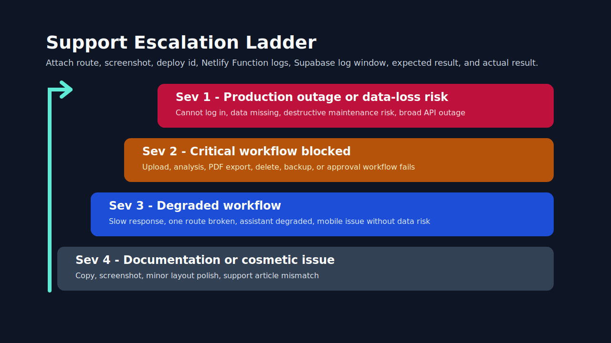
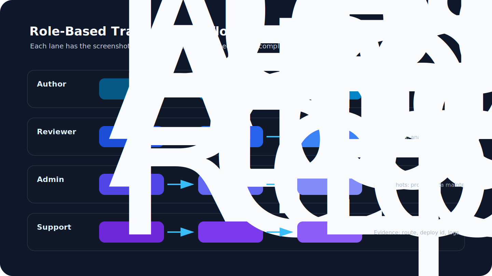
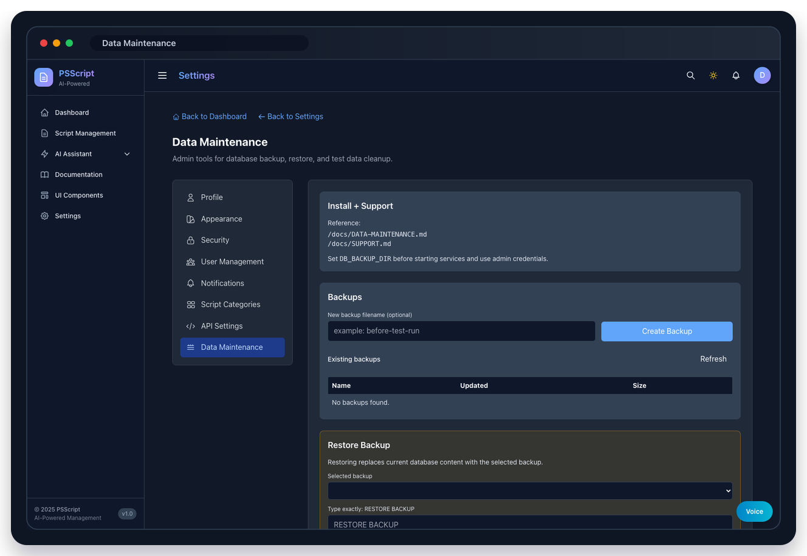

# Lab 05: Governance, Support Evidence, And Safe Cleanup

## Goal

Practice the support lifecycle for a script issue: capture evidence, verify hosted state, test delete behavior on disposable data, and document cleanup.





## Prerequisites

- Approved account on `https://pstest.morloksmaze.com`.
- Admin account for data maintenance sections.
- A disposable script created for training.
- Browser access to capture screenshots.

## Steps

1. Open the disposable script in the Scripts list.
2. Capture the route, script id, title, category, owner, and timestamp.
3. Open the analysis page and confirm the latest analysis state.
4. Export the PDF report and confirm the downloaded file is a PDF.
5. Delete the disposable script from the app.
6. Refresh the Scripts list and confirm the record is gone.
7. As an admin, open Settings -> Data Maintenance and confirm backup controls are visible.
8. Do not run restore or production cleanup unless the exercise explicitly authorizes it.
9. Write a support note with screenshots, expected result, actual result, route, and user role.

## Expected Results

- The deleted test script no longer appears in the library.
- No unrelated production scripts are modified.
- Exported analysis evidence is a PDF.
- The support note contains enough detail for a second person to reproduce the case.

## Evidence Screenshots

Capture or reference these surfaces during the exercise.




## Evidence Template

```text
Environment:
URL:
Netlify deploy:
User role:
Script id:
Script title:
Action:
Expected:
Actual:
Screenshots:
Function log window:
Supabase log window:
Cleanup completed:
```

## Troubleshooting

| Issue | First check | Next step |
| --- | --- | --- |
| Delete fails | User role, ownership, route response | Attach script id and Function logs |
| Deleted record still appears | Browser cache or stale list response | Refresh and check API response |
| Export downloads JSON | Stale deploy or API error | Verify latest deploy and response headers |
| Backup controls hidden | Non-admin profile | Confirm role and `app_profiles.is_enabled` |
