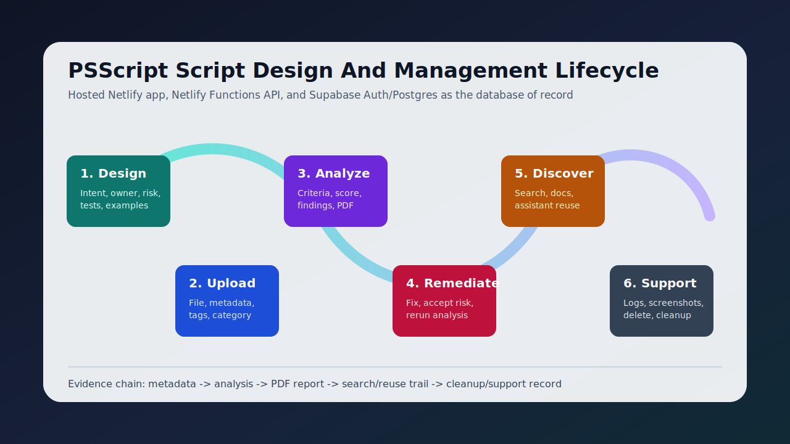

# Module 02: Script Lifecycle

Last updated: April 29, 2026.

## Objectives

- Design a PowerShell script with clear purpose, safety, examples, and test expectations.
- Upload scripts and validate metadata.
- Understand hash-based deduplication and versioning.
- Edit hosted script records and export the current buffer for VS Code.
- Use AI analysis and PDF export as lifecycle evidence.
- Verify delete and bulk delete behavior on safe test data.

## Walkthrough

1. Define the script's intent, owner, affected system, operating environment, and expected risk.
2. Write the script with safe parameters, clear examples, and a test plan.
3. Run local/static checks when available, such as PSScriptAnalyzer for PowerShell syntax and best-practice issues.
4. Open Scripts in the hosted app.
5. Upload a safe test `.ps1` file.
6. Add title, description, tags, category, and owner metadata.
7. Open the script detail page.
8. Open the script edit page and verify title, description, and content load from hosted Supabase.
9. Use **Open in VS Code** to download the current editor buffer as a `.ps1` file for local review.
10. Review metadata, scores, version state, and analysis state.
11. Run or review AI analysis and export the PDF report.
12. For a disposable test script only, verify single delete.
13. For disposable test scripts only, verify bulk selection and bulk delete.

## Screenshots

## Metadata Checklist

| Field | Example | Notes |
| --- | --- | --- |
| Title | Reset-UserPassword | Prefer PowerShell Verb-Noun style |
| Description | Reset an AD user password | Keep it concise |
| Category | Identity | Use current taxonomy |
| Tags | security, active-directory | Use meaningful tags |
| Owner tag | owner:team-identity | Helpful for governance |
| Hash | automatic | Calculated server-side |

## Design Checklist

| Check | Why it matters |
| --- | --- |
| Intent is explicit | Reviewers can decide whether the script belongs in the library |
| Parameters are validated | Reduces accidental misuse and unsafe input |
| Destructive actions are guarded | Supports safer review for delete/update operations |
| Examples are included | Makes reuse and support faster |
| Tests or verification steps exist | Gives reviewers a concrete acceptance path |
| Secrets are externalized | Prevents credentials from entering the library |
| Owner and category are known | Supports future support and cleanup decisions |
| Runtime requirements are known | Helps reviewers confirm PowerShell version, modules, and assemblies before execution |

## Integrity And Deduplication

- The hosted API calculates file hashes.
- Duplicate content should be detected instead of silently creating confusing copies.
- Version history preserves prior uploads.
- Edit saves create a new version when script content changes.
- The **Open in VS Code** action downloads a `.ps1` file; it does not claim direct local filesystem access from the hosted browser.
- The hosted app uses Supabase as the database of record.
- Netlify Function payload limits are why hosted uploads are capped at 4 MB in the UI.

## Verification Checklist

- Uploaded script appears in the list.
- Metadata is visible on list/detail surfaces.
- Analysis results show criteria, scores, findings, remediation, and confidence.
- Runtime requirements show PowerShell version and modules or assemblies where detected.
- Script edit export downloads a `.ps1` file.
- PDF export downloads a PDF file.
- Delete and bulk delete work only for intended test records and authorized users.
