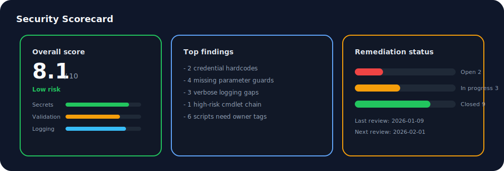
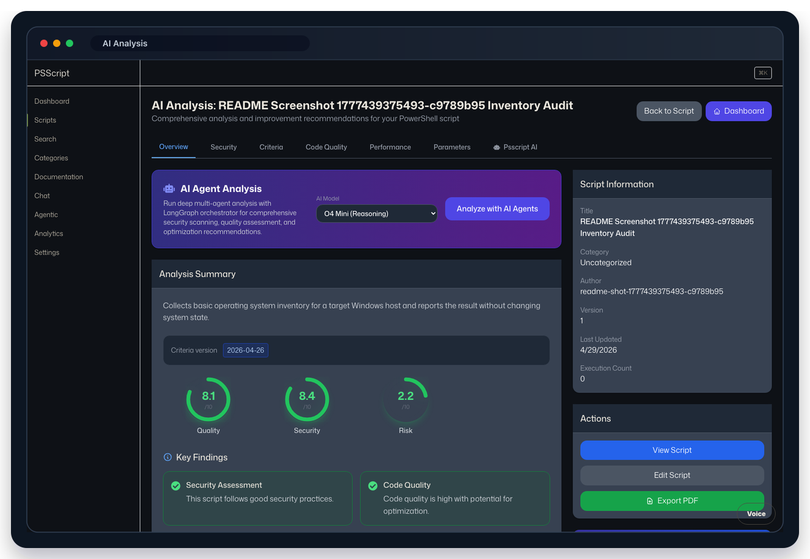

# Module 03: AI Analysis And Security

## Objectives

- Read the current AI analysis criteria payload.
- Interpret security and quality scores.
- Track remediation actions.
- Export analysis as a PDF.

## Walkthrough

1. Open a script detail page.
2. Run or view AI analysis.
3. Review security score, quality score, criteria version, confidence, findings, remediation, and test recommendations.
4. Export the analysis report.
5. Confirm the downloaded report is a PDF, not JSON.

## Scorecard Snapshot

## Screenshots

## Score Interpretation

| Band | Meaning | Action |
| --- | --- | --- |
| 9.0 - 10 | Low risk | Approve and monitor |
| 7.0 - 8.9 | Moderate risk | Plan fixes and rerun analysis |
| below 7.0 | High risk | Remediate before execution |

## What To Look For

- hardcoded credentials or tokens
- unsafe destructive commands
- missing parameter validation
- missing error handling and logging
- unclear operational ownership

## Verification Checklist

- Analysis results display successfully.
- Criteria version and confidence are visible.
- Findings have priorities.
- PDF export downloads and opens as a PDF.
