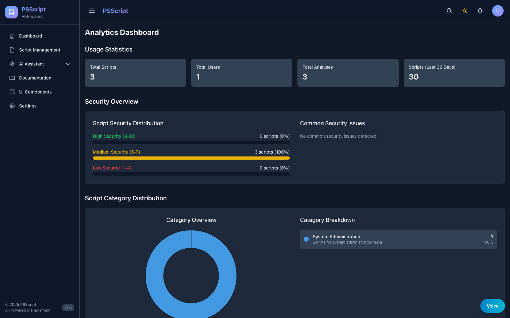

# Module 05: Operations and Governance

## Objectives

- Monitor services and logs
- Review analytics and usage
- Apply operational checks and governance

## Walkthrough

1. Open Analytics and review cost and usage metrics.
2. Review recent activity for script changes.
3. Confirm environment health via `docker-manage.sh health` or log checks.

## Operations visuals

## Operational signals

| Signal | Source | Target |
| --- | --- | --- |
| Analysis success rate | Analytics | >= 95% |
| Upload dedup hits | Scripts | Stable, no spikes |
| Top failing category | Analytics | Investigate weekly |
| Review cadence | Governance logs | <= 30 days |

## Operational checklist

- Database and cache healthy
- AI service reachable
- Script uploads and analysis succeed
- Errors captured in logs

## Verification checklist

- You can find usage metrics in Analytics
- You can identify the most recent script activity
